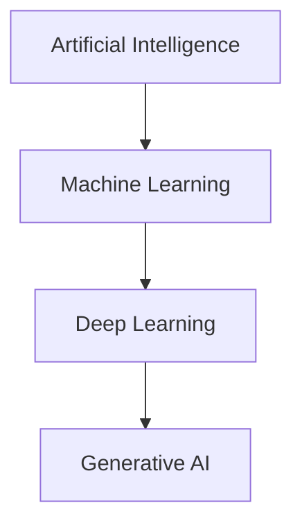

# AI/ML Fundamentals: The Big Picture

## 🎯 1-Line Definitions (Quick Recall)
- **Artificial Intelligence (AI)**: Machines mimicking human intelligence to perform tasks and improve themselves.
- **Machine Learning (ML)**: A subset of AI that uses data to learn patterns without being explicitly programmed.
- **Deep Learning (DL)**: A subset of ML using multi-layered neural networks to handle unstructured data (images, audio).
- **Generative AI (GenAI)**: A subset of DL focused on creating *new* content (text, images, code) rather than just classifying it.

---

## 🏗️ AI vs. ML vs. DL: The Hierarchy


---

## 🧠 ML Algorithms vs. Traditional CS Algorithms
| Feature | Traditional Computer Science | Machine Learning |
| :--- | :--- | :--- |
| **Logic** | Explicitly programmed (If-Else) | Learned from data patterns |
| **Data Requirement** | Low to Medium | High (for training) |
| **Input** | Rule + Data | Data + Output (for training) |
| **Output** | Answer | Rule (Model) |

---

## 🛠️ Types of Machine Learning

### 1. Supervised Learning (Learning from Labeled Data)
- **Concept**: The model is trained on a dataset where the "answers" (labels) are already known.
- **Problem Types**:
    - **Classification**: Predicting a discrete label (e.g., Spam or Not Spam).
        - *Binary*: Two classes (0 or 1).
        - *Multi-class*: Many classes (Dog, Cat, Bird).
    - **Regression**: Predicting a continuous numerical value (e.g., Price of a house).
        - *Math*: $y = mx + c$ (Simple Linear Regression).

### 2. Unsupervised Learning (Learning from Unlabeled Data)
- **Concept**: The model finds hidden patterns or structures in input data without labels.
- **Problem Types**:
    - **Clustering**: Grouping similar data points together.
        - *Partitional*: K-Means (fixed number of groups).
        - *Hierarchical*: Building a tree of clusters.
    - **Association**: Finding rules that describe large portions of your data (e.g., "People who buy milk also buy bread").
    - **Anomaly Detection**: Identifying outliers that don't fit the pattern (e.g., Fraud detection).

### 3. Reinforcement Learning (Learning by Trial & Error)
- **Concept**: An **Agent** interacts with an **Environment**, takes **Actions**, and receives **Rewards** or **Punishments**.
- **Use Cases**: Games (AlphaGo), Robotics, Self-driving cars.

---

## 📉 Overfitting vs. Underfitting
- **Underfitting (High Bias)**: The model is too simple; it doesn't learn the pattern even on training data.
- **Overfitting (High Variance)**: The model is too complex; it "memorizes" training data but fails on new data.
- **Goal**: Find the "Sweet Spot" in the Bias-Variance tradeoff.

---

## 🐍 Python Implementation: Linear Regression (Scikit-Learn)
```python
from sklearn.linear_model import LinearRegression
import numpy as np

# Sample Data: [Area in sqft]
X = np.array([[1000], [1500], [2000], [2500]])
# Target: [Price in USD]
y = np.array([300000, 450000, 600000, 750000])

# Create and Train Model
model = LinearRegression()
model.fit(X, y)

# Predict price for 1800 sqft
prediction = model.predict([[1800]])
print(f"Predicted Price: ${prediction[0]:,.2f}") # Output: $540,000.00
```