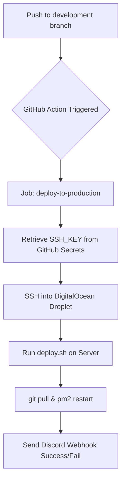

# Cloud Infrastructure & Backend DevOps Handbook

This handbook is designed to help you master the DevOps side of your project, from managing servers to automating deployments, specifically tailored for your technical interviews.

---

## 1. Cloud Instances (VPS)
A Cloud Instance is a **Virtual Private Server (VPS)**—a piece of a powerful physical server rented from companies like AWS or DigitalOcean.

*   **Virtualization:** Multiple small servers running on one physical giant machine.
*   **Scalability:** Instantly upgrade RAM/CPU as your app grows.
*   **On-Demand:** Pay-as-you-go pricing models.

---

## 2. AWS EC2 vs. DigitalOcean Droplets

| Feature | AWS EC2 | DigitalOcean Droplets |
| :--- | :--- | :--- |
| **Philosophy** | Enterprise-grade, massive complexity. | Developer-first, simple & fast. |
| **Pricing** | Complex, pay-per-hour. | Predictable, flat monthly fee. |
| **Target** | Massive corporations (Netflix, etc). | Startups and individual developers. |
| **Learning Curve** | High (VPC, IAM, Security Groups). | Low (Deploy in 60 seconds). |

> [!NOTE]
> **Why do we use DO?** For our project, DigitalOcean provides the perfect balance of performance and simplicity, allowing us to focus on code rather than complex networking.

---

## 3. Remote Management with Termius
**Termius** is our primary command center for the production server.

*   **The Vault:** Securely stores `.pem` keys and credentials with cloud sync.
*   **Snippets:** Save complex commands (like `docker logs` or `pm2 status`) to run with one click.
*   **SFTP:** A visual "Drag & Drop" interface to move files between your PC and the server.
*   **Interview Tip:** "I use Termius because it organizes my infrastructure by project and ensures I can troubleshoot from any device securely."

---

## 4. Essential Linux & SSH Commands

| Task | Command | Why? |
| :--- | :--- | :--- |
| **Health Check** | `htop` | Monitor CPU, RAM, and runaway processes. |
| **Disk Space** | `df -h` | Check if audio processing is filling up the disk. |
| **App Logs** | `pm2 logs` | Real-time debugging of backend errors. |
| **Permissions** | `chmod 400 key.pem` | Essential for SSH security (read-only by owner). |
| **Process Search** | `ps aux \| grep gunicorn` | Find your web server process ID. |

---

## 5. Process Management: PM2
**PM2** is the "Bodyguard" of our application.

*   **Autorestart:** If the app crashes due to an unhandled error, PM2 brings it back online instantly.
*   **Background Running:** Keeps the server active after you close your Termius session.
*   **Persistence:** `pm2 startup` and `pm2 save` ensure the app starts even after a server reboot.
*   **Monitoring:** `pm2 monit` gives a real-time dashboard of your backend's health.

---

## 6. Payment Integration (Stripe Customization)
We customized **Stripe** to provide a specialized experience for our music platform.

*   **Disabling "Link" (One-Click Pay):** We set `payment_method_types = ["card"]` in `stripe_service.py`.
*   **Rationale:** To avoid a cluttered UI during the MVP stage and ensure users focused on the primary credit card payment flow.
*   **Webhooks:** Our server listens for Stripe events. We **only** grant credits once Stripe sends the `payment_succeeded` signal to our webhook endpoint.

---

## 7. Deployment Strategy: Manual & Automated

### A. Manual Troubleshooting (Termius)
When we need to test new server configurations or debug, we use **Termius** to:
1. SSH into the Droplet.
2. Run database migrations (`alembic upgrade head`).
3. Manually restart services via `start.sh`.

### B. Automated CI/CD (GitHub Actions)
For everyday development, we automated the deployment via `deploy.yml`.
1.  **Push:** Developer pushes code to the `development` branch.
2.  **Action:** GitHub connects to DigitalOcean via SSH (using encrypted **Secrets**).
3.  **Execute:** The server pulls the code and runs the deployment script.
4.  **Notify:** A **Discord Webhook** alerts the team if the deployment was a success or failure.

---

## 8. Real-World Case Study: FFM Storage
We use a **Hybrid Storage** model to handle massive audio files efficiently.

*   **Cloud (DO Spaces):** S3-compatible object storage for final songs and stems. It is infinite and serves files via CDN.
*   **Local (/storage):** The server's local disk is used only for temporary processing (separating stems) before uploading them to the cloud.
*   **Presigned URLs:** We generate temporary links so the Frontend can upload files directly to DigitalOcean, saving our server's bandwidth.

---

## 9. Interview Q&A (The "Power Answers")

**Q: Describe your deployment workflow.**
**A:** "For our project, I implemented an automated CI/CD pipeline using **GitHub Actions**. Every time we push to the development branch, GitHub SSHs into our DigitalOcean Droplet and runs our deployment logic. I also used **Termius** for manual server management and **Discord Webhooks** for real-time deployment alerts."

**Q: How do you handle file processing tasks in the background?**
**A:** "We use **Celery** as a task queue. Heavy jobs like stem separation are offloaded to background workers, so the FastAPI server remains responsive for other users. I use **PM2** to keep both the API and the workers alive 24/7."

**Q: Why use Object Storage instead of regular server disks?**
**A:** "Object storage like **DigitalOcean Spaces** is stateless and infinitely scalable. If we need to add more servers, they can all access the same files easily. It's much more reliable than local disks."

**Q: How do you handle security in your CI/CD pipeline?**
**A:** "I use **GitHub Secrets** to store sensitive data like SSH keys and IP addresses. These are never committed to the repository—they are injected during the deployment job to keep our production environment secure."

---

## 10. Deep Dive: Automated CI/CD Workflow

This section explains the technical implementation behind the "Power Answer" in Section 9.

### Deployment Flow Diagram


### Technical Components

1.  **GitHub Secrets (Security)**
    - Never hardcode IP addresses or SSH keys in your `.yml` files.
    - Store them in **Settings > Secrets and variables > Actions**.
    - Common secrets: `SSH_HOST` (Your IP), `SSH_USER` (usually root), `SSH_PRIVATE_KEY`.

2.  **The Workflow File (`.github/workflows/deploy.yml`)**
    ```yaml
    jobs:
      deploy:
        runs-on: ubuntu-latest
        steps:
          - name: Deploy via SSH
            uses: appleboy/ssh-action@master
            with:
              host: ${{ secrets.SSH_HOST }}
              key: ${{ secrets.SSH_PRIVATE_KEY }}
              script: |
                cd /home/project/backend
                git pull origin development
                ./start.sh  # Script containing pm2 reload/migrate
    ```

3.  **The Deployment Script (`start.sh`)**
    This script runs *on the server* once GitHub connects:
    - `git pull`: Updates the code.
    - `source venv/bin/activate`: Enters the environment.
    - `pip install -r requirements.txt`: Installs new dependencies.
    - `pm2 reload all`: Restarts the app with zero downtime.

4.  **Real-time Visibility: Discord Webhooks**
    - We use a simple `curl` command at the end of our workflow to send a POST request to a Discord channel.
    - **Why?** "It allows the whole team to see that a new version is live without checking the GitHub dashboard."

---


> [!TIP]
> **Final Pro-Tip:** In interviews, always mention **Automated Testing** and **Monitoring (PM2/HTOP)**. It shows you care about the long-term reliability of the product.
