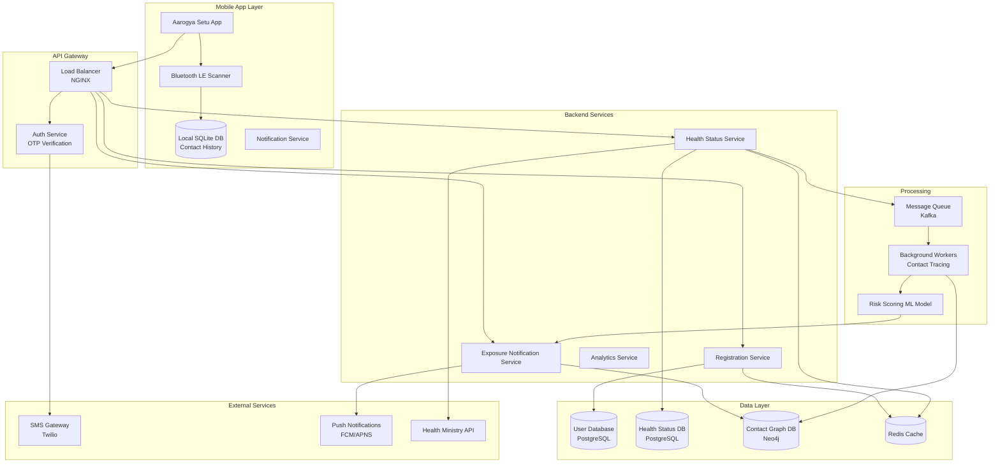

# Aarogya Setu: Contact Tracing System Design

## Problem Statement

**Context**: Design a contact tracing app like Aarogya Setu (India's COVID-19 tracking app) that can track proximity-based contacts and alert users of potential exposure.

**Requirements**:
- Track Bluetooth proximity between users
- Detect potential COVID-19 exposure
- Maintain user privacy (no location tracking)
- Send exposure notifications
- Self-assessment and health status
- Scale to 100M+ users
- Low battery consumption
- Work offline

**Constraints**:
- Privacy-first design (no centralized location data)
- Bluetooth range: ~10 meters
- Contact duration threshold: 15+ minutes
- Distance threshold: < 2 meters
- Data retention: 30 days
- Notification delay: < 1 hour after positive test

---

## Solution Architecture



---

## Core Components

### 1. Bluetooth Contact Detection

```javascript
// Mobile App - Bluetooth Contact Tracking
class BluetoothContactTracker {
    constructor() {
        this.contactHistory = [];
        this.activeContacts = new Map(); // deviceId -> contact info
        this.scanInterval = 5000; // 5 seconds
        this.contactThreshold = 15 * 60 * 1000; // 15 minutes
        this.rssiThreshold = -70; // ~2 meters
    }
    
    // Generate anonymous device ID (changes every 15 minutes)
    generateAnonymousId() {
        const timestamp = Math.floor(Date.now() / (15 * 60 * 1000));
        const userId = this.getUserId();
        
        // HMAC-based ID generation
        return this.hmac(`${userId}:${timestamp}`, this.getSecretKey());
    }
    
    // Start Bluetooth scanning
    async startScanning() {
        setInterval(async () => {
            const nearbyDevices = await this.scanNearbyDevices();
            
            for (const device of nearbyDevices) {
                await this.processContact(device);
            }
            
            // Clean up old contacts
            this.cleanupOldContacts();
        }, this.scanInterval);
    }
    
    async processContact(device) {
        const { deviceId, rssi, timestamp } = device;
        
        // Check if device is within proximity threshold
        if (rssi < this.rssiThreshold) {
            return; // Too far away
        }
        
        // Update or create contact
        if (this.activeContacts.has(deviceId)) {
            const contact = this.activeContacts.get(deviceId);
            contact.lastSeen = timestamp;
            contact.duration = timestamp - contact.firstSeen;
            contact.rssiReadings.push(rssi);
        } else {
            this.activeContacts.set(deviceId, {
                deviceId,
                firstSeen: timestamp,
                lastSeen: timestamp,
                duration: 0,
                rssiReadings: [rssi]
            });
        }
        
        // Save significant contacts (>15 minutes)
        const contact = this.activeContacts.get(deviceId);
        if (contact.duration >= this.contactThreshold) {
            await this.saveContact(contact);
        }
    }
    
    async saveContact(contact) {
        const avgRssi = contact.rssiReadings.reduce((a, b) => a + b, 0) 
                        / contact.rssiReadings.length;
        
        const contactRecord = {
            anonymousId: contact.deviceId,
            timestamp: contact.firstSeen,
            duration: contact.duration,
            avgRssi,
            riskScore: this.calculateRiskScore(contact)
        };
        
        // Save to local database
        await this.db.saveContact(contactRecord);
        
        // Upload to server (encrypted)
        await this.uploadContact(contactRecord);
    }
    
    calculateRiskScore(contact) {
        const durationScore = Math.min(contact.duration / (60 * 60 * 1000), 1); // Max 1 hour
        const proximityScore = Math.max(0, 1 - (contact.avgRssi + 50) / 30); // Closer = higher
        
        return (durationScore * 0.6 + proximityScore * 0.4) * 100;
    }
    
    cleanupOldContacts() {
        const now = Date.now();
        const timeout = 5 * 60 * 1000; // 5 minutes
        
        for (const [deviceId, contact] of this.activeContacts) {
            if (now - contact.lastSeen > timeout) {
                this.activeContacts.delete(deviceId);
            }
        }
    }
}
```

### 2. Health Status Service

```javascript
const express = require('express');
const router = express.Router();

class HealthStatusService {
    constructor(db, kafka) {
        this.db = db;
        this.kafka = kafka;
    }
    
    // Self-assessment
    async submitAssessment(userId, assessment) {
        const {
            symptoms,
            temperature,
            travelHistory,
            contactWithPositive
        } = assessment;
        
        // Calculate risk level
        const riskLevel = this.calculateRiskLevel(assessment);
        
        // Save assessment
        await this.db.query(`
            INSERT INTO health_assessments 
            (user_id, symptoms, temperature, risk_level, created_at)
            VALUES ($1, $2, $3, $4, NOW())
        `, [userId, JSON.stringify(symptoms), temperature, riskLevel]);
        
        // Update user status
        await this.updateUserStatus(userId, riskLevel);
        
        return { riskLevel, recommendations: this.getRecommendations(riskLevel) };
    }
    
    calculateRiskLevel(assessment) {
        let score = 0;
        
        // Symptoms
        const highRiskSymptoms = ['fever', 'cough', 'breathlessness'];
        for (const symptom of assessment.symptoms) {
            if (highRiskSymptoms.includes(symptom)) {
                score += 20;
            } else {
                score += 5;
            }
        }
        
        // Temperature
        if (assessment.temperature >= 100) score += 30;
        else if (assessment.temperature >= 99) score += 15;
        
        // Travel history
        if (assessment.travelHistory) score += 20;
        
        // Contact with positive case
        if (assessment.contactWithPositive) score += 40;
        
        // Risk levels: Low (0-30), Medium (31-60), High (61-100)
        if (score >= 61) return 'HIGH';
        if (score >= 31) return 'MEDIUM';
        return 'LOW';
    }
    
    // Report positive test
    async reportPositiveTest(userId, testDetails) {
        const { testDate, testType, labName } = testDetails;
        
        // Verify test (in production, integrate with health ministry)
        const verified = await this.verifyTest(testDetails);
        
        if (!verified) {
            throw new Error('Test verification failed');
        }
        
        // Update user status
        await this.db.query(`
            UPDATE users 
            SET health_status = 'POSITIVE',
                test_date = $1,
                updated_at = NOW()
            WHERE user_id = $2
        `, [testDate, userId]);
        
        // Trigger contact tracing
        await this.kafka.send({
            topic: 'positive-cases',
            messages: [{
                key: userId,
                value: JSON.stringify({
                    userId,
                    testDate,
                    timestamp: Date.now()
                })
            }]
        });
        
        return { success: true };
    }
    
    getRecommendations(riskLevel) {
        const recommendations = {
            'LOW': [
                'Continue following COVID-19 guidelines',
                'Maintain social distancing',
                'Wear mask in public places',
                'Wash hands frequently'
            ],
            'MEDIUM': [
                'Self-isolate for 14 days',
                'Monitor symptoms daily',
                'Get tested if symptoms worsen',
                'Avoid contact with elderly/vulnerable'
            ],
            'HIGH': [
                'Immediate self-isolation',
                'Get tested immediately',
                'Contact health authorities',
                'Monitor oxygen levels',
                'Seek medical attention if breathlessness'
            ]
        };
        
        return recommendations[riskLevel] || recommendations['LOW'];
    }
}

// API Routes
router.post('/assessment', async (req, res) => {
    const userId = req.user.id;
    const assessment = req.body;
    
    const result = await healthService.submitAssessment(userId, assessment);
    res.json(result);
});

router.post('/positive-test', async (req, res) => {
    const userId = req.user.id;
    const testDetails = req.body;
    
    const result = await healthService.reportPositiveTest(userId, testDetails);
    res.json(result);
});

module.exports = router;
```

### 3. Exposure Notification Service

```javascript
class ExposureNotificationService {
    constructor(db, pushService) {
        this.db = db;
        this.pushService = pushService;
    }
    
    // Process positive case and notify contacts
    async processPositiveCase(userId, testDate) {
        // Get user's contact history (last 14 days)
        const contacts = await this.getContactHistory(userId, 14);
        
        // Get anonymous IDs used by this user
        const anonymousIds = await this.getUserAnonymousIds(userId, 14);
        
        // Find users who had contact with these anonymous IDs
        const exposedUsers = await this.findExposedUsers(anonymousIds);
        
        // Calculate exposure risk for each user
        const notifications = [];
        
        for (const exposedUser of exposedUsers) {
            const riskScore = await this.calculateExposureRisk(
                exposedUser.userId,
                anonymousIds,
                testDate
            );
            
            if (riskScore >= 50) { // Threshold for notification
                notifications.push({
                    userId: exposedUser.userId,
                    riskScore,
                    exposureDate: exposedUser.lastContact,
                    duration: exposedUser.totalDuration
                });
            }
        }
        
        // Send notifications
        await this.sendExposureNotifications(notifications);
        
        return { notifiedUsers: notifications.length };
    }
    
    async getContactHistory(userId, days) {
        const result = await this.db.query(`
            SELECT anonymous_id, timestamp, duration, avg_rssi, risk_score
            FROM contact_history
            WHERE user_id = $1
            AND timestamp >= NOW() - INTERVAL '${days} days'
            ORDER BY timestamp DESC
        `, [userId]);
        
        return result.rows;
    }
    
    async getUserAnonymousIds(userId, days) {
        // Generate all anonymous IDs used by this user in last N days
        const ids = [];
        const now = Date.now();
        const interval = 15 * 60 * 1000; // 15 minutes
        const totalIntervals = (days * 24 * 60 * 60 * 1000) / interval;
        
        for (let i = 0; i < totalIntervals; i++) {
            const timestamp = now - (i * interval);
            const anonymousId = this.generateAnonymousId(userId, timestamp);
            ids.push(anonymousId);
        }
        
        return ids;
    }
    
    async findExposedUsers(anonymousIds) {
        // Find users who had contact with these anonymous IDs
        const result = await this.db.query(`
            SELECT 
                user_id,
                MAX(timestamp) as last_contact,
                SUM(duration) as total_duration,
                AVG(risk_score) as avg_risk_score
            FROM contact_history
            WHERE anonymous_id = ANY($1)
            GROUP BY user_id
        `, [anonymousIds]);
        
        return result.rows;
    }
    
    async calculateExposureRisk(userId, exposedAnonymousIds, testDate) {
        const contacts = await this.db.query(`
            SELECT timestamp, duration, avg_rssi, risk_score
            FROM contact_history
            WHERE user_id = $1
            AND anonymous_id = ANY($2)
            ORDER BY timestamp DESC
        `, [userId, exposedAnonymousIds]);
        
        let totalRisk = 0;
        
        for (const contact of contacts.rows) {
            // Time decay: recent contacts are riskier
            const daysSinceContact = (Date.now() - contact.timestamp) / (24 * 60 * 60 * 1000);
            const timeDecay = Math.max(0, 1 - (daysSinceContact / 14));
            
            // Duration factor
            const durationFactor = Math.min(contact.duration / (60 * 60 * 1000), 1);
            
            // Proximity factor (RSSI)
            const proximityFactor = Math.max(0, 1 - (contact.avg_rssi + 50) / 30);
            
            const contactRisk = timeDecay * durationFactor * proximityFactor * 100;
            totalRisk += contactRisk;
        }
        
        return Math.min(totalRisk, 100);
    }
    
    async sendExposureNotifications(notifications) {
        for (const notification of notifications) {
            const { userId, riskScore, exposureDate, duration } = notification;
            
            // Get user's FCM token
            const user = await this.db.query(
                'SELECT fcm_token FROM users WHERE user_id = $1',
                [userId]
            );
            
            if (!user.rows[0]?.fcm_token) continue;
            
            // Send push notification
            await this.pushService.send({
                token: user.rows[0].fcm_token,
                notification: {
                    title: 'Potential COVID-19 Exposure',
                    body: this.getNotificationMessage(riskScore)
                },
                data: {
                    type: 'exposure',
                    riskScore: riskScore.toString(),
                    exposureDate: exposureDate.toISOString()
                }
            });
            
            // Save notification record
            await this.db.query(`
                INSERT INTO exposure_notifications
                (user_id, risk_score, exposure_date, duration, sent_at)
                VALUES ($1, $2, $3, $4, NOW())
            `, [userId, riskScore, exposureDate, duration]);
        }
    }
    
    getNotificationMessage(riskScore) {
        if (riskScore >= 80) {
            return 'You may have been exposed to COVID-19. Please self-isolate and get tested immediately.';
        } else if (riskScore >= 60) {
            return 'You may have been exposed to COVID-19. Please monitor symptoms and consider getting tested.';
        } else {
            return 'You may have been in proximity to a COVID-19 positive person. Please follow safety guidelines.';
        }
    }
}
```

### 4. Privacy-Preserving Contact Upload

```javascript
class PrivacyPreservingUpload {
    constructor() {
        this.encryptionKey = process.env.ENCRYPTION_KEY;
    }
    
    // Upload contacts from mobile app
    async uploadContacts(userId, contacts) {
        // Encrypt contacts before upload
        const encryptedContacts = contacts.map(contact => ({
            anonymousId: contact.anonymousId, // Already anonymous
            timestamp: this.encryptTimestamp(contact.timestamp),
            duration: contact.duration,
            riskScore: contact.riskScore
            // No location, no personal info
        }));
        
        // Batch upload
        await this.db.query(`
            INSERT INTO contact_history 
            (user_id, anonymous_id, timestamp, duration, risk_score)
            VALUES ${this.generateBatchInsert(userId, encryptedContacts)}
        `);
        
        return { uploaded: encryptedContacts.length };
    }
    
    encryptTimestamp(timestamp) {
        // Round to nearest hour for privacy
        return Math.floor(timestamp / (60 * 60 * 1000)) * (60 * 60 * 1000);
    }
    
    // Download exposure keys (for checking exposure)
    async downloadExposureKeys(lastSync) {
        // Get all anonymous IDs from positive cases since last sync
        const result = await this.db.query(`
            SELECT DISTINCT ch.anonymous_id, ch.timestamp
            FROM contact_history ch
            JOIN users u ON ch.user_id = u.user_id
            WHERE u.health_status = 'POSITIVE'
            AND u.test_date >= $1
            ORDER BY ch.timestamp DESC
        `, [lastSync]);
        
        return result.rows;
    }
}
```

---

## Database Schema

```sql
-- Users table
CREATE TABLE users (
    user_id UUID PRIMARY KEY DEFAULT gen_random_uuid(),
    phone_number VARCHAR(15) UNIQUE NOT NULL,
    phone_verified BOOLEAN DEFAULT FALSE,
    health_status VARCHAR(20) DEFAULT 'UNKNOWN', -- UNKNOWN, LOW, MEDIUM, HIGH, POSITIVE, RECOVERED
    test_date TIMESTAMP,
    fcm_token TEXT,
    created_at TIMESTAMP DEFAULT NOW(),
    updated_at TIMESTAMP DEFAULT NOW()
);

CREATE INDEX idx_users_health_status ON users(health_status);
CREATE INDEX idx_users_test_date ON users(test_date);

-- Contact history (encrypted, anonymous)
CREATE TABLE contact_history (
    id BIGSERIAL PRIMARY KEY,
    user_id UUID REFERENCES users(user_id),
    anonymous_id VARCHAR(64) NOT NULL, -- Anonymous device ID
    timestamp TIMESTAMP NOT NULL,
    duration INTEGER NOT NULL, -- in seconds
    avg_rssi INTEGER, -- Signal strength
    risk_score INTEGER, -- 0-100
    created_at TIMESTAMP DEFAULT NOW()
);

CREATE INDEX idx_contact_history_user ON contact_history(user_id, timestamp DESC);
CREATE INDEX idx_contact_history_anonymous ON contact_history(anonymous_id, timestamp DESC);

-- Health assessments
CREATE TABLE health_assessments (
    id BIGSERIAL PRIMARY KEY,
    user_id UUID REFERENCES users(user_id),
    symptoms JSONB,
    temperature DECIMAL(4,2),
    risk_level VARCHAR(20),
    created_at TIMESTAMP DEFAULT NOW()
);

CREATE INDEX idx_assessments_user ON health_assessments(user_id, created_at DESC);

-- Exposure notifications
CREATE TABLE exposure_notifications (
    id BIGSERIAL PRIMARY KEY,
    user_id UUID REFERENCES users(user_id),
    risk_score INTEGER,
    exposure_date TIMESTAMP,
    duration INTEGER,
    sent_at TIMESTAMP DEFAULT NOW(),
    acknowledged BOOLEAN DEFAULT FALSE
);

CREATE INDEX idx_notifications_user ON exposure_notifications(user_id, sent_at DESC);

-- Positive cases (for contact tracing)
CREATE TABLE positive_cases (
    id BIGSERIAL PRIMARY KEY,
    user_id UUID REFERENCES users(user_id),
    test_date TIMESTAMP NOT NULL,
    test_type VARCHAR(50),
    lab_name VARCHAR(200),
    verified BOOLEAN DEFAULT FALSE,
    reported_at TIMESTAMP DEFAULT NOW()
);

CREATE INDEX idx_positive_cases_date ON positive_cases(test_date DESC);

-- Data retention policy (delete after 30 days)
CREATE OR REPLACE FUNCTION delete_old_contacts() RETURNS void AS $$
BEGIN
    DELETE FROM contact_history WHERE created_at < NOW() - INTERVAL '30 days';
    DELETE FROM health_assessments WHERE created_at < NOW() - INTERVAL '30 days';
    DELETE FROM exposure_notifications WHERE sent_at < NOW() - INTERVAL '30 days';
END;
$$ LANGUAGE plpgsql;

-- Schedule cleanup job
SELECT cron.schedule('cleanup-old-data', '0 2 * * *', 'SELECT delete_old_contacts()');
```

---

## Scalability & Performance

### 1. Caching Strategy

```javascript
class CachingLayer {
    constructor(redis) {
        this.redis = redis;
    }
    
    // Cache user status
    async getUserStatus(userId) {
        const cached = await this.redis.get(`user:${userId}:status`);
        if (cached) return JSON.parse(cached);
        
        const status = await this.db.getUserStatus(userId);
        await this.redis.setex(`user:${userId}:status`, 3600, JSON.stringify(status));
        
        return status;
    }
    
    // Cache exposure keys
    async getExposureKeys(date) {
        const cacheKey = `exposure:keys:${date}`;
        const cached = await this.redis.get(cacheKey);
        if (cached) return JSON.parse(cached);
        
        const keys = await this.db.getExposureKeys(date);
        await this.redis.setex(cacheKey, 1800, JSON.stringify(keys)); // 30 min
        
        return keys;
    }
}
```

### 2. Sharding Strategy

```javascript
// Shard by user_id hash
function getShardId(userId) {
    const hash = crypto.createHash('md5').update(userId).digest('hex');
    const hashInt = parseInt(hash.substring(0, 8), 16);
    return hashInt % NUM_SHARDS;
}

// Route to appropriate shard
function getDbConnection(userId) {
    const shardId = getShardId(userId);
    return dbConnections[shardId];
}
```

---

## Security & Privacy

### 1. Privacy Measures

- **No Location Tracking**: Only Bluetooth proximity
- **Anonymous IDs**: Rotating every 15 minutes
- **Encrypted Storage**: All contact data encrypted
- **Data Retention**: Auto-delete after 30 days
- **Decentralized**: Contact matching on device
- **No PII Upload**: Only anonymous contact IDs

### 2. Security Measures

```javascript
// OTP-based authentication
class AuthService {
    async sendOTP(phoneNumber) {
        const otp = Math.floor(100000 + Math.random() * 900000);
        
        await this.redis.setex(`otp:${phoneNumber}`, 300, otp); // 5 min expiry
        await this.sms.send(phoneNumber, `Your Aarogya Setu OTP: ${otp}`);
        
        return { success: true };
    }
    
    async verifyOTP(phoneNumber, otp) {
        const storedOTP = await this.redis.get(`otp:${phoneNumber}`);
        
        if (storedOTP !== otp.toString()) {
            throw new Error('Invalid OTP');
        }
        
        // Generate JWT token
        const token = jwt.sign({ phoneNumber }, process.env.JWT_SECRET, {
            expiresIn: '30d'
        });
        
        await this.redis.del(`otp:${phoneNumber}`);
        
        return { token };
    }
}
```

---

## Performance Metrics

| Metric | Target | Monitoring |
|--------|--------|------------|
| Contact Detection Latency | < 5s | Bluetooth scan interval |
| Notification Delivery | < 1 hour | From positive test to notification |
| Battery Consumption | < 5% per day | Monitor Bluetooth usage |
| API Response Time | < 200ms | p95 latency |
| Database Query Time | < 50ms | Contact history queries |
| Upload Success Rate | > 99% | Contact upload reliability |

---

## Interview Talking Points

1. **Privacy vs Functionality Trade-off**:
   - Decentralized approach (Apple/Google model)
   - Anonymous IDs rotating every 15 minutes
   - No location data, only Bluetooth proximity
   - Data retention limited to 30 days

2. **Scalability Challenges**:
   - 100M+ users in India
   - Sharding by user_id
   - Caching exposure keys
   - Batch processing for contact tracing

3. **Bluetooth Limitations**:
   - Range: ~10 meters (not precise)
   - Signal strength varies (walls, pockets)
   - Battery consumption
   - iOS background limitations

4. **Contact Tracing Algorithm**:
   - Risk score based on: duration, proximity, time decay
   - Threshold for notification (avoid false positives)
   - Balance between sensitivity and specificity

5. **Real-world Challenges**:
   - User adoption (need critical mass)
   - False positives/negatives
   - Test verification
   - Integration with health ministry

---

## Next Steps

- Learn [Monitoring System](../05_Monitoring_Tool/05_Monitoring_Tool_System.md)
- Study [Real-time Notifications](../06_Twitter/06_Twitter_Timeline_System.md)
- Master [Privacy-Preserving Systems](../04_Payment_gateway/04_Payment_Gateway_System.md)
