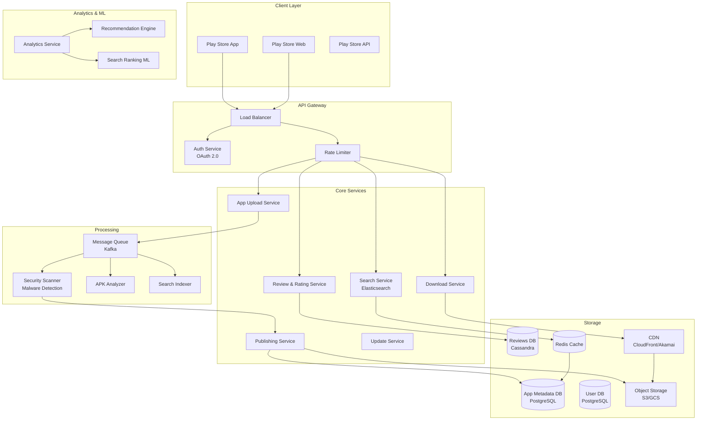

# Google Play Store: System Design

## Problem Statement

**Context**: Design an app distribution platform like Google Play Store that allows developers to publish apps and users to discover, download, and update apps.

**Requirements**:
- App upload and publishing workflow
- App discovery (search, browse, recommendations)
- Download and installation
- Automatic updates
- Reviews and ratings
- In-app purchases and subscriptions
- Security scanning (malware detection)
- Scale to 2.5M+ apps, 2B+ users
- Handle 100M+ downloads per day

**Constraints**:
- App size: up to 4GB
- Download speed: optimize for slow networks
- Security: scan for malware/viruses
- Regional compliance (GDPR, data localization)
- Payment processing (multiple currencies)

---

## Solution Architecture



---

## Core Components

### 1. App Upload & Publishing Service

```javascript
const express = require('express');
const multer = require('multer');
const AWS = require('aws-sdk');

class AppUploadService {
    constructor() {
        this.s3 = new AWS.S3();
        this.kafka = new Kafka();
        this.maxAppSize = 4 * 1024 * 1024 * 1024; // 4GB
    }
    
    // Multipart upload for large APK files
    async uploadAPK(developerId, file, metadata) {
        const { appId, versionCode, versionName } = metadata;
        
        // Validate file
        if (file.size > this.maxAppSize) {
            throw new Error('App size exceeds 4GB limit');
        }
        
        if (!file.originalname.endsWith('.apk') && !file.originalname.endsWith('.aab')) {
            throw new Error('Invalid file format. Only APK/AAB allowed');
        }
        
        // Generate unique upload ID
        const uploadId = `${appId}_${versionCode}_${Date.now()}`;
        
        // Start multipart upload
        const multipartUpload = await this.s3.createMultipartUpload({
            Bucket: process.env.APK_BUCKET,
            Key: `apps/${developerId}/${appId}/${uploadId}.apk`,
            ContentType: 'application/vnd.android.package-archive'
        }).promise();
        
        // Upload in chunks (100MB each)
        const chunkSize = 100 * 1024 * 1024;
        const parts = [];
        
        for (let i = 0; i < file.size; i += chunkSize) {
            const chunk = file.buffer.slice(i, Math.min(i + chunkSize, file.size));
            const partNumber = Math.floor(i / chunkSize) + 1;
            
            const uploadPart = await this.s3.uploadPart({
                Bucket: process.env.APK_BUCKET,
                Key: multipartUpload.Key,
                PartNumber: partNumber,
                UploadId: multipartUpload.UploadId,
                Body: chunk
            }).promise();
            
            parts.push({
                ETag: uploadPart.ETag,
                PartNumber: partNumber
            });
        }
        
        // Complete multipart upload
        await this.s3.completeMultipartUpload({
            Bucket: process.env.APK_BUCKET,
            Key: multipartUpload.Key,
            UploadId: multipartUpload.UploadId,
            MultipartUpload: { Parts: parts }
        }).promise();
        
        // Trigger security scan
        await this.kafka.send({
            topic: 'app-uploads',
            messages: [{
                key: uploadId,
                value: JSON.stringify({
                    uploadId,
                    developerId,
                    appId,
                    versionCode,
                    s3Key: multipartUpload.Key
                })
            }]
        });
        
        return { uploadId, status: 'SCANNING' };
    }
    
    // Publish app after security scan
    async publishApp(uploadId, appDetails) {
        const {
            title,
            description,
            category,
            screenshots,
            icon,
            price,
            inAppPurchases
        } = appDetails;
        
        // Validate app details
        this.validateAppDetails(appDetails);
        
        // Save to database
        const result = await this.db.query(`
            INSERT INTO apps 
            (upload_id, developer_id, title, description, category, 
             icon_url, price, has_iap, status, created_at)
            VALUES ($1, $2, $3, $4, $5, $6, $7, $8, 'PENDING_REVIEW', NOW())
            RETURNING app_id
        `, [uploadId, developerId, title, description, category, 
            icon, price, inAppPurchases]);
        
        const appId = result.rows[0].app_id;
        
        // Save screenshots
        for (const screenshot of screenshots) {
            await this.db.query(`
                INSERT INTO app_screenshots (app_id, url, position)
                VALUES ($1, $2, $3)
            `, [appId, screenshot.url, screenshot.position]);
        }
        
        // Trigger review process
        await this.kafka.send({
            topic: 'app-review',
            messages: [{
                key: appId,
                value: JSON.stringify({ appId, uploadId })
            }]
        });
        
        return { appId, status: 'PENDING_REVIEW' };
    }
}
```

### 2. Security Scanner

```javascript
class SecurityScanner {
    constructor() {
        this.virusTotalAPI = process.env.VIRUSTOTAL_API_KEY;
    }
    
    async scanAPK(uploadId, s3Key) {
        console.log(`Scanning APK: ${uploadId}`);
        
        // Download APK from S3
        const apkBuffer = await this.downloadFromS3(s3Key);
        
        // 1. Static Analysis
        const staticAnalysis = await this.performStaticAnalysis(apkBuffer);
        
        // 2. Malware Scan
        const malwareScan = await this.scanForMalware(apkBuffer);
        
        // 3. Permission Analysis
        const permissions = await this.analyzePermissions(apkBuffer);
        
        // 4. Code Obfuscation Detection
        const obfuscation = await this.detectObfuscation(apkBuffer);
        
        // Calculate risk score
        const riskScore = this.calculateRiskScore({
            staticAnalysis,
            malwareScan,
            permissions,
            obfuscation
        });
        
        // Save scan results
        await this.db.query(`
            INSERT INTO security_scans
            (upload_id, risk_score, malware_detected, suspicious_permissions, 
             obfuscated, scan_details, scanned_at)
            VALUES ($1, $2, $3, $4, $5, $6, NOW())
        `, [uploadId, riskScore, malwareScan.detected, 
            permissions.suspicious, obfuscation.detected, 
            JSON.stringify({ staticAnalysis, malwareScan, permissions })]);
        
        // Approve or reject
        if (riskScore > 70 || malwareScan.detected) {
            await this.rejectApp(uploadId, 'Security concerns detected');
        } else {
            await this.approveApp(uploadId);
        }
        
        return { uploadId, riskScore, approved: riskScore <= 70 };
    }
    
    async performStaticAnalysis(apkBuffer) {
        // Analyze APK structure
        const apk = await this.parseAPK(apkBuffer);
        
        return {
            packageName: apk.manifest.package,
            versionCode: apk.manifest.versionCode,
            minSdkVersion: apk.manifest.usesSdk.minSdkVersion,
            targetSdkVersion: apk.manifest.usesSdk.targetSdkVersion,
            permissions: apk.manifest.usesPermission,
            activities: apk.manifest.application.activity,
            services: apk.manifest.application.service
        };
    }
    
    async scanForMalware(apkBuffer) {
        // Use VirusTotal API
        const hash = crypto.createHash('sha256').update(apkBuffer).digest('hex');
        
        const response = await axios.get(
            `https://www.virustotal.com/api/v3/files/${hash}`,
            {
                headers: { 'x-apikey': this.virusTotalAPI }
            }
        );
        
        const stats = response.data.data.attributes.last_analysis_stats;
        
        return {
            detected: stats.malicious > 0,
            maliciousCount: stats.malicious,
            suspiciousCount: stats.suspicious,
            engines: response.data.data.attributes.last_analysis_results
        };
    }
    
    analyzePermissions(apk) {
        const dangerousPermissions = [
            'READ_SMS',
            'SEND_SMS',
            'READ_CONTACTS',
            'ACCESS_FINE_LOCATION',
            'RECORD_AUDIO',
            'CAMERA',
            'READ_CALL_LOG'
        ];
        
        const requestedPermissions = apk.manifest.usesPermission || [];
        const suspicious = requestedPermissions.filter(p => 
            dangerousPermissions.includes(p.name)
        );
        
        return {
            total: requestedPermissions.length,
            dangerous: suspicious.length,
            suspicious: suspicious.length > 5,
            permissions: requestedPermissions.map(p => p.name)
        };
    }
    
    calculateRiskScore(analysis) {
        let score = 0;
        
        // Malware detected
        if (analysis.malwareScan.detected) score += 100;
        
        // Suspicious permissions
        score += analysis.permissions.dangerous * 5;
        
        // Code obfuscation (can be legitimate or malicious)
        if (analysis.obfuscation.detected) score += 10;
        
        // Outdated target SDK
        if (analysis.staticAnalysis.targetSdkVersion < 29) score += 15;
        
        return Math.min(score, 100);
    }
}
```

### 3. Search & Discovery Service

```javascript
const { Client } = require('@elastic/elasticsearch');

class SearchService {
    constructor() {
        this.es = new Client({ node: process.env.ELASTICSEARCH_URL });
        this.redis = new Redis();
    }
    
    // Index app for search
    async indexApp(app) {
        await this.es.index({
            index: 'apps',
            id: app.app_id,
            body: {
                title: app.title,
                description: app.description,
                developer: app.developer_name,
                category: app.category,
                rating: app.average_rating,
                downloads: app.total_downloads,
                price: app.price,
                tags: app.tags,
                last_updated: app.updated_at,
                created_at: app.created_at
            }
        });
    }
    
    // Search apps
    async searchApps(query, filters = {}) {
        const { category, minRating, maxPrice, sort } = filters;
        
        // Build Elasticsearch query
        const must = [
            {
                multi_match: {
                    query,
                    fields: ['title^3', 'description', 'developer', 'tags^2'],
                    type: 'best_fields',
                    fuzziness: 'AUTO'
                }
            }
        ];
        
        const filter = [];
        
        if (category) {
            filter.push({ term: { category } });
        }
        
        if (minRating) {
            filter.push({ range: { rating: { gte: minRating } } });
        }
        
        if (maxPrice !== undefined) {
            filter.push({ range: { price: { lte: maxPrice } } });
        }
        
        // Execute search
        const result = await this.es.search({
            index: 'apps',
            body: {
                query: {
                    bool: { must, filter }
                },
                sort: this.getSortCriteria(sort),
                size: 20
            }
        });
        
        return result.hits.hits.map(hit => ({
            appId: hit._id,
            score: hit._score,
            ...hit._source
        }));
    }
    
    getSortCriteria(sort) {
        const criteria = {
            'relevance': [{ _score: 'desc' }],
            'rating': [{ rating: 'desc' }, { downloads: 'desc' }],
            'downloads': [{ downloads: 'desc' }],
            'newest': [{ created_at: 'desc' }],
            'price_low': [{ price: 'asc' }],
            'price_high': [{ price: 'desc' }]
        };
        
        return criteria[sort] || criteria['relevance'];
    }
    
    // Autocomplete suggestions
    async getSuggestions(prefix) {
        const cacheKey = `suggestions:${prefix}`;
        const cached = await this.redis.get(cacheKey);
        if (cached) return JSON.parse(cached);
        
        const result = await this.es.search({
            index: 'apps',
            body: {
                suggest: {
                    app_suggest: {
                        prefix,
                        completion: {
                            field: 'title.suggest',
                            size: 10,
                            fuzzy: { fuzziness: 'AUTO' }
                        }
                    }
                }
            }
        });
        
        const suggestions = result.suggest.app_suggest[0].options.map(opt => opt.text);
        
        await this.redis.setex(cacheKey, 3600, JSON.stringify(suggestions));
        
        return suggestions;
    }
}
```

### 4. Download Service

```javascript
class DownloadService {
    constructor() {
        this.cdn = new CloudFront();
        this.db = new Database();
    }
    
    // Generate signed download URL
    async getDownloadURL(userId, appId, deviceInfo) {
        // Check if user owns the app (for paid apps)
        const ownership = await this.checkOwnership(userId, appId);
        
        if (!ownership.allowed) {
            throw new Error('Purchase required');
        }
        
        // Get app details
        const app = await this.db.query(
            'SELECT * FROM apps WHERE app_id = $1',
            [appId]
        );
        
        if (!app.rows[0]) {
            throw new Error('App not found');
        }
        
        // Select appropriate APK variant (based on device)
        const variant = this.selectAPKVariant(app.rows[0], deviceInfo);
        
        // Generate signed CDN URL (expires in 1 hour)
        const signedUrl = this.cdn.getSignedUrl({
            url: `https://cdn.playstore.com/apps/${variant.s3_key}`,
            expires: Math.floor(Date.now() / 1000) + 3600
        });
        
        // Track download
        await this.trackDownload(userId, appId, deviceInfo);
        
        return {
            downloadUrl: signedUrl,
            size: variant.size,
            checksum: variant.sha256,
            expiresAt: Date.now() + 3600000
        };
    }
    
    selectAPKVariant(app, deviceInfo) {
        // Select based on:
        // - Screen density (mdpi, hdpi, xhdpi, xxhdpi)
        // - CPU architecture (armeabi-v7a, arm64-v8a, x86, x86_64)
        // - Android version
        
        const variants = app.apk_variants;
        
        return variants.find(v => 
            v.density === deviceInfo.density &&
            v.architecture === deviceInfo.architecture &&
            v.min_sdk <= deviceInfo.sdk_version
        ) || variants[0]; // Fallback to universal APK
    }
    
    async trackDownload(userId, appId, deviceInfo) {
        await this.db.query(`
            INSERT INTO downloads 
            (user_id, app_id, device_model, android_version, downloaded_at)
            VALUES ($1, $2, $3, $4, NOW())
        `, [userId, appId, deviceInfo.model, deviceInfo.sdk_version]);
        
        // Update download count
        await this.db.query(`
            UPDATE apps 
            SET total_downloads = total_downloads + 1
            WHERE app_id = $1
        `, [appId]);
    }
}
```

### 5. Review & Rating Service

```javascript
class ReviewService {
    constructor() {
        this.cassandra = new Cassandra();
        this.kafka = new Kafka();
    }
    
    // Submit review
    async submitReview(userId, appId, review) {
        const { rating, title, content } = review;
        
        // Validate rating
        if (rating < 1 || rating > 5) {
            throw new Error('Rating must be between 1 and 5');
        }
        
        // Check if user has downloaded the app
        const hasDownloaded = await this.checkDownload(userId, appId);
        if (!hasDownloaded) {
            throw new Error('You must download the app before reviewing');
        }
        
        // Save review (Cassandra for high write throughput)
        const reviewId = uuidv4();
        
        await this.cassandra.execute(`
            INSERT INTO reviews 
            (review_id, app_id, user_id, rating, title, content, 
             helpful_count, created_at)
            VALUES (?, ?, ?, ?, ?, ?, 0, toTimestamp(now()))
        `, [reviewId, appId, userId, rating, title, content]);
        
        // Update app rating (async)
        await this.kafka.send({
            topic: 'app-ratings',
            messages: [{
                key: appId,
                value: JSON.stringify({ appId, rating })
            }]
        });
        
        return { reviewId };
    }
    
    // Get reviews for app
    async getReviews(appId, options = {}) {
        const { sort = 'helpful', limit = 20, offset = 0 } = options;
        
        const sortField = {
            'helpful': 'helpful_count DESC',
            'newest': 'created_at DESC',
            'rating_high': 'rating DESC',
            'rating_low': 'rating ASC'
        }[sort] || 'helpful_count DESC';
        
        const result = await this.cassandra.execute(`
            SELECT review_id, user_id, rating, title, content, 
                   helpful_count, created_at
            FROM reviews
            WHERE app_id = ?
            ORDER BY ${sortField}
            LIMIT ?
        `, [appId, limit]);
        
        return result.rows;
    }
    
    // Update app average rating (background job)
    async updateAppRating(appId) {
        const result = await this.cassandra.execute(`
            SELECT rating, COUNT(*) as count
            FROM reviews
            WHERE app_id = ?
            GROUP BY rating
        `, [appId]);
        
        let totalRating = 0;
        let totalCount = 0;
        const distribution = { 1: 0, 2: 0, 3: 0, 4: 0, 5: 0 };
        
        for (const row of result.rows) {
            totalRating += row.rating * row.count;
            totalCount += row.count;
            distribution[row.rating] = row.count;
        }
        
        const averageRating = totalCount > 0 ? totalRating / totalCount : 0;
        
        // Update in PostgreSQL
        await this.db.query(`
            UPDATE apps
            SET average_rating = $1,
                total_reviews = $2,
                rating_distribution = $3
            WHERE app_id = $4
        `, [averageRating, totalCount, JSON.stringify(distribution), appId]);
    }
}
```

---

## Database Schema

```sql
-- Apps table
CREATE TABLE apps (
    app_id UUID PRIMARY KEY DEFAULT gen_random_uuid(),
    developer_id UUID NOT NULL,
    package_name VARCHAR(255) UNIQUE NOT NULL,
    title VARCHAR(255) NOT NULL,
    description TEXT,
    category VARCHAR(50),
    icon_url TEXT,
    price DECIMAL(10,2) DEFAULT 0,
    has_iap BOOLEAN DEFAULT FALSE,
    average_rating DECIMAL(3,2) DEFAULT 0,
    total_reviews INTEGER DEFAULT 0,
    total_downloads BIGINT DEFAULT 0,
    status VARCHAR(20) DEFAULT 'DRAFT', -- DRAFT, PENDING_REVIEW, PUBLISHED, SUSPENDED
    created_at TIMESTAMP DEFAULT NOW(),
    updated_at TIMESTAMP DEFAULT NOW()
);

CREATE INDEX idx_apps_category ON apps(category);
CREATE INDEX idx_apps_rating ON apps(average_rating DESC);
CREATE INDEX idx_apps_downloads ON apps(total_downloads DESC);

-- App versions
CREATE TABLE app_versions (
    version_id UUID PRIMARY KEY DEFAULT gen_random_uuid(),
    app_id UUID REFERENCES apps(app_id),
    version_code INTEGER NOT NULL,
    version_name VARCHAR(50),
    s3_key TEXT NOT NULL,
    size_bytes BIGINT,
    sha256 VARCHAR(64),
    min_sdk_version INTEGER,
    target_sdk_version INTEGER,
    released_at TIMESTAMP DEFAULT NOW()
);

CREATE INDEX idx_versions_app ON app_versions(app_id, version_code DESC);

-- Downloads tracking
CREATE TABLE downloads (
    download_id BIGSERIAL PRIMARY KEY,
    user_id UUID NOT NULL,
    app_id UUID REFERENCES apps(app_id),
    version_code INTEGER,
    device_model VARCHAR(100),
    android_version VARCHAR(20),
    downloaded_at TIMESTAMP DEFAULT NOW()
);

CREATE INDEX idx_downloads_user ON downloads(user_id, downloaded_at DESC);
CREATE INDEX idx_downloads_app ON downloads(app_id, downloaded_at DESC);

-- Cassandra schema for reviews (high write throughput)
CREATE TABLE reviews (
    review_id UUID,
    app_id UUID,
    user_id UUID,
    rating INT,
    title TEXT,
    content TEXT,
    helpful_count INT,
    created_at TIMESTAMP,
    PRIMARY KEY (app_id, created_at, review_id)
) WITH CLUSTERING ORDER BY (created_at DESC);

CREATE INDEX ON reviews (user_id);
```

---

## Performance Optimizations

### 1. CDN for App Downloads

```javascript
// CloudFront distribution for APK files
const distribution = {
    origins: [
        {
            id: 'apk-storage',
            domainName: 's3.amazonaws.com/playstore-apks',
            s3OriginConfig: {
                originAccessIdentity: 'origin-access-identity/cloudfront/...'
            }
        }
    ],
    cacheBehaviors: {
        pathPattern: '/apps/*',
        targetOriginId: 'apk-storage',
        viewerProtocolPolicy: 'redirect-to-https',
        minTTL: 86400, // 1 day
        maxTTL: 31536000, // 1 year
        defaultTTL: 604800 // 1 week
    }
};
```

### 2. Caching Strategy

```javascript
class CachingLayer {
    // Cache app metadata
    async getApp(appId) {
        const cacheKey = `app:${appId}`;
        const cached = await redis.get(cacheKey);
        if (cached) return JSON.parse(cached);
        
        const app = await db.getApp(appId);
        await redis.setex(cacheKey, 3600, JSON.stringify(app));
        
        return app;
    }
    
    // Cache search results
    async cacheSearchResults(query, results) {
        const cacheKey = `search:${query}`;
        await redis.setex(cacheKey, 1800, JSON.stringify(results));
    }
}
```

---

## Scalability

| Component | Strategy | Scale |
|-----------|----------|-------|
| API Gateway | Load balancing, auto-scaling | 1M requests/sec |
| Database | Sharding by app_id | 2.5M apps |
| CDN | Global edge locations | 100M downloads/day |
| Search | Elasticsearch cluster | 10M searches/day |
| Reviews | Cassandra (write-optimized) | 1M reviews/day |

---

## Interview Talking Points

1. **App Distribution at Scale**: CDN, signed URLs, APK variants
2. **Security**: Malware scanning, permission analysis, code review
3. **Search & Discovery**: Elasticsearch, ranking algorithms, personalization
4. **Monetization**: In-app purchases, subscriptions, payment processing
5. **Analytics**: Download tracking, user engagement, A/B testing

---

## Next Steps

- Learn [E-commerce Platform](../10_Ecommerce_Platform/10_Ecommerce_Platform_System.md)
- Study [Recommendation System](../11_Recommendation_System/11_Recommendation_System.md)
- Master [CDN Architecture](../08_Load_Balancer/08_Load_Balancer_System.md)
