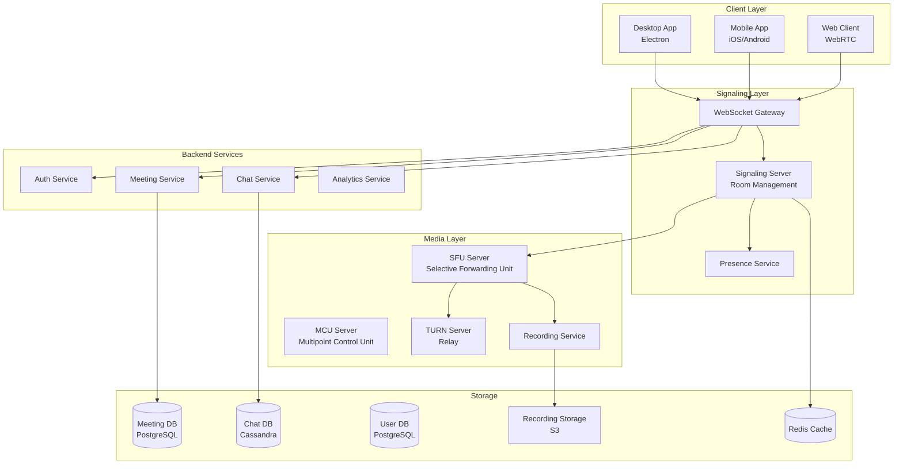

# Zoom: Low-Level Design (LLD)

## Problem Statement

**Context**: Design a video conferencing system like Zoom that supports real-time video/audio communication, screen sharing, chat, and recording.

**Requirements**:
- Real-time video/audio streaming (1-1000 participants)
- Screen sharing
- Text chat
- Meeting recording
- Virtual backgrounds
- Breakout rooms
- Waiting room
- Host controls (mute, remove participant)
- Low latency (< 150ms)
- High availability

**Constraints**:
- Video quality: 720p/1080p
- Audio quality: 48kHz
- Bandwidth: adaptive (100 Kbps - 3 Mbps)
- Concurrent meetings: 1M+
- Max participants per meeting: 1000
- Recording storage: scalable

---

## Solution Architecture



---

## Core Components

### 1. Signaling Server (WebSocket)

```javascript
const WebSocket = require('ws');
const Redis = require('ioredis');

class SignalingServer {
    constructor() {
        this.wss = new WebSocket.Server({ port: 8080 });
        this.redis = new Redis();
        this.rooms = new Map(); // roomId -> Set of participants
        this.connections = new Map(); // userId -> WebSocket
        
        this.setupWebSocketServer();
    }
    
    setupWebSocketServer() {
        this.wss.on('connection', (ws, req) => {
            const userId = this.authenticateUser(req);
            
            if (!userId) {
                ws.close(1008, 'Unauthorized');
                return;
            }
            
            this.connections.set(userId, ws);
            
            ws.on('message', async (message) => {
                await this.handleMessage(userId, JSON.parse(message));
            });
            
            ws.on('close', () => {
                this.handleDisconnect(userId);
            });
        });
    }
    
    async handleMessage(userId, message) {
        const { type, payload } = message;
        
        switch (type) {
            case 'JOIN_ROOM':
                await this.handleJoinRoom(userId, payload);
                break;
                
            case 'LEAVE_ROOM':
                await this.handleLeaveRoom(userId, payload);
                break;
                
            case 'OFFER':
            case 'ANSWER':
            case 'ICE_CANDIDATE':
                await this.handleWebRTCSignaling(userId, message);
                break;
                
            case 'CHAT_MESSAGE':
                await this.handleChatMessage(userId, payload);
                break;
                
            case 'MUTE_AUDIO':
            case 'MUTE_VIDEO':
                await this.handleMediaControl(userId, message);
                break;
                
            case 'SCREEN_SHARE':
                await this.handleScreenShare(userId, payload);
                break;
        }
    }
    
    async handleJoinRoom(userId, { roomId, userName, isHost }) {
        // Check if room exists
        const room = await this.getRoomInfo(roomId);
        
        if (!room) {
            this.sendToUser(userId, {
                type: 'ERROR',
                payload: { message: 'Room not found' }
            });
            return;
        }
        
        // Check waiting room
        if (room.hasWaitingRoom && !isHost) {
            await this.addToWaitingRoom(roomId, userId, userName);
            return;
        }
        
        // Add to room
        if (!this.rooms.has(roomId)) {
            this.rooms.set(roomId, new Set());
        }
        
        this.rooms.get(roomId).add(userId);
        
        // Get existing participants
        const participants = await this.getParticipants(roomId);
        
        // Notify user about existing participants
        this.sendToUser(userId, {
            type: 'ROOM_JOINED',
            payload: {
                roomId,
                participants: participants.map(p => ({
                    userId: p.userId,
                    userName: p.userName,
                    isHost: p.isHost,
                    audioMuted: p.audioMuted,
                    videoMuted: p.videoMuted
                }))
            }
        });
        
        // Notify other participants
        this.broadcastToRoom(roomId, {
            type: 'PARTICIPANT_JOINED',
            payload: { userId, userName, isHost }
        }, userId);
        
        // Save to Redis
        await this.redis.sadd(`room:${roomId}:participants`, userId);
        await this.redis.hset(`participant:${userId}`, {
            roomId,
            userName,
            isHost,
            joinedAt: Date.now()
        });
    }
    
    async handleWebRTCSignaling(userId, message) {
        const { type, payload } = message;
        const { targetUserId, sdp, candidate } = payload;
        
        // Forward signaling message to target user
        this.sendToUser(targetUserId, {
            type,
            payload: {
                fromUserId: userId,
                sdp,
                candidate
            }
        });
    }
    
    async handleScreenShare(userId, { roomId, isSharing }) {
        // Notify all participants
        this.broadcastToRoom(roomId, {
            type: 'SCREEN_SHARE_STARTED',
            payload: { userId, isSharing }
        });
        
        // Update participant state
        await this.redis.hset(`participant:${userId}`, 'screenSharing', isSharing);
    }
    
    sendToUser(userId, message) {
        const ws = this.connections.get(userId);
        if (ws && ws.readyState === WebSocket.OPEN) {
            ws.send(JSON.stringify(message));
        }
    }
    
    broadcastToRoom(roomId, message, excludeUserId = null) {
        const participants = this.rooms.get(roomId);
        
        if (!participants) return;
        
        for (const userId of participants) {
            if (userId !== excludeUserId) {
                this.sendToUser(userId, message);
            }
        }
    }
    
    async handleDisconnect(userId) {
        const participant = await this.redis.hgetall(`participant:${userId}`);
        
        if (participant.roomId) {
            await this.handleLeaveRoom(userId, { roomId: participant.roomId });
        }
        
        this.connections.delete(userId);
    }
}
```

### 2. SFU (Selective Forwarding Unit)

```javascript
const mediasoup = require('mediasoup');

class SFUServer {
    constructor() {
        this.workers = [];
        this.routers = new Map(); // roomId -> Router
        this.transports = new Map(); // transportId -> Transport
        this.producers = new Map(); // producerId -> Producer
        this.consumers = new Map(); // consumerId -> Consumer
        
        this.initializeWorkers();
    }
    
    async initializeWorkers() {
        const numWorkers = require('os').cpus().length;
        
        for (let i = 0; i < numWorkers; i++) {
            const worker = await mediasoup.createWorker({
                logLevel: 'warn',
                rtcMinPort: 10000 + (i * 1000),
                rtcMaxPort: 10000 + ((i + 1) * 1000) - 1
            });
            
            this.workers.push(worker);
        }
    }
    
    async createRouter(roomId) {
        // Round-robin worker selection
        const worker = this.workers[this.routers.size % this.workers.length];
        
        const router = await worker.createRouter({
            mediaCodecs: [
                {
                    kind: 'audio',
                    mimeType: 'audio/opus',
                    clockRate: 48000,
                    channels: 2
                },
                {
                    kind: 'video',
                    mimeType: 'video/VP8',
                    clockRate: 90000,
                    parameters: {
                        'x-google-start-bitrate': 1000
                    }
                },
                {
                    kind: 'video',
                    mimeType: 'video/H264',
                    clockRate: 90000,
                    parameters: {
                        'packetization-mode': 1,
                        'profile-level-id': '42e01f',
                        'level-asymmetry-allowed': 1
                    }
                }
            ]
        });
        
        this.routers.set(roomId, router);
        
        return router;
    }
    
    async createWebRtcTransport(roomId, userId) {
        const router = this.routers.get(roomId) || await this.createRouter(roomId);
        
        const transport = await router.createWebRtcTransport({
            listenIps: [
                { ip: '0.0.0.0', announcedIp: process.env.PUBLIC_IP }
            ],
            enableUdp: true,
            enableTcp: true,
            preferUdp: true
        });
        
        this.transports.set(transport.id, transport);
        
        return {
            id: transport.id,
            iceParameters: transport.iceParameters,
            iceCandidates: transport.iceCandidates,
            dtlsParameters: transport.dtlsParameters
        };
    }
    
    async produce(transportId, kind, rtpParameters) {
        const transport = this.transports.get(transportId);
        
        if (!transport) {
            throw new Error('Transport not found');
        }
        
        const producer = await transport.produce({
            kind,
            rtpParameters
        });
        
        this.producers.set(producer.id, producer);
        
        // Notify other participants to consume this producer
        await this.notifyNewProducer(producer);
        
        return { id: producer.id };
    }
    
    async consume(transportId, producerId, rtpCapabilities) {
        const transport = this.transports.get(transportId);
        const producer = this.producers.get(producerId);
        
        if (!transport || !producer) {
            throw new Error('Transport or Producer not found');
        }
        
        const router = transport.appData.router;
        
        if (!router.canConsume({ producerId, rtpCapabilities })) {
            throw new Error('Cannot consume');
        }
        
        const consumer = await transport.consume({
            producerId,
            rtpCapabilities,
            paused: true // Start paused, resume after client is ready
        });
        
        this.consumers.set(consumer.id, consumer);
        
        return {
            id: consumer.id,
            producerId,
            kind: consumer.kind,
            rtpParameters: consumer.rtpParameters
        };
    }
    
    async notifyNewProducer(producer) {
        const roomId = producer.appData.roomId;
        const userId = producer.appData.userId;
        
        // Get all participants in room
        const participants = await this.getParticipants(roomId);
        
        // Notify each participant to consume this producer
        for (const participant of participants) {
            if (participant.userId !== userId) {
                this.signaling.sendToUser(participant.userId, {
                    type: 'NEW_PRODUCER',
                    payload: {
                        producerId: producer.id,
                        userId,
                        kind: producer.kind
                    }
                });
            }
        }
    }
}
```

### 3. Meeting Service

```javascript
class MeetingService {
    constructor(db, redis) {
        this.db = db;
        this.redis = redis;
    }
    
    async createMeeting(hostId, meetingDetails) {
        const {
            title,
            scheduledTime,
            duration,
            password,
            waitingRoomEnabled,
            recordingEnabled
        } = meetingDetails;
        
        // Generate meeting ID
        const meetingId = this.generateMeetingId();
        
        // Save to database
        await this.db.query(`
            INSERT INTO meetings 
            (meeting_id, host_id, title, scheduled_time, duration, 
             password, waiting_room_enabled, recording_enabled, created_at)
            VALUES ($1, $2, $3, $4, $5, $6, $7, $8, NOW())
        `, [meetingId, hostId, title, scheduledTime, duration, 
            password, waitingRoomEnabled, recordingEnabled]);
        
        // Cache meeting info
        await this.redis.hset(`meeting:${meetingId}`, {
            hostId,
            title,
            password,
            waitingRoomEnabled,
            recordingEnabled
        });
        
        return { meetingId };
    }
    
    async joinMeeting(userId, meetingId, password) {
        // Get meeting info
        const meeting = await this.getMeetingInfo(meetingId);
        
        if (!meeting) {
            throw new Error('Meeting not found');
        }
        
        // Verify password
        if (meeting.password && meeting.password !== password) {
            throw new Error('Invalid password');
        }
        
        // Check if meeting is active
        const isActive = await this.redis.get(`meeting:${meetingId}:active`);
        
        if (!isActive && userId !== meeting.hostId) {
            throw new Error('Meeting not started');
        }
        
        // Add to participants
        await this.redis.sadd(`meeting:${meetingId}:participants`, userId);
        
        return { success: true };
    }
    
    async startRecording(meetingId, hostId) {
        // Verify host
        const meeting = await this.getMeetingInfo(meetingId);
        
        if (meeting.hostId !== hostId) {
            throw new Error('Only host can start recording');
        }
        
        // Start recording service
        const recordingId = await this.recordingService.startRecording(meetingId);
        
        // Update meeting
        await this.db.query(`
            UPDATE meetings 
            SET recording_id = $1, recording_started_at = NOW()
            WHERE meeting_id = $2
        `, [recordingId, meetingId]);
        
        return { recordingId };
    }
    
    generateMeetingId() {
        // Generate 11-digit meeting ID (like Zoom)
        return Math.floor(10000000000 + Math.random() * 90000000000).toString();
    }
}
```

### 4. Recording Service

```javascript
const ffmpeg = require('fluent-ffmpeg');
const AWS = require('aws-sdk');

class RecordingService {
    constructor() {
        this.s3 = new AWS.S3();
        this.activeRecordings = new Map();
    }
    
    async startRecording(meetingId) {
        const recordingId = uuidv4();
        const outputPath = `/tmp/recordings/${recordingId}`;
        
        // Create recording session
        const recording = {
            recordingId,
            meetingId,
            startTime: Date.now(),
            outputPath,
            streams: []
        };
        
        this.activeRecordings.set(recordingId, recording);
        
        return recordingId;
    }
    
    async addStream(recordingId, streamInfo) {
        const recording = this.activeRecordings.get(recordingId);
        
        if (!recording) {
            throw new Error('Recording not found');
        }
        
        const { userId, kind, rtpParameters } = streamInfo;
        
        // Create FFmpeg process for this stream
        const ffmpegProcess = ffmpeg()
            .input(`rtp://localhost:${rtpParameters.port}`)
            .inputFormat('rtp')
            .videoCodec('libx264')
            .audioCodec('aac')
            .output(`${recording.outputPath}/${userId}_${kind}.mp4`)
            .on('end', () => {
                console.log(`Stream recording completed: ${userId}_${kind}`);
            })
            .on('error', (err) => {
                console.error(`Recording error: ${err.message}`);
            });
        
        ffmpegProcess.run();
        
        recording.streams.push({
            userId,
            kind,
            ffmpegProcess
        });
    }
    
    async stopRecording(recordingId) {
        const recording = this.activeRecordings.get(recordingId);
        
        if (!recording) {
            throw new Error('Recording not found');
        }
        
        // Stop all FFmpeg processes
        for (const stream of recording.streams) {
            stream.ffmpegProcess.kill('SIGINT');
        }
        
        // Merge all streams into single video
        const mergedPath = await this.mergeStreams(recording);
        
        // Upload to S3
        const s3Key = await this.uploadToS3(mergedPath, recordingId);
        
        // Cleanup
        this.activeRecordings.delete(recordingId);
        
        return { recordingId, s3Key };
    }
    
    async mergeStreams(recording) {
        const outputPath = `${recording.outputPath}/merged.mp4`;
        
        // Create complex filter for merging video/audio streams
        const ffmpegProcess = ffmpeg();
        
        // Add all input streams
        for (const stream of recording.streams) {
            ffmpegProcess.input(`${recording.outputPath}/${stream.userId}_${stream.kind}.mp4`);
        }
        
        // Merge with grid layout
        ffmpegProcess
            .complexFilter([
                // Create grid layout
                '[0:v][1:v]hstack=inputs=2[top]',
                '[2:v][3:v]hstack=inputs=2[bottom]',
                '[top][bottom]vstack=inputs=2[v]',
                // Mix audio
                '[0:a][1:a][2:a][3:a]amix=inputs=4[a]'
            ])
            .map('[v]')
            .map('[a]')
            .output(outputPath)
            .run();
        
        return outputPath;
    }
    
    async uploadToS3(filePath, recordingId) {
        const fileStream = fs.createReadStream(filePath);
        const s3Key = `recordings/${recordingId}.mp4`;
        
        await this.s3.upload({
            Bucket: process.env.RECORDINGS_BUCKET,
            Key: s3Key,
            Body: fileStream,
            ContentType: 'video/mp4'
        }).promise();
        
        return s3Key;
    }
}
```

### 5. Chat Service

```javascript
class ChatService {
    constructor(cassandra, redis) {
        this.cassandra = cassandra;
        this.redis = redis;
    }
    
    async sendMessage(meetingId, userId, message) {
        const messageId = uuidv4();
        const timestamp = Date.now();
        
        // Save to Cassandra
        await this.cassandra.execute(`
            INSERT INTO chat_messages 
            (message_id, meeting_id, user_id, content, timestamp)
            VALUES (?, ?, ?, ?, ?)
        `, [messageId, meetingId, userId, message, timestamp]);
        
        // Publish to Redis pub/sub
        await this.redis.publish(`meeting:${meetingId}:chat`, JSON.stringify({
            messageId,
            userId,
            content: message,
            timestamp
        }));
        
        return { messageId };
    }
    
    async getChatHistory(meetingId, limit = 100) {
        const result = await this.cassandra.execute(`
            SELECT message_id, user_id, content, timestamp
            FROM chat_messages
            WHERE meeting_id = ?
            ORDER BY timestamp DESC
            LIMIT ?
        `, [meetingId, limit]);
        
        return result.rows.reverse();
    }
}
```

---

## Database Schema

```sql
-- Meetings
CREATE TABLE meetings (
    meeting_id VARCHAR(20) PRIMARY KEY,
    host_id UUID NOT NULL,
    title VARCHAR(255),
    scheduled_time TIMESTAMP,
    duration INTEGER, -- in minutes
    password VARCHAR(50),
    waiting_room_enabled BOOLEAN DEFAULT FALSE,
    recording_enabled BOOLEAN DEFAULT FALSE,
    recording_id UUID,
    recording_started_at TIMESTAMP,
    created_at TIMESTAMP DEFAULT NOW()
);

CREATE INDEX idx_meetings_host ON meetings(host_id);

-- Participants
CREATE TABLE participants (
    participant_id UUID PRIMARY KEY DEFAULT gen_random_uuid(),
    meeting_id VARCHAR(20) REFERENCES meetings(meeting_id),
    user_id UUID NOT NULL,
    user_name VARCHAR(100),
    joined_at TIMESTAMP DEFAULT NOW(),
    left_at TIMESTAMP,
    duration INTEGER -- in seconds
);

CREATE INDEX idx_participants_meeting ON participants(meeting_id);

-- Cassandra schema for chat
CREATE TABLE chat_messages (
    message_id UUID,
    meeting_id TEXT,
    user_id UUID,
    content TEXT,
    timestamp BIGINT,
    PRIMARY KEY (meeting_id, timestamp, message_id)
) WITH CLUSTERING ORDER BY (timestamp DESC);
```

---

## Performance Optimizations

### 1. Adaptive Bitrate

```javascript
class AdaptiveBitrate {
    constructor() {
        this.targetBitrates = {
            '360p': 500000,   // 500 Kbps
            '720p': 1500000,  // 1.5 Mbps
            '1080p': 3000000  // 3 Mbps
        };
    }
    
    adjustBitrate(networkStats) {
        const { bandwidth, packetLoss, rtt } = networkStats;
        
        // Select quality based on available bandwidth
        if (bandwidth > 2500000 && packetLoss < 2 && rtt < 100) {
            return this.targetBitrates['1080p'];
        } else if (bandwidth > 1000000 && packetLoss < 5 && rtt < 150) {
            return this.targetBitrates['720p'];
        } else {
            return this.targetBitrates['360p'];
        }
    }
}
```

### 2. Simulcast (Multiple Quality Streams)

```javascript
// Client sends multiple quality streams
const producer = await transport.produce({
    kind: 'video',
    rtpParameters,
    encodings: [
        { maxBitrate: 500000, scaleResolutionDownBy: 4 },  // Low
        { maxBitrate: 1500000, scaleResolutionDownBy: 2 }, // Medium
        { maxBitrate: 3000000 }                             // High
    ]
});
```

---

## Scalability

| Component | Strategy | Scale |
|-----------|----------|-------|
| Signaling | WebSocket cluster | 1M concurrent connections |
| SFU | Horizontal scaling | 1000 participants/meeting |
| Database | Sharding by meeting_id | 1M concurrent meetings |
| Recording | Distributed workers | 100K recordings/day |

---

## Interview Talking Points

1. **WebRTC Architecture**: Peer-to-peer vs SFU vs MCU
2. **Scalability**: How to handle 1000 participants in a meeting
3. **Low Latency**: Optimizations for < 150ms latency
4. **Recording**: Challenges in recording multi-stream meetings
5. **Network Resilience**: Handling packet loss, jitter, bandwidth variations

---

## Next Steps

- Learn [Real-time Systems](../06_Twitter/06_Twitter_Timeline_System.md)
- Study [WebSocket Architecture](../09_Logging_System/09_Logging_System.md)
- Master [Video Streaming](../03_Zombie_Crawler_System/03_Zombie_Crawler_System.md)
