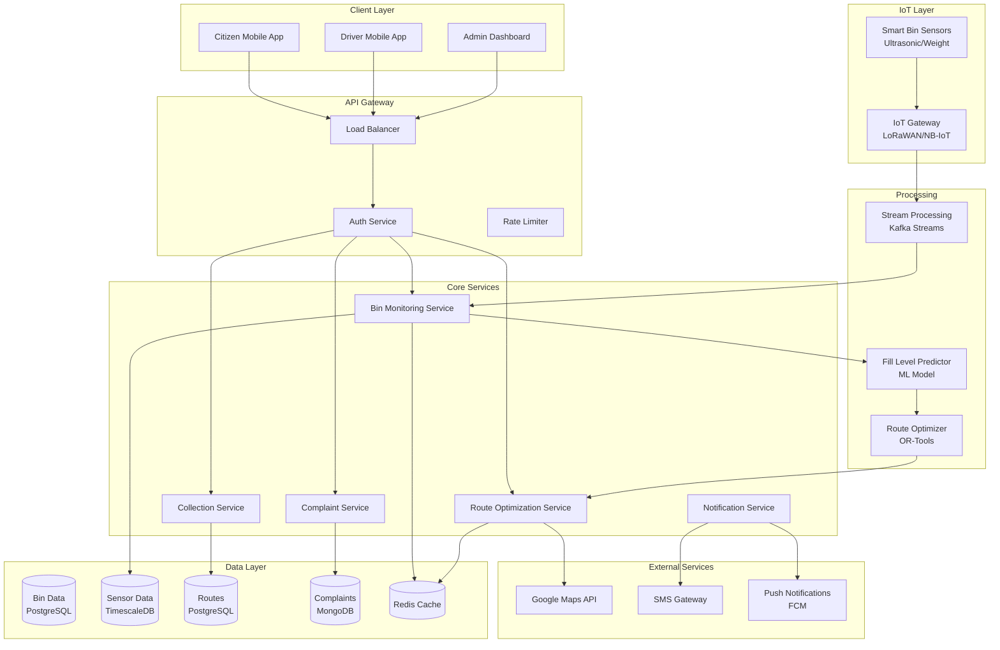

# Waste Management App: System Design

## Problem Statement

**Context**: Design a smart waste management system for cities that optimizes garbage collection routes, tracks bin fill levels, and manages waste disposal efficiently.

**Requirements**:
- Real-time bin fill level monitoring (IoT sensors)
- Optimized collection routes
- Citizen complaint/request system
- Waste segregation tracking (wet, dry, hazardous)
- Collection scheduling and notifications
- Analytics dashboard for city officials
- Driver mobile app for collection
- Citizen mobile app for requests
- Scale to 100K+ bins, 1M+ citizens

**Constraints**:
- IoT sensors update every 30 minutes
- Route optimization in < 5 seconds
- Support offline mode for drivers
- Real-time notifications
- Data retention: 2 years

---

## Solution Architecture



---

## Core Components

### 1. IoT Sensor Integration

```javascript
const mqtt = require('mqtt');
const Kafka = require('kafkajs');

class IoTSensorService {
    constructor() {
        this.mqttClient = mqtt.connect(process.env.MQTT_BROKER);
        this.kafka = new Kafka({ brokers: [process.env.KAFKA_BROKER] });
        this.producer = this.kafka.producer();
    }
    
    async start() {
        await this.producer.connect();
        
        // Subscribe to sensor topics
        this.mqttClient.subscribe('bins/+/sensor', (err) => {
            if (err) {
                console.error('MQTT subscription error:', err);
            }
        });
        
        // Handle incoming sensor data
        this.mqttClient.on('message', async (topic, message) => {
            const binId = topic.split('/')[1];
            const sensorData = JSON.parse(message.toString());
            
            await this.processSensorData(binId, sensorData);
        });
    }
    
    async processSensorData(binId, data) {
        const {
            fillLevel,      // 0-100%
            weight,         // in kg
            temperature,    // in celsius
            timestamp,
            batteryLevel
        } = data;
        
        // Validate data
        if (fillLevel < 0 || fillLevel > 100) {
            console.error(`Invalid fill level for bin ${binId}: ${fillLevel}`);
            return;
        }
        
        // Calculate fill percentage
        const fillPercentage = this.calculateFillPercentage(fillLevel, weight);
        
        // Publish to Kafka for processing
        await this.producer.send({
            topic: 'sensor-data',
            messages: [{
                key: binId,
                value: JSON.stringify({
                    binId,
                    fillPercentage,
                    weight,
                    temperature,
                    batteryLevel,
                    timestamp: timestamp || Date.now()
                })
            }]
        });
        
        // Check if bin needs immediate attention
        if (fillPercentage >= 80) {
            await this.triggerCollectionAlert(binId, fillPercentage);
        }
        
        // Check battery level
        if (batteryLevel < 20) {
            await this.triggerMaintenanceAlert(binId, 'LOW_BATTERY');
        }
    }
    
    calculateFillPercentage(distance, weight) {
        // Ultrasonic sensor: distance from sensor to waste
        // Lower distance = higher fill level
        const binHeight = 100; // cm
        const fillHeight = binHeight - distance;
        const fillPercentage = (fillHeight / binHeight) * 100;
        
        return Math.max(0, Math.min(100, fillPercentage));
    }
    
    async triggerCollectionAlert(binId, fillPercentage) {
        await this.producer.send({
            topic: 'collection-alerts',
            messages: [{
                key: binId,
                value: JSON.stringify({
                    binId,
                    fillPercentage,
                    priority: fillPercentage >= 90 ? 'HIGH' : 'MEDIUM',
                    timestamp: Date.now()
                })
            }]
        });
    }
}
```

### 2. Bin Monitoring Service

```javascript
class BinMonitoringService {
    constructor(db, redis) {
        this.db = db;
        this.redis = redis;
    }
    
    // Save sensor reading
    async saveSensorReading(binId, reading) {
        const {
            fillPercentage,
            weight,
            temperature,
            batteryLevel,
            timestamp
        } = reading;
        
        // Save to TimescaleDB (time-series data)
        await this.db.query(`
            INSERT INTO sensor_readings 
            (bin_id, fill_percentage, weight, temperature, 
             battery_level, timestamp)
            VALUES ($1, $2, $3, $4, $5, to_timestamp($6/1000.0))
        `, [binId, fillPercentage, weight, temperature, 
            batteryLevel, timestamp]);
        
        // Update current bin status in cache
        await this.redis.hset(`bin:${binId}`, {
            fillPercentage,
            weight,
            lastUpdated: timestamp
        });
        
        // Update bin status in PostgreSQL
        await this.db.query(`
            UPDATE bins
            SET current_fill_percentage = $1,
                current_weight = $2,
                last_sensor_update = to_timestamp($3/1000.0),
                status = $4
            WHERE bin_id = $5
        `, [fillPercentage, weight, timestamp, 
            this.getBinStatus(fillPercentage), binId]);
    }
    
    getBinStatus(fillPercentage) {
        if (fillPercentage >= 90) return 'CRITICAL';
        if (fillPercentage >= 80) return 'HIGH';
        if (fillPercentage >= 50) return 'MEDIUM';
        return 'LOW';
    }
    
    // Get bins needing collection
    async getBinsForCollection(threshold = 80) {
        const result = await this.db.query(`
            SELECT 
                b.bin_id,
                b.location,
                b.current_fill_percentage,
                b.waste_type,
                b.capacity,
                ST_X(b.location::geometry) as longitude,
                ST_Y(b.location::geometry) as latitude
            FROM bins b
            WHERE b.current_fill_percentage >= $1
            AND b.status != 'COLLECTED'
            ORDER BY b.current_fill_percentage DESC
        `, [threshold]);
        
        return result.rows;
    }
    
    // Predict fill time using ML
    async predictFillTime(binId) {
        // Get historical data
        const history = await this.db.query(`
            SELECT fill_percentage, timestamp
            FROM sensor_readings
            WHERE bin_id = $1
            AND timestamp >= NOW() - INTERVAL '7 days'
            ORDER BY timestamp ASC
        `, [binId]);
        
        if (history.rows.length < 10) {
            return null; // Not enough data
        }
        
        // Calculate fill rate (percentage per hour)
        const readings = history.rows;
        const firstReading = readings[0];
        const lastReading = readings[readings.length - 1];
        
        const timeDiff = (lastReading.timestamp - firstReading.timestamp) / (1000 * 60 * 60); // hours
        const fillDiff = lastReading.fill_percentage - firstReading.fill_percentage;
        const fillRate = fillDiff / timeDiff;
        
        // Predict when bin will be full (100%)
        const currentFill = lastReading.fill_percentage;
        const remainingFill = 100 - currentFill;
        const hoursToFull = remainingFill / fillRate;
        
        return {
            predictedFullTime: new Date(Date.now() + hoursToFull * 60 * 60 * 1000),
            fillRate,
            confidence: this.calculateConfidence(readings)
        };
    }
    
    calculateConfidence(readings) {
        // Calculate variance in fill rate
        // Lower variance = higher confidence
        const fillRates = [];
        
        for (let i = 1; i < readings.length; i++) {
            const timeDiff = (readings[i].timestamp - readings[i-1].timestamp) / (1000 * 60 * 60);
            const fillDiff = readings[i].fill_percentage - readings[i-1].fill_percentage;
            fillRates.push(fillDiff / timeDiff);
        }
        
        const mean = fillRates.reduce((a, b) => a + b, 0) / fillRates.length;
        const variance = fillRates.reduce((sum, rate) => sum + Math.pow(rate - mean, 2), 0) / fillRates.length;
        
        // Convert variance to confidence (0-1)
        return Math.max(0, 1 - (variance / 10));
    }
}
```

### 3. Route Optimization Service

```javascript
const { RoutingClient } = require('@google-cloud/routing');
const orTools = require('or-tools');

class RouteOptimizationService {
    constructor() {
        this.routingClient = new RoutingClient();
    }
    
    // Optimize collection routes using Vehicle Routing Problem (VRP)
    async optimizeRoutes(bins, vehicles) {
        // Prepare data for VRP
        const locations = this.prepareLocations(bins);
        const distanceMatrix = await this.calculateDistanceMatrix(locations);
        
        // Solve VRP using OR-Tools
        const solution = await this.solveVRP({
            locations,
            distanceMatrix,
            vehicles,
            bins
        });
        
        return solution;
    }
    
    prepareLocations(bins) {
        // Depot (starting point) + bin locations
        const depot = { lat: 28.6139, lng: 77.2090 }; // Example: Delhi
        
        return [
            depot,
            ...bins.map(bin => ({
                lat: bin.latitude,
                lng: bin.longitude,
                binId: bin.bin_id,
                fillPercentage: bin.current_fill_percentage,
                wasteType: bin.waste_type
            }))
        ];
    }
    
    async calculateDistanceMatrix(locations) {
        const origins = locations.map(loc => ({ latitude: loc.lat, longitude: loc.lng }));
        const destinations = origins;
        
        const request = {
            origins,
            destinations,
            travelMode: 'DRIVE',
            routingPreference: 'TRAFFIC_AWARE'
        };
        
        const [response] = await this.routingClient.computeRouteMatrix(request);
        
        // Convert to 2D matrix
        const matrix = [];
        const n = locations.length;
        
        for (let i = 0; i < n; i++) {
            matrix[i] = [];
            for (let j = 0; j < n; j++) {
                const index = i * n + j;
                matrix[i][j] = response[index]?.duration?.seconds || 0;
            }
        }
        
        return matrix;
    }
    
    async solveVRP(data) {
        const { locations, distanceMatrix, vehicles, bins } = data;
        
        // Create routing model
        const manager = new orTools.RoutingIndexManager(
            locations.length,
            vehicles.length,
            0 // depot index
        );
        
        const routing = new orTools.RoutingModel(manager);
        
        // Distance callback
        const transitCallback = (fromIndex, toIndex) => {
            const fromNode = manager.indexToNode(fromIndex);
            const toNode = manager.indexToNode(toIndex);
            return distanceMatrix[fromNode][toNode];
        };
        
        const transitCallbackIndex = routing.registerTransitCallback(transitCallback);
        routing.setArcCostEvaluatorOfAllVehicles(transitCallbackIndex);
        
        // Add capacity constraint
        const demands = locations.map((loc, i) => {
            if (i === 0) return 0; // depot
            const bin = bins[i - 1];
            return Math.ceil(bin.current_fill_percentage / 10); // units
        });
        
        const demandCallbackIndex = routing.registerUnaryTransitCallback(
            (index) => demands[manager.indexToNode(index)]
        );
        
        routing.addDimensionWithVehicleCapacity(
            demandCallbackIndex,
            0, // null capacity slack
            vehicles.map(v => v.capacity),
            true, // start cumul to zero
            'Capacity'
        );
        
        // Solve
        const searchParameters = orTools.DefaultRoutingSearchParameters();
        searchParameters.setFirstSolutionStrategy(
            orTools.FirstSolutionStrategy.PATH_CHEAPEST_ARC
        );
        
        const solution = routing.solveWithParameters(searchParameters);
        
        // Extract routes
        return this.extractRoutes(solution, routing, manager, locations, bins);
    }
    
    extractRoutes(solution, routing, manager, locations, bins) {
        const routes = [];
        
        for (let vehicleId = 0; vehicleId < routing.vehicles(); vehicleId++) {
            const route = {
                vehicleId,
                stops: [],
                totalDistance: 0,
                totalTime: 0
            };
            
            let index = routing.start(vehicleId);
            
            while (!routing.isEnd(index)) {
                const nodeIndex = manager.indexToNode(index);
                
                if (nodeIndex !== 0) { // Skip depot
                    const location = locations[nodeIndex];
                    route.stops.push({
                        binId: location.binId,
                        location: { lat: location.lat, lng: location.lng },
                        fillPercentage: location.fillPercentage,
                        wasteType: location.wasteType
                    });
                }
                
                const previousIndex = index;
                index = solution.value(routing.nextVar(index));
                route.totalDistance += routing.getArcCostForVehicle(previousIndex, index, vehicleId);
            }
            
            if (route.stops.length > 0) {
                routes.push(route);
            }
        }
        
        return routes;
    }
}
```

### 4. Complaint Service

```javascript
class ComplaintService {
    constructor(db, notificationService) {
        this.db = db;
        this.notificationService = notificationService;
    }
    
    async submitComplaint(userId, complaint) {
        const {
            type,           // MISSED_COLLECTION, OVERFLOWING_BIN, ILLEGAL_DUMPING
            description,
            location,
            photos,
            binId
        } = complaint;
        
        const complaintId = uuidv4();
        
        // Save complaint
        await this.db.collection('complaints').insertOne({
            complaintId,
            userId,
            type,
            description,
            location: {
                type: 'Point',
                coordinates: [location.longitude, location.latitude]
            },
            photos,
            binId,
            status: 'OPEN',
            priority: this.calculatePriority(type),
            createdAt: new Date(),
            updatedAt: new Date()
        });
        
        // Assign to nearest supervisor
        await this.assignComplaint(complaintId, location);
        
        // Send notification to user
        await this.notificationService.send(userId, {
            title: 'Complaint Registered',
            body: `Your complaint #${complaintId} has been registered and assigned.`,
            data: { complaintId, type: 'COMPLAINT_REGISTERED' }
        });
        
        return { complaintId };
    }
    
    calculatePriority(type) {
        const priorities = {
            'ILLEGAL_DUMPING': 'HIGH',
            'OVERFLOWING_BIN': 'HIGH',
            'MISSED_COLLECTION': 'MEDIUM',
            'DAMAGED_BIN': 'MEDIUM',
            'OTHER': 'LOW'
        };
        
        return priorities[type] || 'LOW';
    }
    
    async assignComplaint(complaintId, location) {
        // Find nearest supervisor
        const supervisor = await this.db.collection('supervisors').findOne({
            location: {
                $near: {
                    $geometry: {
                        type: 'Point',
                        coordinates: [location.longitude, location.latitude]
                    },
                    $maxDistance: 5000 // 5km
                }
            },
            status: 'ACTIVE'
        });
        
        if (supervisor) {
            await this.db.collection('complaints').updateOne(
                { complaintId },
                {
                    $set: {
                        assignedTo: supervisor.supervisorId,
                        assignedAt: new Date()
                    }
                }
            );
            
            // Notify supervisor
            await this.notificationService.send(supervisor.userId, {
                title: 'New Complaint Assigned',
                body: 'A new complaint has been assigned to you.',
                data: { complaintId, type: 'COMPLAINT_ASSIGNED' }
            });
        }
    }
    
    async updateComplaintStatus(complaintId, status, resolution) {
        await this.db.collection('complaints').updateOne(
            { complaintId },
            {
                $set: {
                    status,
                    resolution,
                    resolvedAt: status === 'RESOLVED' ? new Date() : null,
                    updatedAt: new Date()
                }
            }
        );
        
        // Notify user
        const complaint = await this.db.collection('complaints').findOne({ complaintId });
        
        await this.notificationService.send(complaint.userId, {
            title: 'Complaint Updated',
            body: `Your complaint #${complaintId} status: ${status}`,
            data: { complaintId, status, type: 'COMPLAINT_UPDATED' }
        });
    }
}
```

### 5. Collection Service (Driver App)

```javascript
class CollectionService {
    constructor(db, redis) {
        this.db = db;
        this.redis = redis;
    }
    
    // Get today's route for driver
    async getDriverRoute(driverId) {
        const route = await this.db.query(`
            SELECT 
                r.route_id,
                r.vehicle_id,
                r.scheduled_date,
                json_agg(
                    json_build_object(
                        'binId', rs.bin_id,
                        'sequence', rs.sequence,
                        'location', ST_AsGeoJSON(b.location)::json,
                        'fillPercentage', b.current_fill_percentage,
                        'wasteType', b.waste_type,
                        'status', rs.status
                    ) ORDER BY rs.sequence
                ) as stops
            FROM routes r
            JOIN route_stops rs ON r.route_id = rs.route_id
            JOIN bins b ON rs.bin_id = b.bin_id
            WHERE r.driver_id = $1
            AND r.scheduled_date = CURRENT_DATE
            AND r.status = 'IN_PROGRESS'
            GROUP BY r.route_id
        `, [driverId]);
        
        return route.rows[0];
    }
    
    // Mark bin as collected
    async markBinCollected(driverId, binId, collectionData) {
        const {
            weight,
            wasteType,
            photos,
            notes,
            timestamp
        } = collectionData;
        
        // Save collection record
        const collectionId = await this.db.query(`
            INSERT INTO collections 
            (bin_id, driver_id, weight, waste_type, photos, notes, collected_at)
            VALUES ($1, $2, $3, $4, $5, $6, to_timestamp($7/1000.0))
            RETURNING collection_id
        `, [binId, driverId, weight, wasteType, JSON.stringify(photos), 
            notes, timestamp]);
        
        // Update bin status
        await this.db.query(`
            UPDATE bins
            SET current_fill_percentage = 0,
                current_weight = 0,
                last_collection = to_timestamp($1/1000.0),
                status = 'COLLECTED'
            WHERE bin_id = $2
        `, [timestamp, binId]);
        
        // Update route stop status
        await this.db.query(`
            UPDATE route_stops
            SET status = 'COMPLETED',
                completed_at = to_timestamp($1/1000.0)
            WHERE bin_id = $2
            AND route_id IN (
                SELECT route_id FROM routes 
                WHERE driver_id = $3 
                AND scheduled_date = CURRENT_DATE
            )
        `, [timestamp, binId, driverId]);
        
        return { collectionId: collectionId.rows[0].collection_id };
    }
    
    // Update driver location (for real-time tracking)
    async updateDriverLocation(driverId, location) {
        await this.redis.geoadd('driver:locations', 
            location.longitude, 
            location.latitude, 
            driverId
        );
        
        await this.redis.hset(`driver:${driverId}`, {
            latitude: location.latitude,
            longitude: location.longitude,
            lastUpdated: Date.now()
        });
    }
}
```

---

## Database Schema

```sql
-- Bins table
CREATE TABLE bins (
    bin_id UUID PRIMARY KEY DEFAULT gen_random_uuid(),
    bin_code VARCHAR(50) UNIQUE NOT NULL,
    location GEOGRAPHY(POINT, 4326) NOT NULL,
    waste_type VARCHAR(20) NOT NULL, -- WET, DRY, HAZARDOUS, MIXED
    capacity INTEGER NOT NULL, -- in liters
    current_fill_percentage DECIMAL(5,2) DEFAULT 0,
    current_weight DECIMAL(10,2) DEFAULT 0,
    status VARCHAR(20) DEFAULT 'ACTIVE', -- ACTIVE, COLLECTED, MAINTENANCE, CRITICAL
    last_sensor_update TIMESTAMP,
    last_collection TIMESTAMP,
    created_at TIMESTAMP DEFAULT NOW()
);

CREATE INDEX idx_bins_location ON bins USING GIST(location);
CREATE INDEX idx_bins_status ON bins(status);
CREATE INDEX idx_bins_fill ON bins(current_fill_percentage DESC);

-- Sensor readings (TimescaleDB)
CREATE TABLE sensor_readings (
    bin_id UUID REFERENCES bins(bin_id),
    fill_percentage DECIMAL(5,2),
    weight DECIMAL(10,2),
    temperature DECIMAL(5,2),
    battery_level INTEGER,
    timestamp TIMESTAMPTZ NOT NULL
);

SELECT create_hypertable('sensor_readings', 'timestamp');
CREATE INDEX idx_sensor_bin_time ON sensor_readings(bin_id, timestamp DESC);

-- Routes
CREATE TABLE routes (
    route_id UUID PRIMARY KEY DEFAULT gen_random_uuid(),
    driver_id UUID NOT NULL,
    vehicle_id UUID NOT NULL,
    scheduled_date DATE NOT NULL,
    status VARCHAR(20) DEFAULT 'PENDING', -- PENDING, IN_PROGRESS, COMPLETED
    total_distance DECIMAL(10,2),
    estimated_duration INTEGER, -- in minutes
    created_at TIMESTAMP DEFAULT NOW()
);

CREATE INDEX idx_routes_driver_date ON routes(driver_id, scheduled_date);

-- Route stops
CREATE TABLE route_stops (
    stop_id UUID PRIMARY KEY DEFAULT gen_random_uuid(),
    route_id UUID REFERENCES routes(route_id),
    bin_id UUID REFERENCES bins(bin_id),
    sequence INTEGER NOT NULL,
    status VARCHAR(20) DEFAULT 'PENDING', -- PENDING, COMPLETED, SKIPPED
    completed_at TIMESTAMP
);

CREATE INDEX idx_stops_route ON route_stops(route_id, sequence);

-- Collections
CREATE TABLE collections (
    collection_id UUID PRIMARY KEY DEFAULT gen_random_uuid(),
    bin_id UUID REFERENCES bins(bin_id),
    driver_id UUID NOT NULL,
    weight DECIMAL(10,2),
    waste_type VARCHAR(20),
    photos JSONB,
    notes TEXT,
    collected_at TIMESTAMP DEFAULT NOW()
);

CREATE INDEX idx_collections_bin ON collections(bin_id, collected_at DESC);

-- MongoDB schema for complaints
{
    complaintId: UUID,
    userId: UUID,
    type: String,
    description: String,
    location: {
        type: "Point",
        coordinates: [longitude, latitude]
    },
    photos: [String],
    binId: UUID,
    status: String, // OPEN, IN_PROGRESS, RESOLVED, CLOSED
    priority: String, // LOW, MEDIUM, HIGH
    assignedTo: UUID,
    resolution: String,
    createdAt: Date,
    resolvedAt: Date
}

// Geospatial index
db.complaints.createIndex({ location: "2dsphere" });
db.complaints.createIndex({ status: 1, priority: -1 });
```

---

## Analytics Dashboard

```javascript
class AnalyticsService {
    async getDashboardMetrics(cityId, dateRange) {
        const metrics = await Promise.all([
            this.getTotalBins(cityId),
            this.getCollectionStats(cityId, dateRange),
            this.getFillLevelDistribution(cityId),
            this.getWasteSegregationStats(cityId, dateRange),
            this.getComplaintStats(cityId, dateRange)
        ]);
        
        return {
            totalBins: metrics[0],
            collectionStats: metrics[1],
            fillDistribution: metrics[2],
            segregation: metrics[3],
            complaints: metrics[4]
        };
    }
    
    async getCollectionStats(cityId, dateRange) {
        const result = await this.db.query(`
            SELECT 
                COUNT(*) as total_collections,
                SUM(weight) as total_waste_collected,
                AVG(weight) as avg_weight_per_bin,
                COUNT(DISTINCT driver_id) as active_drivers
            FROM collections
            WHERE collected_at BETWEEN $1 AND $2
        `, [dateRange.start, dateRange.end]);
        
        return result.rows[0];
    }
    
    async getFillLevelDistribution(cityId) {
        const result = await this.db.query(`
            SELECT 
                CASE 
                    WHEN current_fill_percentage >= 90 THEN 'CRITICAL'
                    WHEN current_fill_percentage >= 70 THEN 'HIGH'
                    WHEN current_fill_percentage >= 40 THEN 'MEDIUM'
                    ELSE 'LOW'
                END as fill_level,
                COUNT(*) as count
            FROM bins
            WHERE city_id = $1
            GROUP BY fill_level
        `, [cityId]);
        
        return result.rows;
    }
}
```

---

## Performance Metrics

| Metric | Target | Monitoring |
|--------|--------|------------|
| Sensor Data Latency | < 1 minute | IoT gateway to database |
| Route Optimization | < 5 seconds | VRP solver execution time |
| Collection Efficiency | > 85% | Bins collected vs scheduled |
| Fuel Savings | > 20% | Optimized vs traditional routes |
| Complaint Resolution | < 24 hours | Average time to resolve |

---

## Interview Talking Points

1. **IoT Integration**: MQTT for sensor data, real-time processing with Kafka
2. **Route Optimization**: Vehicle Routing Problem (VRP) with OR-Tools
3. **Scalability**: TimescaleDB for time-series data, geospatial indexing
4. **ML Predictions**: Fill level prediction for proactive scheduling
5. **Real-time Tracking**: Driver location tracking with Redis geospatial

---

## Next Steps

- Learn [Real-time Inventory Tracking](../20_Realtime_Inventory_Tracking/20_Realtime_Inventory_System.md)
- Study [IoT Systems](../05_Monitoring_Tool/05_Monitoring_Tool_System.md)
- Master [Route Optimization](../08_Load_Balancer/08_Load_Balancer_System.md)
