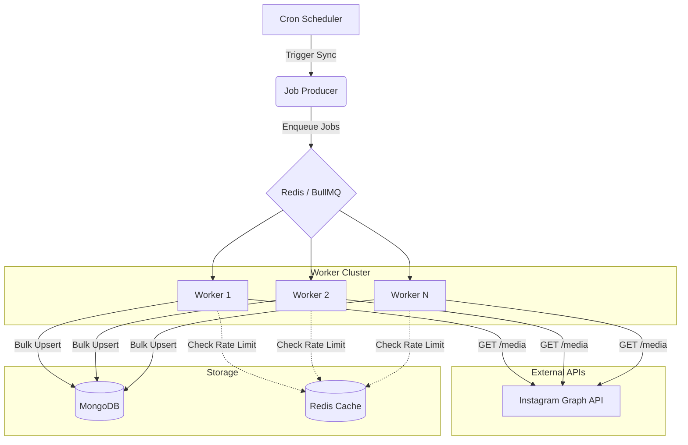
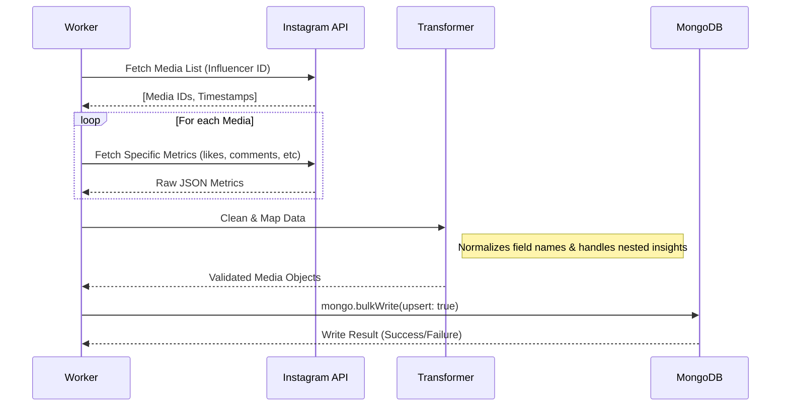

# Instagram ETL Pipeline: Visuals & Architecture

## System High-Level Architecture

## Data Transformation Flow

## Scalability Strategy (100k+ Influencers)

| Feature | Large Scale Handling |
| :--- | :--- |
| **API Throttling** | Distributed rate limiting via Redis (`rate-limiter-flexible`). |
| **Job Chunks** | Splitting 100k influencers into smaller batches (e.g., 500 per job). |
| **Worker Pools** | Deploying workers as K8s pods that auto-scale based on queue length. |
| **Database Throughput** | Using Sharded MongoDB or Indexed collections on `igId` and `ownerId`. |
| **Failure Recovery** | Using BullMQ dead-letter queues (DLQ) for manual inspection of repeated failures. |
