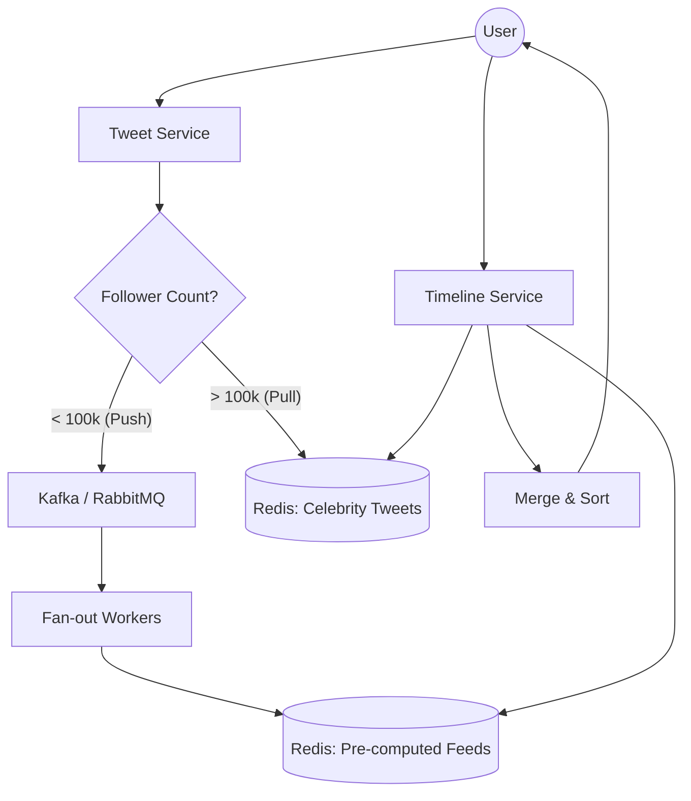

# System Design: Twitter Timeline (Backend Deep Dive)

## 🎯 Problem Statement

**Challenge**: Build a highly scalable news feed (Timeline) for millions of users.
**Core Conflict**: 
- **User A** follows **User B**.
- When User B tweets, it must appear in User A's feed instantly.
- **Celebrity Problem**: A user like Elon Musk has 150M+ followers. Pushing a tweet to 150M timelines simultaneously crashes databases and causes "Fan-out" bottlenecks.

---

## 🏗️ Architecture: Hybrid Fan-out (Push + Pull)



---

## 🛠️ Technical Implementation (Node.js/Redis)

### 1. The Fan-out Strategy
We categorize users into "Regular" and "Celebrities".

```javascript
// tweet_service.js
async function handleNewTweet(tweet) {
  const followerCount = await getFollowerCount(tweet.userId);
  
  if (followerCount > CELEBRITY_THRESHOLD) {
    // PULL MODEL: Just cache the tweet
    await redis.lpush(`celeb:tweets:${tweet.userId}`, JSON.stringify(tweet));
    await redis.ltrim(`celeb:tweets:${tweet.userId}`, 0, 1000); // Keep last 1000
  } else {
    // PUSH MODEL: Dispatch to workers for pre-computation
    await kafka.send('fanout-task', { tweetId: tweet.id, authorId: tweet.userId });
  }
}
```

### 2. Timeline Aggregation (The Hybrid Fetch)
When a user requests their feed, we merge pre-computed tweets with celebrity on-demand tweets.

```javascript
// timeline_service.js
async function getTimeline(userId) {
  // 1. Get pre-computed feed (Push data)
  const preComputedFeeds = await redis.zrevrange(`feed:${userId}`, 0, 100);
  
  // 2. Identify Celebrities followed
  const followedCelebs = await getFollowedCelebrities(userId);
  
  // 3. Pull from Celebrity caches (Pull data)
  const celebTweetsPromises = followedCelebs.map(celebId => 
    redis.lrange(`celeb:tweets:${celebId}`, 0, 50)
  );
  const celebTweets = (await Promise.all(celebTweetsPromises)).flat();

  // 4. Merge and Sort by Timestamp
  return [...preComputedFeeds, ...celebTweets]
    .sort((a, b) => b.timestamp - a.timestamp)
    .slice(0, 50);
}
```

---

## 🧠 Deep Dive: Advanced Backend Concepts & Scalability

### 1. Fan-out Strategy: Push vs. Pull Model
One of the most critical decisions in Twitter's backend is how to deliver tweets to millions of followers.

| Feature | **Push Model (Fan-out on Write)** | **Pull Model (Fan-out on Load)** |
| :--- | :--- | :--- |
| **Process** | Tweet is pushed to all follower feeds at write time. | Tweets are fetched from authors at read time. |
| **Pros** | Fast Reads: Feed is ready in Redis. | Fast Writes: Single DB/Cache insert. |
| **Cons** | Slow Writes: High-degree fan-out for big accounts. | Slow Reads: Merging hundreds of lists at runtime. |
| **Best For** | Regular users (< 100k followers). | Celebrities (> 1M followers). |

**The Hybrid Fix**: We use a **Pre-computed Cache** for regular users and an **On-demand Fetch** for celebrities. When a user opens their timeline, the system merges their pre-computed Redis list with the recent tweets from the celebrities they follow.

### 2. Failure Handling & Reliability
- **Kafka for Resilience**: Fan-out workers are decoupled using Kafka. If the Redis feed cache is down, workers retry until it's back, ensuring no "missing tweets" in the timeline.
- **Dead Letter Queues (DLQ)**: If a fan-out task fails repeatedly (e.g., malformed data), it's moved to a DLQ for manual inspection, preventing the main pipeline from stalling.
- **Idempotent Writes**: We use `ZADD` in Redis with the tweet ID as the member and timestamp as the score. This ensures that even if a worker retries the same task, the timeline doesn't show duplicate tweets.

### 3. Database Selection & Partitioning
- **Primary Data (PostgreSQL)**: Stores Users and Tweets. We shard by `userId` to distribute data across multiple nodes.
- **Timeline Cache (Redis)**: Uses **Redis Clusters** with LRU (Least Recently Used) eviction. We only keep the last 500-1000 tweets per user in memory to save costs.

---

## 📊 Back-of-the-envelope Estimation (The Math)

Let's assume **300 Million Daily Active Users (DAU)**.

- **Storage (Tweets)**:
    - 5,000 tweets/sec * 86,400 sec/day ≈ 430 Million tweets/day.
    - Each tweet metadata ≈ 1 KB.
    - 430M * 1KB ≈ **430 GB/day**.
    - For 5 years: 430 GB * 365 * 5 ≈ **784 TB**.
- **Throughput**:
    - **Read QPS**: 300M users * 2 visits/day * 5 requests/visit / 86400s ≈ **35,000 QPS**.
    - **Write QPS**: ~5,000 Tweets/sec (Average).
- **Fan-out Load**:
    - Average followers = 200.
    - 5,000 writes/sec * 200 fan-out = **1 Million writes/sec to Redis**.

---

## 🚀 Why This Works (Summary for Interview)
- **Extreme Read Speed**: 90% of users' feeds are served from a single Redis lookup $O(1)$.
- **Celebrity Scalability**: By exempting celebrities from the push model, we avoid the "Justin Bieber" bottleneck that used to crash older systems.
- **Consistency**: The "Eventually Consistent" nature of the fan-out workers ensures the system remains highly available even during traffic spikes (e.g., World Cup goals).

---

## 🔄 Alternative Solutions
- **Graph Databases (e.g., Neo4j)**: Good for finding "friends of friends," but not optimized for the high-throughput, high-concurrency timeline generation required by Twitter.
- **Push-Only Model**: Would require massive infra for celebrities and cause minutes of lag for followers of high-profile accounts.
- **Cassandra for Timelines**: A great alternative to Redis for cold-storage timelines, offering high write throughput and easy horizontal scaling.
