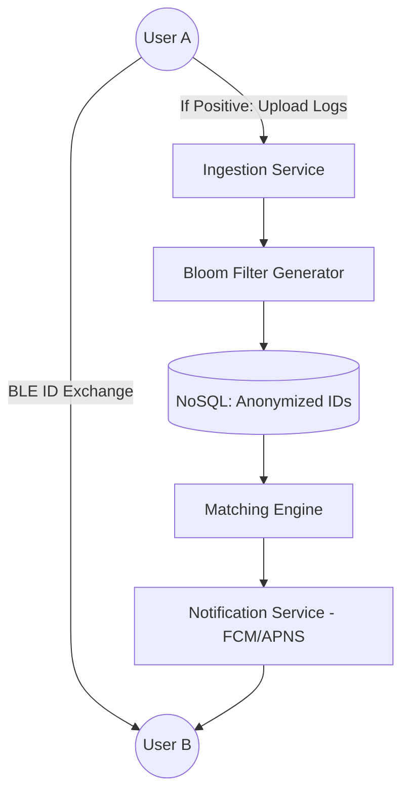

# System Design: Aarogya Setu (Distributed Proximity Tracing)

## 🎯 Problem Statement

**Challenge**: Track proximity between users to notify potential exposures to a pandemic while maintaining absolute user privacy.
**Constraints**:
- **Scaling**: 100M+ concurrent users.
- **Privacy**: No central server should know the user's location history unless they test positive.
- **Latency**: Critical alerts must be delivered within minutes of a positive test upload.

---

## 🏗️ Architecture: Decentralized Matching + Centralized Alerts



---

## 🛠️ Technical Implementation (Node.js/Redis)

### 1. Privacy-Preserving ID Generation
We avoid using sensitive IDs. Instead, we use rotating ephemeral IDs.

```javascript
// crypto_util.js
const crypto = require('crypto');

function generateRotatingDI(userId, secretKey) {
  // Rotate every 15 minutes to prevent tracking
  const timestamp = Math.floor(Date.now() / (15 * 60 * 1000)); 
  const hash = crypto.createHmac('sha256', secretKey)
                     .update(`${userId}:${timestamp}`)
                     .digest('hex');
  return hash.substring(0, 16); // Shortened for BLE efficiency
}
```

### 2. Bloom Filter for Privacy Optimization
Instead of sending 10 million positive IDs to every phone, we send a **Bloom Filter**.

```javascript
// bloom_service.js
const { BloomFilter } = require('bloom-filters');

async function createPositiveBloomFilter(positiveIds) {
  const filter = new BloomFilter(1000000, 10); // 1M bits, 10 hash functions
  positiveIds.forEach(id => filter.add(id));
  
  // Serialize for download
  return filter.saveAsJSON();
}

// Frontend (Phone) checks:
// if (bloomFilter.has(some_nearby_id)) { 
//    triggerPotentialRisk(); 
// }
```

---

## 🧠 Deep Dive: Advanced Backend Processes

### 1. Privacy-Preserving Proximity Tracing
How do we trace users without knowing their identity?
- **Rotating Tokens (DIDs)**: The backend generates **Dynamic IDs** (DIDs) using a HMAC of the UserID and a 15-minute time window. 
- **Decentralized Matching**: The phone only uploads its *own* DID list when a user tests positive. Other users download the "Infected DIDs" list and perform the match **locally on the device**. The server never knows who User A met.

### 2. Bloom Filters for Efficient Downloads
Checking a list of 1 Million "Infected IDs" on a mobile device is heavy.
- **The Bloom Filter Solution**: The server sends a compressed **Bloom Filter** (a bit-array).
- **Trade-off (False Positives)**: Bloom filters never have False Negatives (if it says you aren't at risk, you aren't). However, they can have **False Positives**.
- **The Optimization**: If the local Bloom Filter says "Maybe Infected," the app makes a specific API call with that DID to the server for a final verify. This saves 99% of bandwidth for healthy users.

### 3. High-Throughput Stream Processing (Kafka + Spark)
When thousands of users upload logs simultaneously:
- **Ingestion**: We use **Kafka** to buffer incoming logs.
- **Analysis**: **Spark Streaming** or **Apache Flink** processes the logs to find hotspots. 
- **Geo-Sharding**: Data is sharded by PinCode/Region to ensure that matching for "Delhi" doesn't bottleneck matching for "Mumbai."

---

## 📊 Back-of-the-envelope Estimation
- **Users**: 100 Million.
- **Daily Ingestion**: ~10,000 positive cases * 500 contacts each = **5 Million logs/day**.
- **Bandwidth**: DID size = 16 bytes. 5B * 16B ≈ **80 GB/day**.
- **Bloom Filter size**: To keep False Positive rate < 0.1% for 100k infected users, we need a ~2MB filter.

---

## 🚀 Why This Works (Summary for Interview)
- **User Trust**: By doing the "Matching" on the device (Pull model) and using Rotating Tokens, the system addresses the primary "Mass Surveillance" concern.
- **Battery Efficiency**: BLE (Bluetooth Low Energy) and local batching ensure the app doesn't drain the user's phone in hours.
- **Elastic Scale**: Using Kafka and Big Data streaming allows the system to handle sudden pandemic surges (millions of uploads per hour) without dropping data.

---

## 🔄 Alternative Solutions
- **GPS-only Tracing**: High battery drain and lacks accuracy in indoor settings (malls/elevators).
- **Centralized Model (Push)**: Users upload ALL met DIDs to a server. ❌ Poor privacy; high server compute cost for matching.
- **P2P Messaging**: Devices broadcast their status via mesh networks. ❌ Unreliable; potential for griefing/false reports.
