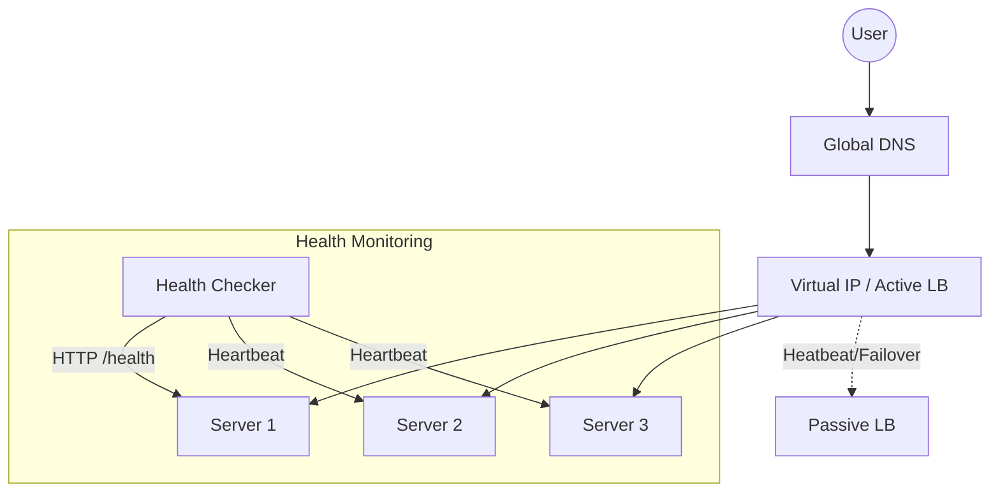

# System Design: Load Balancer (Distributed Traffic Control)

## 🎯 Problem Statement

**Challenge**: Distribute incoming traffic across multiple servers to ensure no single server becomes a bottleneck.
**Constraints**:
- **Availability**: The Load Balancer (LB) itself must not be a Single Point of Failure.
- **Accuracy**: Routing should be based on real-time server health.
- **Identity**: Sessions must be preserved (Sticky Sessions) if the application is stateful.

---

## 🏗️ Architecture: L4 (Network) vs L7 (Application)



---

## 🛠️ Technical Implementation (Node.js/JS)

### 1. Weighted Round Robin Algorithm
Simple Round Robin isn't enough if one server is beefier (CPU/RAM) than others.

```javascript
// lb_logic.js
class LoadBalancer {
  constructor(servers) {
    this.servers = servers; // [{ url, weight, currentWeight, healthy }]
  }

  getNextServer() {
    let bestServer = null;
    let totalWeight = 0;

    for (let s of this.servers) {
      if (!s.healthy) continue;

      s.currentWeight += s.weight;
      totalWeight += s.weight;

      if (!bestServer || s.currentWeight > bestServer.currentWeight) {
        bestServer = s;
      }
    }

    if (bestServer) {
        bestServer.currentWeight -= totalWeight;
    }
    return bestServer;
  }
}
```

### 2. Active Health Checks
A worker process that constantly tests the availability of the targets.

```javascript
// health_checker.js
const axios = require('axios');

async function checkHealth(servers) {
  for (let s of servers) {
    try {
      const res = await axios.get(`${s.url}/health`, { timeout: 1000 });
      s.healthy = (res.status === 200);
    } catch (err) {
      s.healthy = false;
      console.warn(`Server ${s.url} marked DOWN`);
    }
  }
}
```

---

## 🧠 Deep Dive: Advanced Backend Concepts

### 1. L4 vs. L7: When to use which?
- **Layer 4 (Transport)**: Operates at the TCP/UDP level. 
    - **Pros**: Blazing fast ($10M+ CPS$); doesn't decrypt SSL; low CPU usage.
    - **Use Case**: Databases, generic TCP traffic, edge load balancing.
- **Layer 7 (Application)**: Operates at the HTTP level.
    - **Pros**: Can route by URL (`/api` vs `/static`), headers, or even JSON content. Can handle SSL Termination.
    - **Use Case**: Microservices where different paths hit different pods.

### 2. High Availability (HA) & The "Brain" problem
How do we ensure the Load Balancer isn't a Single Point of Failure?
- **Active-Passive**: Two LBs share a **Virtual IP (VIP)**. If one heart-beat fails, the other takes over.
- **Active-Active (BGP Anycast)**: Multiple LBs across the globe share the *same IP*. The Internet's BGP protocol routes the user to the "closest" one. If one fails, the route is withdrawn, and traffic automatically flows to the next closest node.

### 3. Consistent Hashing (The Stateless sticky session)
Traditional "Sticky Sessions" save user-to-server mapping in memory. 
- **The Problem**: If the LB restarts, all sessions are lost.
- **The Fix**: Use **Consistent Hashing**. We map server IDs and User IPs to a large hash ring. A user always hits the same server *mathematically*, even without the LB storing any state.

---

## 📊 Back-of-the-envelope Estimation
- **Throughput**: A single Nginx/HAProxy node can handle ~10k-20k SSL-terminated requests/sec on 8 cores.
- **Latency Overheat**: Adding an LB typically adds < 1ms to 5ms for L7 processing.

---

## 🚀 Why This Works (Summary for Interview)
- **Zero Downtime**: Health checks ensure users only hit functional servers, enabling rolling deployments.
- **Decoupling**: Frontend doesn't need to know the IP of 10 different backend servers; it just hits one entry point.
- **Scaling**: A Load Balancer is the fundamental component that allows an application to grow from one server to ten thousand.

---

## 🔄 Alternative Solutions
- **DNS Round Robin**: Simple, but DNS takes minutes to update (TTL issue). If a server dies, users still hit the old IP.
- **Client-Side Load Balancing (gRPC/Netflix Ribbon)**: The client knows all server IPs and chooses one. ❌ Hard to manage server lists on thousands of clients.
- **Service Mesh (Istio)**: Handles load balancing inside a Kubernetes cluster between microservices.
