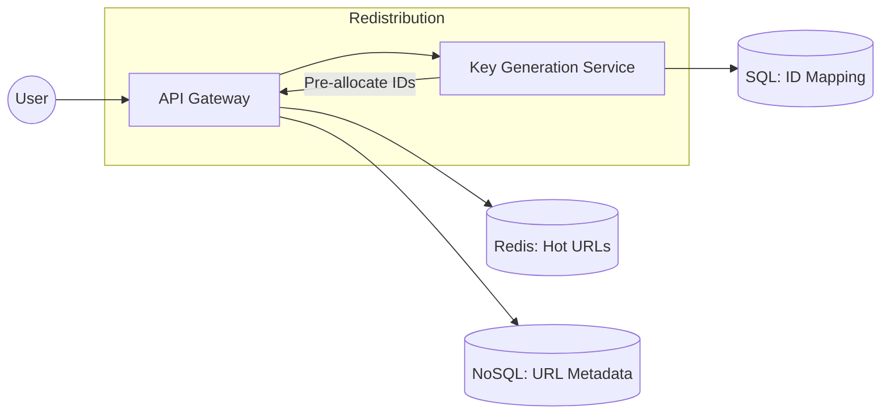

# System Design: URL Shortener (High Performance Redirector)

## 🎯 Problem Statement

**Challenge**: Create a system that converts long URLs into short, unique aliases (e.g., `bit.ly/abc123`).
**Constraints**:
- **Uniqueness**: No two long URLs should result in the same short alias at the same time.
- **Read-to-Write Ratio**: 100:1 (Extremely read-heavy).
- **Latency**: Redirection must happen in < 50ms.

---

## 🏗️ Architecture: The KGS (Key Generation Service)



---

## 🛠️ Technical Implementation (Node.js/Redis)

### 1. Base62 Encoding
We use 0-9, a-z, and A-Z (62 characters) to generate short strings from a numeric ID.

```javascript
// encoder.js
const CHARS = "0123456789abcdefghijklmnopqrstuvwxyzABCDEFGHIJKLMNOPQRSTUVWXYZ";

function encodeToBase62(num) {
  let res = "";
  while (num > 0) {
    res = CHARS[num % 62] + res;
    num = Math.floor(num / 62);
  }
  return res || "0";
}

// 7 characters in Base62 = 62^7 ≈ 3.5 Trillion unique IDs
```

### 2. The KGS Logic (Key Generation)
To avoid DB overhead during URL creation, we use a service that pre-allocates blocks of unique IDs.

```javascript
// kgs_service.js
let currentRange = { start: 1000, end: 2000 };
let currentPointer = currentRange.start;

async function getNextUniqueId() {
  if (currentPointer >= currentRange.end) {
    // Fetch next block from DB to avoid collision
    currentRange = await db.fetchNextRange(1000); 
    currentPointer = currentRange.start;
  }
  return currentPointer++;
}
```

---

## 🧠 Deep Dive: Advanced Backend Concepts

### 1. Key Generation Service (To Scale Writes)
- **The Bottle Neck**: If every API server hits the database to get a new ID, the DB becomes the bottleneck.
- **The KGS Fix**: We use a centralized service (like ZooKeeper) to maintain "ID Blocks." Each API server requests a block (e.g., 1-1,000,000). The API server then generates IDs locally from this block.
- **Resilience**: If an API server crashes, the remaining IDs in its block are lost, which is acceptable as we have trillions of IDs available.

### 2. Redirection Strategy: HTTP 301 vs. 302
| Status Code | **301 (Permanent Redirect)** | **302 (Temporary Redirect)** |
| :--- | :--- | :--- |
| **Caching** | Browser caches the long URL. | Browser never caches the link. |
| **Server Load** | Very low (subsequent hits don't reach our server). | High (every hit reaches our server). |
| **Analytics** | Hard to track (only 1st click is recorded). | **Excellent for Analytics** (capture every click). |
| **Use Case** | Search engine optimization (SEO). | Marketing campaigns, link tracking. |

### 3. Database Sharding & Partitioning
- **Sharding**: Since we store billions of URLs, we shard the database by `shortUrl` (the hash). This ensures that redirects (reads) are distributed evenly across database nodes.
- **Consistency**: We use **Bloom Filters** at the application layer to quickly check if a short URL exists before hitting the database, saving expensive disk I/O.

---

## 📊 Back-of-the-envelope Estimation (10-Year Plan)
- **Writes**: 100 new URLs/sec → ~3B URLs in 10 years.
- **Reads**: 10,000 requests/sec.
- **Storage**:
    - Long URL: 500 bytes.
    - Short URL: 7 bytes.
    - Metadata: 100 bytes.
    - Total per entry ≈ 600 bytes.
    - 3B * 600B ≈ **1.8 TB Storage** (Fits easily into modern NoSQL clusters).
- **Caching**: 
    - 20% of the URLs will account for 80% of the traffic (Pareto Principle).
    - To cache 2 days of "Hot" URLs: 10,000 RPS * 3600 * 24 * 2 * 600B ≈ **1 TB Redis Cluster**.

---

## 🚀 Why This Works (Summary for Interview)
- **Low Latency**: By using Redis for 80% of redirects and a KGS for 100% of writes, we achieve < 20ms response times.
- **Availability**: Each layer (API, KGS, Redis) is stateless and horizontally scalable.
- **Predictable Collision Handling**: Using a range-based KGS completely eliminates the risk of two users getting the same short URL.

---

## 🔄 Alternative Solutions
- **Hashing (MD5/SHA) + DB collision check**: ❌ Requires multiple DB lookups per write to ensure no collision. 
- **Snowflake ID Generator**: ✅ Generates unique IDs without a central KGS, but creates longer strings than a sequential KGS.
- **DynamoDB**: ✅ Excellent for this use case due to built-in TTL and predictable 1-digit ms latency.
