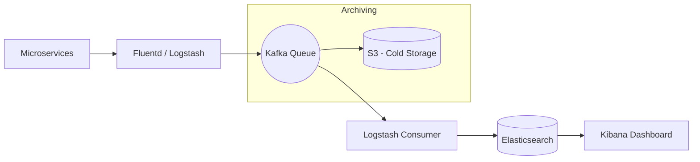

# System Design: Distributed Logging (ELK Stack Architecture)

## 🎯 Problem Statement

**Challenge**: Collect, store, and analyze logs from thousands of microservices in real-time.
**Constraints**:
- **Volume**: Terabytes of log data per day.
- **Searchability**: Developers must be able to search for specific errors (e.g., `404` or `Timeout`) across all services simultaneously.
- **Latency**: Logs should be available for search within seconds of being generated.

---

## 🏗️ Architecture: The Logging Pipeline



---

## 🛠️ Technical Implementation (Node.js/ELK)

### 1. Log Ingestion (The Producer)
Services shouldn't block their main thread for logging.

```javascript
// logger.js
const winston = require('winston');

const logger = winston.createLogger({
  level: 'info',
  format: winston.format.json(),
  defaultMeta: { service: 'payment-service', region: 'us-east-1' },
  transports: [
    new winston.transports.Http({
      host: 'log-collector.internal',
      path: '/v1/logs'
    })
  ]
});
```

### 2. Backpressure Management (Kafka)
If Elasticsearch is slow during a traffic spike, logs will be lost. We use Kafka as a buffer.

```javascript
// indexer_service.js (Consumer)
async function consumeAndIndex() {
  await consumer.run({
    eachBatch: async ({ batch }) => {
      const logs = batch.messages.map(m => m.value.toString());
      
      // Perform Bulk Indexing into ES for performance
      await esClient.bulk({
          body: logs.flatMap(log => [{ index: { _index: 'logs-daily' } }, log])
      });
    }
  });
}
```

---

## 🧠 Deep Dive: Advanced Backend Concepts

### 1. Kafka Partitioning & Sharding
- **The Problem**: If 10,000 microservices push logs to one Kafka topic, it becomes a bottleneck.
- **The Fix**: We shard the topic into multiple **Partitions**.
- **Partitioning Strategy**: Shard by `ServiceId`. This ensures that all logs from the "Payment Service" arrive in order, while allowing "Inventory Service" logs to be processed in parallel on a different consumer.

### 2. Elasticsearch Performance: The Inverted Index
- **Mechanism**: Elasticsearch doesn't store data row-by-row like SQL. It builds an **Inverted Index** (mapping every word to its document location).
- **Optimization**: We use **Index Aliases** and **Rolling Indices**. Instead of one massive `logs` index, we create `logs-2023-10-01`, `logs-2023-10-02`, etc. Searching today's logs is fast because it only hits a small fraction of the total data.

### 3. Log Aggregation vs. Sampled Logging
- **The Trade-off**: At Billion-scale, storing 100% of logs is prohibitively expensive.
- **Solution**: **Sampling**. High-volume "Info" logs are sampled (e.g., 1 out of 100 results are stored), while 100% of "Error" and "Critical" logs are captured.

---

## 📊 Back-of-the-envelope Estimation
- **Traffic**: 1 Million log lines per second.
- **Bandwidth**: 500 MB/sec ingestion.
- **Daily Storage (Raw)**: ~43 TB/day.
- **Compressed Storage**: Elasticsearch compression typically reduces this by 40-50% → **~22 TB/day**.
- **Cold Storage Cost**: Moving 1 Petabyte of logs to S3 Glacier costs ~$1,000/month, whereas keeping it in Hot ES would cost $50,000+.

---

## 🚀 Why This Works (Summary for Interview)
- **High Durability**: Even if the search engine (ES) goes down, logs are safe in Kafka for 24-48 hours.
- **Observability**: Developers get a "Google-like" search experience across the entire distributed cloud.
- **Cost-Efficiency**: The tiering strategy ensures you pay only for the logs you actively search, while meeting compliance for the rest.

---

## 🔄 Alternative Solutions
- **Prometheus (Metrics)**: Better for "counter" data (e.g., CPU %, RPS), but cannot store stack traces or raw log strings.
- **ClickHouse**: A faster alternative to Elasticsearch for log storage, offering better compression and SQL-based querying, though slightly less flexible for full-text search.
- **Grafana Loki**: A "Prometheus-like" logging system that indexes only metadata (tags) rather than the full log body, significantly reducing storage costs.
