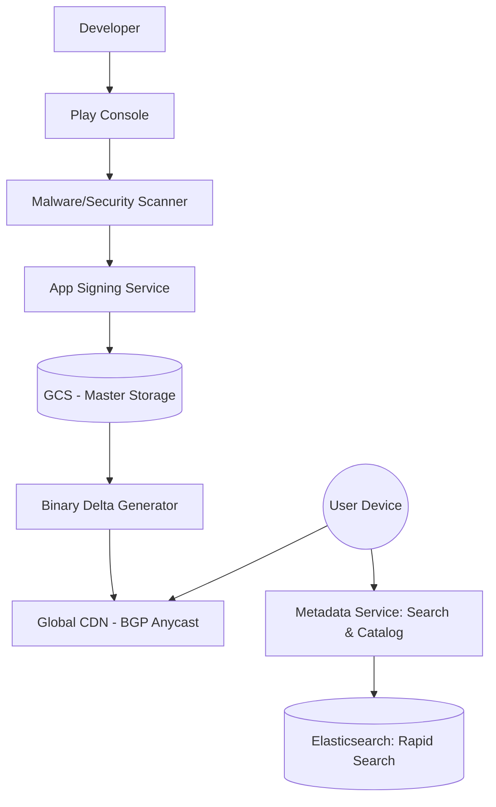

# System Design: Google Play Store (Asset Delivery & Distribution)

## 🎯 Problem Statement

**Challenge**: Deliver multi-gigabyte application files (APKs/AABs) to billions of devices globally.
**Constraints**:
- **Bandwidth Efficiency**: Minimize data usage for users (Updates should be small).
- **Security**: Prevent malware injection during the distribution process.
- **Concurrency**: Handle millions of simultaneous downloads during popular app releases (e.g., PUBG/Threads releases).

---

## 🏗️ Architecture: Global Asset Pipeline



---

## 🛠️ Technical Implementation (Node.js/Binary)

### 1. Generating Binary Delta Updates (The "Diff")
Instead of downloading a 100MB app again, we send a "patch" $(V_2 - V_1)$.

```javascript
// delta_service.js
const bsdiff = require('bsdiff-node'); // Standard binary diffing tool

async function generatePatch(oldApkPath, newApkPath, outputPath) {
  // Uses bsdiff algorithm to find bytes that changed
  await bsdiff.diff(oldApkPath, newApkPath, outputPath);
  console.log('Patch generated for bandwidth optimization');
}
```

### 2. Resumable Uploads/Downloads (Range Requests)
Large files must support pausing and resuming.

```javascript
// download_server.js
app.get('/download/:appId', (req, res) => {
  const range = req.headers.range; // e.g., "bytes=5000-"
  if (!range) return res.sendStatus(416);

  const start = parseInt(range.replace(/bytes=/, ""), 10);
  const fileStream = fs.createReadStream(filePath, { start });
  
  res.status(206); // Partial Content
  res.set({
    'Content-Range': `bytes ${start}-${totalSize - 1}/${totalSize}`,
    'Accept-Ranges': 'bytes',
  });
  fileStream.pipe(res);
});
```

---

## 🧠 Deep Dive: Advanced Backend Concepts

### 1. Binary Delta Strategy: bsdiff vs. Courgette
- **The Challenge**: Generating delta patches for billions of device combinations is CPU-intensive.
- **Courgette (Optimization)**: Instead of a raw byte-diff, Courgette "disassembles" the binary, aligns instructions, and diffs those. This often reduces the patch size by another 50% compared to standard bsdiff.
- **Trade-off**: Generating patches takes minutes of compute. We only pre-calculate deltas for the last 3 versions. If a user is on an older version, they get the full APK.

### 2. The Thundering Herd Problem (Global Releases)
When a 2GB game like *Genshin Impact* releases an update:
- **Solution**: **Staggered TTLs** and **Pre-fetching**. We "Warm" the Edge CDNs (Akamai/Cloudfront) by pushing the files to regional caches *before* the update announcement.
- **Edge Sharding**: We use multiple CDN providers to prevent a single ISP or CDN from being overwhelmed.

### 3. Progressive Rollouts & Verification
- **Safety Check**: The backend monitors the **Crash Reporting Service** (like Firebase) in real-time. If the new version has a > 0.5% crash rate compared to the old one, the rollout is instantly killed at the Metadata layer.
- **Code Integrity**: We use **V3 Signing**. Even if the CDN is compromised, the user's phone will reject any APK that doesn't match the signature generated by our secure, internal Key Management Service (KMS).

---

## 📊 Back-of-the-envelope Estimation
- **Users**: 2.5 Billion Active Android Devices.
- **Daily Updates**: ~500 Million.
- **Average App Size**: 40 MB.
- **Bandwidth Saved**: With Delta Updates (70% reduction), we save 350+ Petabytes of bandwidth globally *per month*.
- **Storage**: Master copies + Historics ≈ **5 PB** of highly durable storage (GCS/S3).

---

## 🚀 Why This Works (Summary for Interview)
- **Scalability**: Decoupling the Metadata (Search/Catalog) from Asset Delivery (CDN) allows the system to scale to trillions of requests.
- **Bandwidth Efficiency**: Binary delta updates make the Play Store viable even in countries with expensive or slow mobile data.
- **Security**: The air-gapped signing process ensures that even if a developer's machine or our delivery network is hacked, users remain safe.

---

## 🔄 Alternative Solutions
- **BitTorrent Distribution**: ✅ Great for large files, but ❌ battery-intensive for mobile devices and inconsistent speeds.
- **Direct S3 Downloads**: ❌ Lacks global edge caching; ❌ extremely expensive egress costs compared to a dedicated CDN.
- **Dynamic Feature Delivery**: Users only download the parts of the app they use (e.g., only download the 'Level Designer' if the user opens it).
