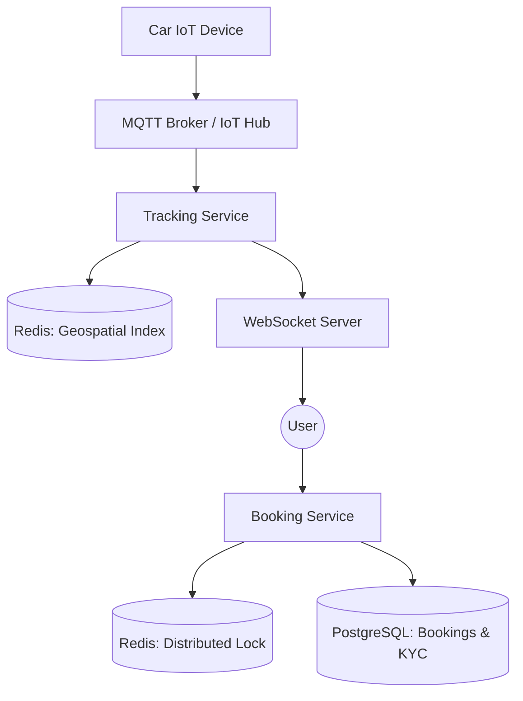

# System Design: ZoomCar (Distributed Car Rental System)

## 🎯 Problem Statement

**Challenge**: Manage car inventory across a city, preventing double bookings while handling real-time GPS tracking.
**Constraints**:
- **Concurrency**: High traffic during holidays/weekends. Two users must not be able to book the same car at the same time.
- **Geospatial**: Users must see the "Nearest Cars" instantly.
- **Hardware Integration**: The backend must communicate with the car's IoT device to unlock/lock doors remotedly.

---

## 🏗️ Architecture: Distributed Inventory & Real-time Tracking



---

## 🛠️ Technical Implementation (Node.js/Redis)

### 1. Preventing Double Bookings (Distributed Locking)
We use the **Redlock** algorithm to ensure that only one transaction can touch a specific `car_id` at a time.

```javascript
// booking_service.js
const Redlock = require('redlock');

async function bookCar(userId, carId) {
  const lock = await redlock.lock(`locks:car:${carId}`, 5000); // 5s lock
  try {
    const isAvailable = await checkAvailability(carId);
    if (isAvailable) {
      await db.query('INSERT INTO bookings ...');
      await updateInventory(carId, 'BOOKED');
    }
  } finally {
    await lock.unlock();
  }
}
```

### 2. Finding Nearby Cars (Geospatial Indexing)
Redis `GEOADD` and `GEORADIUS` are extremely efficient for this.

```javascript
// tracking_service.js
async function updateCarLocation(carId, lat, lng) {
  // Update real-time coordinates
  await redis.geoadd('active_cars', lng, lat, carId);
}

async function getNearbyCars(userLat, userLng, radiusKm) {
  // O(log(N)) complexity search
  return await redis.georadius('active_cars', userLng, userLat, radiusKm, 'km');
}
```

---

## 🧠 Deep Dive: Advanced Backend Concepts

### 1. Distributed Locking Nuances (Redlock)
- **The Challenge**: In a multi-region setup, a car in Delhi must not be bookable by someone in Mumbai and someone in Delhi simultaneously.
- **Why Redlock?**: Standard Redis locks (`SETNX`) can fail if the Redis master crashes before syncing. Redlock acquires locks from $N/2 + 1$ independent Redis nodes, making it resilient to single-node failures.
- **Fencing Tokens**: To prevent a "stale" process from writing to the DB after its lock has expired, we use **Fencing Tokens** (monotonically increasing IDs) that the database validates before every commit.

### 2. IoT Resilience: "Offline-First" Unlock
- **The Concern**: What if the car is in a basement with zero cellular connectivity?
- **The Solution**: **Time-bound Offline Credits**. When the user's booking starts, the mobile app downloads a digital key (HMAC-signed). The car's IoT device has a synchronized clock and can verify this key via **Bluetooth Low Energy (BLE)** without needing an internet connection.
- **Health Watchdogs**: The IoT device sends a "Heartbeat" every 60s. If the backend doesn't receive 3 heartbeats, it flags the car as "In Maintenance" and alerts the ground team.

### 3. Geospatial Indexing: S2 Cells vs. Geohash
- **Geohash**: Good for proximity, but suffers from "edge cases" where two points are close but have different hashes.
- **S2 Geometry**: Used by Google/Uber. It treats the earth as a sphere and uses "Cells." It's more accurate for computing distances and handling Earth's curvature, making "Nearest Car" logic highly reliable.

---

## 📊 Back-of-the-envelope Estimation
- **Fleet**: 100,000 Cars.
- **Ingestion**: 10s heartbeat → 10,000 requests/sec.
- **Geospatial Storage**: Redis `GEOADD` for 100k cars takes ~15MB.
- **Peak Throughput**: During sale windows (e.g., Diwali), booking requests can spike to 5,000/sec.
- **Data Retention**: GPS history for 1 year (100k cars * 8640 logs/day * 100 bytes/log) ≈ **30 TB/year**. we move this to **BigQuery/Redshift** for analytics.

---

## 🚀 Why This Works (Summary for Interview)
- **Zero Overselling**: The combination of Redlock and DB-level constraints ensures high availability without sacrificing consistency.
- **High UX in Low Signal**: The BLE offline-unlock logic solves the #1 pain point of car-sharing apps in urban basements.
- **Geospatial Speed**: $O(log(N))$ search complexity in Redis provides sub-50ms car discovery for users.

---

## 🔄 Alternative Solutions
- **Pessimistic DB Locks (`SELECT FOR UPDATE`)**: ❌ Blocks the entire database connection pool; doesn't scale horizontally.
- **Event-Driven Inventory**: ❌ Hard to manage real-time car state (locks/unlocks) via pure events due to latency.
- **Cassandra for GPS History**: ✅ Excellent for high-write location logs, though Redis is better for real-time proximity search.
