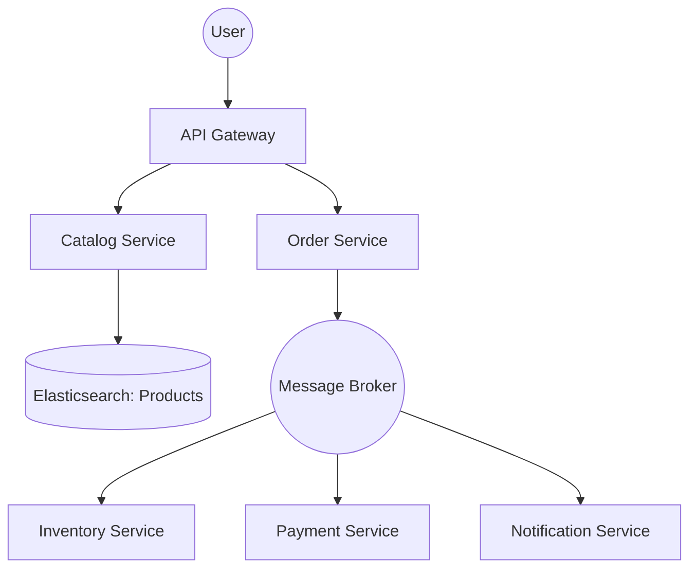

# System Design: E-commerce Platform (Architecture & Scalability)

## 🎯 Problem Statement

**Challenge**: Build a robust, scalable e-commerce platform capable of handling millions of concurrent users during a "Big Billion Day" sale.
**Constraints**:
- **Consistency**: High inventory accuracy (Never sell the same item twice).
- **Searchability**: Instant search and filtering across millions of products.
- **Availability**: High uptime; the checkout service must survive even if the recommendation service is down.

---

## 🏗️ Architecture: Microservices & Eventual Consistency



---

## 🛠️ Technical Implementation (Node.js/Microservices)

### 1. High Performance Product Search
Relational databases are too slow for complex filters (e.g., `Color=Red AND Brand=Nike AND Size=10`). 

```javascript
// search_service.js
const { Client } = require('@elastic/elasticsearch');
const esClient = new Client({ node: 'http://localhost:9200' });

async function searchProducts(query, filters) {
  const result = await esClient.search({
    index: 'products',
    body: {
      query: {
        bool: {
          must: [{ match: { name: query } }],
          filter: [
            { term: { color: filters.color } },
            ...otherFilters
          ]
        }
      },
      // Aggregations to show counts for sidebar filters
      aggs: { 
          brands: { terms: { field: "brand" } } 
      }
    }
  });
  return result.body.hits.hits;
}
```

### 2. Distributed Transactions (The Saga Pattern)
In microservices, we can't use `BEGIN TRANSACTION`. We use a sequence of events.

```javascript
// order_service.js
async function placeOrder(orderData) {
  // 1. Create order in PENDING status
  const order = await db.orders.create(orderData);
  
  // 2. Publish event to Kafka
  await kafka.publish('ORDER_CREATED', { orderId: order.id, items: order.items });
  
  // 3. Compensation logic: If Payment fails, Inventory service must RESTORE items
  // This is handled by a "Saga Orchestrator" or individual consumers.
}
```

---

## 🧠 Deep Dive: Advanced Backend Concepts

### 1. Flash Sale Mastery (Redis + Lua)
- **The Problem**: During a 0.01ms spike, multiple threads might read "Quantity=1" and all try to decrement it.
- **The Fix**: **Atomic Increment/Decrement via Lua**. We wrap the inventory logic in a Lua script that runs inside Redis. Since Redis is single-threaded, the script is atomic.
- **Logic**: `IF redis.call('get', KEYS[1]) >= ARGV[1] THEN RETURN redis.call('decrby', KEYS[1], ARGV[1]) ELSE RETURN -1 END`.

### 2. Saga Orchestration vs. Choreography
- **Choreography**: Each service listens to Kafka and decides its next move. (Hard to track/debug).
- **Orchestration**: A central **Order Manager** (State Machine) manages the flow. If Payment fails, it explicitly tells Inventory to "RESTORE."
- **Why Orchestration?**: For E-commerce, having a "Central Source of Truth" for an order's state (Pending -> Paid -> Shipped) is critical for customer support.

### 3. Database Selection: The Polyglot Approach
- **Users/Orders**: **PostgreSQL** (ACID is non-negotiable).
- **Product Catalog**: **Elasticsearch** (For fuzzy search like "Nik" finding "Nike").
- **Real-time Inventory**: **Redis** (For sub-millisecond updates during sales).
- **Clickstream/Analytics**: **ClickHouse** or **BigQuery** (Columnar storage for fast range queries).

---

## 📊 Back-of-the-envelope Estimation (Sale Day)
- **Peak Traffic**: 1 Million Concurrent Users.
- **Requests/Sec**: ~100k RPS.
- **Database Load**:
    - Reads (Catalog): 80,000/sec (served from Redis/CDN).
    - Writes (Orders): 5,000/sec (served from PG Cluster).
- **Bandwidth**: High-res product images served via **CloudFront CDN** can hit 100+ Gbps egress.

---

## 🚀 Why This Works (Summary for Interview)
- **Massive Concurrency**: Offloading inventory to Redis Lua scripts prevents DB deadlocks and ensures 100% accuracy during flash sales.
- **Fault Tolerance**: The Saga pattern ensures that even if one microservice crashes, the system can "self-heal" by rolling back transactions (e.g., refunding if shipment fails).
- **Search relevance**: Elasticsearch provides "did you mean" and filter aggregations that are impossible in standard SQL.

---

## 🔄 Alternative Solutions
- **Single Monolithic DB**: ❌ Simple to start, but will crash during 100k RPS spikes due to connection limits.
- **Optimistic Locking (`version` column)**: ✅ Good for normal days, but ❌ inefficient for Flash Sales high-contention (too many retries).
- **Two-Phase Commit (2PC)**: ❌ Too slow for high-scale distributed systems; blocks resources for too long.
