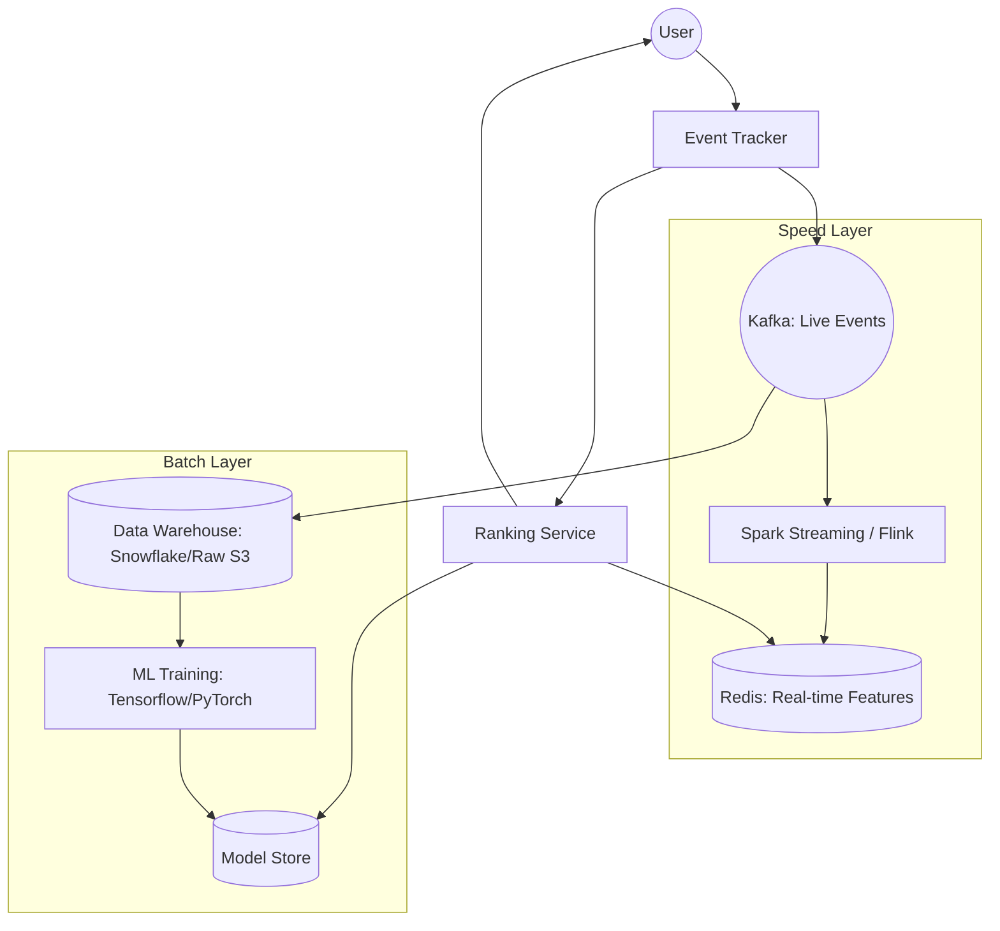

# System Design: Recommendation System (Personalization & ML Pipeline)

## 🎯 Problem Statement

**Challenge**: Deliver highly relevant content (Movies/YouTube/Netflix) to users based on their behavior, history, and preferences.
**Constraints**:
- **Latency**: Recommendations should appear on the homepage in < 200ms.
- **Data Volume**: Billions of user interactions (CLicks, Likes, Watch time) per day.
- **Freshness**: The system should react to a user's recent "like" within minutes (avoiding the "Stale Feed" problem).

---

## 🏗️ Architecture: Lambda Architecture (Real-time + Batch)



---

## 🛠️ Technical Implementation (Node.js/Python)

### 1. Collaborative Filtering (Matrix Factorization)
The "Heart" of basic recommendations: Users who like X also like Y.

```python
# recommendation_core.py (Conceptual Python ML implementation)
import pandas as pd
from sklearn.metrics.pairwise import cosine_similarity

def get_recommendations(user_id, interaction_matrix):
    # Find users with similar interaction history
    similarities = cosine_similarity(interaction_matrix[user_id], interaction_matrix)
    # Weighted average of their scores to predict what this user might like
    ...
    return recommended_item_ids
```

### 2. Event Ingestion (High Throughput)
Events are the fuel for recommendations.

```javascript
// tracker.js (Node.js API)
app.post('/track-event', async (req, res) => {
  const { userId, eventType, itemId, duration } = req.body;
  
  const event = {
    userId, eventType, itemId,
    timestamp: Date.now(),
    features: req.headers['user-agent'] // Capture device info for context
  };

  // Push to Kafka to avoid blocking the user
  await kafkaProducer.send({
    topic: 'user-interactions',
    messages: [{ value: JSON.stringify(event) }]
  });
  
  res.status(202).send(); // Accepted
});
```

---

## 🧠 Deep Dive: Advanced Backend Concepts

### 1. Vector Search (The Modern Candidate Generation)
- **The Tech**: We convert users and items into **Embeddings** (arrays of numbers).
- **The Search**: We use **Vector Databases** (like Pinecone, Milvus, or Redis VSS) to find "Nearest Neighbors" using **Cosine Similarity**.
- **Efficiency**: Instead of $O(N)$, Vector DBs use **HNSW** (Hierarchical Navigable Small World) algorithms to search through billions of items in sub-10ms.

### 2. Scoring: Online vs. Offline
- **Offline Scoring**: Pre-compute recommendations for every user every night. 
    - **Pros**: $O(1)$ read time.
    - **Cons**: Doesn't react to what the user did 5 minutes ago.
- **Online Scoring (The Hybrid)**: Fetch pre-computed candidates but run a **Lightweight Ranking Model** (like Logistic Regression or XGBoost) in real-time on the server based on the user's *current* session activity.

### 3. Feedback Loops & Cold Start
- **Positive Feedback**: Clicks, Watch-time > 50%, Likes.
- **Negative Feedback**: "Not interested," skipping a video in < 2 seconds.
- **Cold Start Fix**: For new users, we use **Popularity-based** or **Content-based** (tags/genre) recommendations until we have enough interaction data for collaborative filtering.

---

## 📊 Back-of-the-envelope Estimation
- **Events**: 1 Billion interactions/day.
- **Throughput**: Kafka must handle ~12,000 events/sec.
- **Inference Latency**: The ranking model must return results in < 50ms.
- **Storage**:
    - Interaction Logs (S3): ~100 TB (Retained for 2 years for deep learning).
    - Embedding Cache (Redis): ~20 GB for 1 Million active items.

---

## 🚀 Why This Works (Summary for Interview)
- **Scale**: The 3-stage pipeline (Recall, Rank, Re-rank) ensures we can find the best content out of billions without blowing up the server.
- **Real-time Reactivity**: Using a Speed Layer (Flink/Spark) allows the "Up next" video to be relevant to the video the user *just* watched.
- **Business Focus**: Multi-armed bandits ensure the platform doesn't become an "Echo Chamber," keeping long-term user retention high.

---

## 🔄 Alternative Solutions
- **Pure SQL Joins**: ❌ Only works for small catalogs; impossible to run at 1M+ rows.
- **Content-based only**: ❌ Lacks the "Surprise" factor; user only sees things they've seen before.
- **Deep Learning (Wide & Deep Models)**: ✅ State-of-the-art but ❌ require massive GPU clusters for training and high-latency inference if not optimized.
