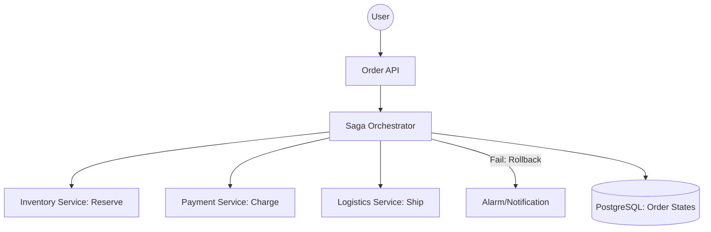

# System Design: Order Management System (OMS)

## 🎯 Problem Statement

**Challenge**: Design a system to handle the entire lifecycle of an order—from creation and payment to fulfillment and delivery—across a distributed environment.
**Constraints**:
- **Consistency**: Prevent "Ghost Orders" where payment is taken but no order is created.
- **Idempotency**: Retrying a request (due to network timeout) should NOT create a duplicate order.
- **Complexity**: Multiple third-party integrations (Stripe, FedEx, Inventory).

---

## 🏗️ Architecture: Orchestrated Saga Pattern



---

## 🛠️ Technical Implementation (Node.js/Idempotency)

### 1. The Idempotency Key
This prevents double-charging a user if they click "Pay" twice.

```javascript
// middleware/idempotency.js
async function checkIdempotency(req, res, next) {
  const key = req.headers['x-idempotency-key'];
  if (!key) return next();

  const cachedResponse = await redis.get(`idempotency:${key}`);
  if (cachedResponse) {
    return res.status(200).json(JSON.parse(cachedResponse));
  }
  
  // Tag current request for caching later
  req.idempotencyKey = key;
  next();
}
```

### 2. State Machine for Orders
An order should never jump from `CREATED` to `DELIVERED` without being `PICKED`.

```javascript
// order_model.js
const Transitions = {
  'CREATED': ['PAID', 'CANCELLED'],
  'PAID': ['SHIPPED', 'REFUNDED'],
  'SHIPPED': ['DELIVERED', 'RETURNED']
};

function transitionOrder(order, nextStatus) {
  if (!Transitions[order.status].includes(nextStatus)) {
    throw new Error('Invalid status transition');
  }
  order.status = nextStatus;
}
```

---

## 🧠 Deep Dive: Advanced Backend Concepts

### 1. Saga Rollback Strategies (Compensating Transactions)
- **The Problem**: If the "Payment" service fails, the "Inventory" has already been reserved. How to undo it?
- **The Solution**: Every step in the Saga has a corresponding **Compensating Action**.
    - `Step 1: ReserveInventory` -> `Undo 1: ReleaseInventory`
    - `Step 2: ProcessPayment` -> `Undo 2: IssueRefund`
- **Orchestrator Role**: The Saga Orchestrator keeps a "State Journal" in the database. If a step fails, it reads the journal backwards and executes all Undo actions.

### 2. Distributed Tracing & Correlation IDs
- **Scenario**: An order is stuck in "Pending." Which service failed?
- **The Fix**: The API Gateway injects a `X-Order-Trace-ID`. Every microservice logs this ID.
- **Backend**: We use **OpenTelemetry** or **Jaeger** to visualize the request flow. You can see exactly how many milliseconds were spent in the "Tax Calculation" vs. "Payment Gateway."

### 3. Handling Partial Shipments
- **Problem**: Order has 3 items. 2 are in Warehouse A, 1 is in Warehouse B.
- **Solution**: **Order Splitting**. The Order Management System creates `Sub-Orders` or `Fulfillment Groups`. Each group has its own independent Saga lifecycle, but they all link back to the parent `OrderUUID`.

---

## 📊 Back-of-the-envelope Estimation
- **Scaling**: 1,000 Orders/sec during peak.
- **Storage**: 1 Billion orders/year.
    - Each order meta is ~2KB.
    - 1B * 2KB ≈ **2 TB/year**.
- **Cold Storage**: Orders older than 2 years are archived to **S3 Glacier** or **BigQuery** for audit, keeping the operational PostgreSQL DB lean and fast.
- **Redis Requirement**: Tracking 1 million active/in-flight orders in Redis for rapid lookup takes ~5GB RAM.

---

## 🚀 Why This Works (Summary for Interview)
- **Consistency**: The Saga pattern ensures the system eventually reaches a consistent state, even if intermediate services fail.
- **Scalability**: By using the Outbox pattern and Kafka, we decouple order placement from heavy fulfillment logic, allowing the "Buy" button to be instant.
- **Idempotency**: Using an `Idempotency-Key` prevents the "Double Charge" nightmare that ruins customer trust.

---

## 🔄 Alternative Solutions
- **Two-Phase Commit (2PC)**: ❌ Too slow; causes "Distributed Deadlocks" in microservices.
- **Monolithic SQL Transaction**: ✅ Easiest for small scale, ❌ impossible for global systems with multiple regional databases.
- **Event Choreography**: ✅ Highly scalable and decoupled, but ❌ nightmare to monitor and trace complex refund flows.
