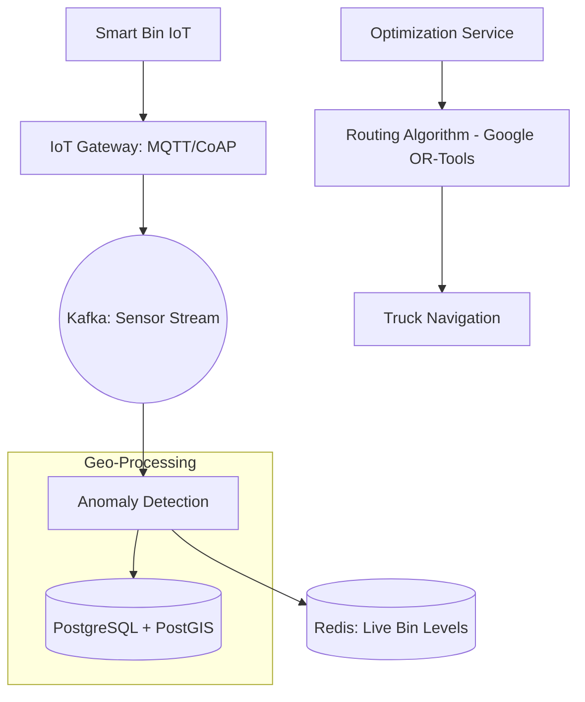

# System Design: Smart Waste Management (Logistics & IoT)

## 🎯 Problem Statement

**Challenge**: Efficiently manage city-wide waste collection by tracking "Fullness" levels of bins and optimizing truck routes.
**Constraints**:
- **IoT Density**: Millions of bins sending sensor data (Ultrasonic level).
- **Optimization**: The system must solve the "Traveling Salesman Problem" (TSP) for hundreds of trucks daily.
- **Offline Access**: Drivers must be able to work in areas with poor cellular coverage.

---

## 🏗️ Architecture: GIS & IoT Ingestion



---

## 🛠️ Technical Implementation (Node.js/GIS)

### 1. Handling High-Frequency IoT Data
Sensors shouldn't write to SQL directly. We use a stream processors to filter "Noise" (e.g., bin lid opened/closed vs actually full).

```javascript
// sensor_stream.js
async function processPacket(packet) {
  // 1. Validate Checksum
  // 2. Anomaly: If 'Full' jumps from 10% to 90% in 1 sec, it's likely noise/object blocking.
  if (isNoise(packet)) return;

  // 3. Store only significant changes in Redis
  await redis.set(`bin:level:${packet.id}`, packet.percentage, 'EX', 86400);
}
```

### 2. Solving Route Optimization (TSP)
We use a Graph-based algorithm to minimize fuel consumption.

```javascript
// routing_service.js (Pseudocode for solver)
const { solveTSP } = require('optimization-engine');

async function generateDailyRoute(truckId, sectorId) {
  const fullBins = await db.query('SELECT lat, lng FROM bins WHERE level > 80 AND sector=$1', [sectorId]);
  
  // Matrix of distances between all full bins
  const distanceMatrix = calculateMatrix(fullBins);
  
  // Return optimized order of coordinates
  return solveTSP(distanceMatrix);
}
```

---

## 🧠 Deep Dive: Advanced Backend Concepts

### 1. MQTT QoS Levels for Battery Life
- **The Challenge**: Smart bins run on batteries that must last 2+ years. Keeping a high-energy connection is impossible.
- **QoS 0 (At most once)**: Just send and forget. Efficient, but we might miss a "Full" alert.
- **QoS 1 (At least once)**: The broker acknowledges receipt. **This is our choice**. If the bin doesn't get an ACK, it retries. This ensures we never miss a full bin while being more battery-efficient than QoS 2.

### 2. Time-Window Routing (The Hard Part)
- **Constraint**: Some areas in the city only allow trash trucks between 5 AM and 7 AM.
- **Solution**: We use **Constraint Satisfaction Solvers** (like OptaPlanner). The backend feeds it:
    1. Bin Fullness (from IoT).
    2. Truck Capacity.
    3. Traffic Data (from Google Maps API).
    4. Time-Window constraints per sector.
- **Result**: A dynamic route that updates every hour as more bins get "Full."

### 3. Edge Filtering & Debouncing
- **Problem**: Wind or objects can temporarily block an ultrasonic sensor, making a bin look "Full" for 2 seconds.
- **Solution**: **L-point Average**. The IoT device (or the Edge Gateway) only sends an "Increase" event if the level is consistently high for 5 consecutive readings. This saves bandwidth and prevents "Ghost" alerts.

---

## 📊 Back-of-the-envelope Estimation
- **Scale**: 1 Million Bins.
- **Ingestion**: 15m heartbeat → ~1,100 PPS.
- **Processing**: Each sensor packet is tiny (~50 bytes). Total ingestion traffic is only ~55 KB/sec.
- **Storage**:
    - Real-time states in Redis: ~50MB.
    - Historical levels (PostGIS) for ML route-prediction: ~5 TB/year.
- **Compute**: Route solver takes ~10 CPU-seconds per 100 stops. Total daily compute is low.

---

## 🚀 Why This Works (Summary for Interview)
- **Efficiency**: Dynamic routing saves 20-30% on fuel and labor by skipping "Empty" bins.
- **Reliability**: Using MQTT QoS 1 ensures that "Overflow" alerts are always received by the backend.
- **Proactive Maintenance**: Analysis of "Fill Rates" (ML) allows the city to predict where more bins are needed *before* they overflow.

---

## 🔄 Alternative Solutions
- **Static Routes**: ❌ Extremely inefficient; trucks waste fuel checking empty bins.
- **HTTP Ingestion**: ❌ Too much overhead for battery-powered sensors; MQTT is much leaner.
- **Centralized SQL for everything**: ❌ PostGIS is necessary for spatial math (Distance calculations), whereas standard MySQL/PG without extensions is extremely slow for "Nearest Stop" logic.
