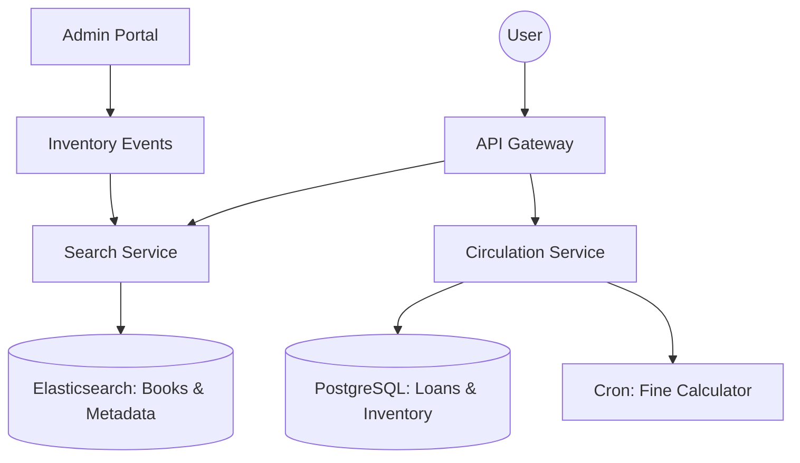

# System Design: Library Management (Distributed Catalog & Inventory)

## 🎯 Problem Statement

**Challenge**: Manage millions of books across multiple branches, handling reservations, checkouts, and late returns concurrently.
**Constraints**:
- **Concurrency**: Multiple users trying to reserve the *last* available copy of a popular book.
- **Search**: Fast lookup by Title, Author, ISBN, or Genre across a massive catalog.
- **Rules**: Automatic fine calculation based on dynamic logic (Holidays, Membership Tier).

---

## 🏗️ Architecture: Search Optimized Catalog



---

## 🛠️ Technical Implementation (Node.js/SQL)

### 1. Handling Race Conditions (Optimistic Locking)
To prevent two people from checking out the same copy of a physical book simultaneously.

```sql
-- Circulation DB Schema
-- TABLE books: { id, title, total_copies, available_copies, version }

-- ATOMIC UPDATE with versioning
UPDATE books 
SET available_copies = available_copies - 1, 
    version = version + 1
WHERE id = ? AND available_copies > 0 AND version = current_version_from_read;
```

### 2. Full-Text Search Indexing
Relational `LIKE %query%` is too slow for millions of books. We sync data to Elasticsearch.

```javascript
// search_service.js
const result = await es.search({
  index: 'library_catalog',
  body: {
    query: {
      multi_match: {
        query: 'Harry Potter',
        fields: ['title^3', 'author^2', 'description'], // Title has 3x weight
        fuzziness: 'AUTO' // Handles typos
      }
    }
  }
});
```

---

## 🧠 Deep Dive: Advanced Backend Concepts

### 1. High-Performance Catalog Search
- **The Challenge**: Users often search by partial titles ("Har Potter") or authors.
- **Elasticsearch Suggesters**: 
    - **Term Suggester**: Corrects typos (Did you mean 'Harry'?).
    - **Completion Suggester**: Fast "Search-as-you-type" functionality.
- **Indexing Strategy**: We use **N-grams** for titles. This allows searching for "Pot" and finding "Harry Potter" or "The Potter's Wheel" instantly.

### 2. Distributed Locking for Reservations
- **Scenario**: A physical book only has 5 copies. 1,000 people click "Reserve" at once.
- **Solution**: **Redis Distributed Lock (Redlock)** on the `ISBN_copy_id`.
- **Logic**: 
    1. Acquire lock: `SET locks:book:123 user_456 NX EX 30`.
    2. Check DB: `SELECT available_copies FROM books WHERE id=123`.
    3. Update DB: `UPDATE books SET available_copies = available_copies - 1`.
    4. Release lock.
- **Why not just SQL?**: At scale, locking a row in SQL blocks the database connection. Redis handles this in memory at 100k+ ops/sec.

### 3. Denormalization for Member Views
- **Problem**: When a user logs in, showing "All my borrowed books + their current overdue status" requires joining 5 tables.
- **Solution**: **Read-Model Denormalization**. We maintain a `user_summary` table in **DynamoDB** or a JSON column in Postgres. Every time a book is borrowed, we asynchronously update this summary. Reading the dashboard becomes a simple $O(1)$ lookup.

---

## 📊 Back-of-the-envelope Estimation
- **Catalog**: 10 Million Books.
- **Active Members**: 5 Million.
- **Traffic**: 
    - Search: 5,000 requests/sec.
    - Calculations (Fines): Million-row batch job daily.
- **Storage**: ~100 GB.
- **Reliability**: 99.9% (Reservations are strictly consistent).

---

## 🚀 Why This Works (Summary for Interview)
- **Search Relevance**: Moving search from SQL `LIKE` to Elasticsearch N-grams makes the library feel modern and fast.
- **Data Integrity**: Using Distributed Locks prevents "Double Reservations" which cause operational headaches at the front desk.
- **Cost-Efficiency**: Sharded batch processing for fines ensures we don't need a super-computer to calculate debt for 5M users every night.

---

## 🔄 Alternative Solutions
- **Single SQL Instance**: ❌ Fine for 1,000 books, but ❌ crashes at 10M+ rows with complex genre filters.
- **NoSQL for Books**: ✅ Good for flexible metadata (different fields for Magazine vs Book), but ❌ requires extra effort for ACID transactions in lending logic.
- **Static Fine Calculation**: ❌ Calculating fines only upon return. (Better for server, but ❌ users can't see their current "Live Debt" in the app).
