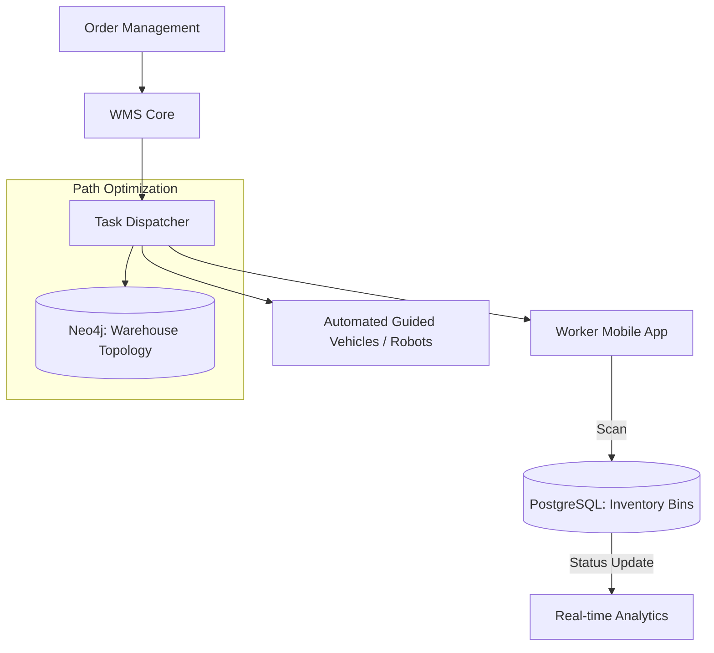

# System Design: Warehouse Management System (WMS)

## 🎯 Problem Statement

**Challenge**: Orchestrate thousands of workers and robots to pick, pack, and ship orders with near-zero latency and 100% accuracy.
**Constraints**:
- **Concurrency**: Multiple pickers working in the same bin simultaneously.
- **Latency**: Scanners must get instant "Success/Fail" feedback to keep the flow moving.
- **Efficiency**: Minimize "Total Worker Travel Distance" using optimized picking paths.

---

## 🏗️ Architecture: Event-Driven Warehouse Flow



---

## 🛠️ Technical Implementation (Node.js/SQL)

### 1. High-Precision Inventory Control (Pessimistic Locking)
In a warehouse, if two people pick the last item from the same physical bin, one will be empty-handed. We use `SELECT ... FOR UPDATE`.

```sql
-- picking_service.js
-- We lock the specific BIN row until the transaction completes
BEGIN;
SELECT count FROM inventory_bins 
WHERE bin_id = 'A-102' AND sku_id = 'SHOE-99' 
FOR UPDATE;

-- If count > 0, we proceed
UPDATE inventory_bins SET count = count - 1 WHERE bin_id = 'A-102';
INSERT INTO picker_manifest (picker_id, sku_id) VALUES (45, 'SHOE-99');
COMMIT;
```

### 2. Wave Picking Algorithm
Grouping orders to minimize travel time.

```javascript
// wave_service.js
async function createWave() {
  // 1. Fetch all pending orders for the next hour
  const orders = await getPendingOrders(60);
  
  // 2. Group items by Zone (e.g., A, B, C)
  const zoneBuckets = groupByZone(orders);
  
  // 3. Assign 1 worker to collect ALL items from Zone A for 10 different orders
  // This is much faster than 10 workers going to Zone A separately.
}
```

---

## 🧠 Deep Dive: Advanced Backend Concepts

### 1. Picking Path Optimization (A* / Dijkstra)
- **The Challenge**: A picker has to find 20 items in a 1-million-sq-ft warehouse.
- **The Solution**: The backend treats the warehouse as a **Weighted Graph**. Every time a pick-list is generated, the system runs the **A* Search Algorithm** to find the shortest walking path that hits all 20 locations.
- **Micro-Optimization**: The algorithm also accounts for "Vertical Travel" (using a ladder/lift) which is slower than "Horizontal Travel."

### 2. Picking Strategies: Wave vs. Cluster
- **Wave Picking**: All items for all orders are picked at once and sorted later. **Best for massive volume**.
- **Cluster Picking**: A worker takes a cart with 10 boxes (orders) and puts items directly into the boxes. **Reduces sorting time** but requires smarter pathing.
- **Backend Role**: The `Task Dispatcher` uses a **Heuristic Model** to decide which strategy is better based on current order density and worker availability.

### 3. Inventory Reconciliation (The "Zero-inventory" Audit)
- **Concept**: If the DB says "Stock=0" but the physical bin is not empty, you have a tracking leak.
- **Solution**: The system forces a "Quantity Check" whenever a bin's digital count drops below a threshold. If there's a mismatch, a high-priority "Audit Event" is triggered for the supervisor's dashboard.

---

## 📊 Back-of-the-envelope Estimation
- **Inventory**: 500,000 SKUs.
- **Throughput**: 1 Million pick-scans per day.
- **Worker Load**: Peak 2,000 active workers.
- **Pathfinding Latency**: < 100ms for a 20-stop optimized path.
- **Storage**: ~500 GB for history and audit logs (PostgreSQL + TimeScaleDB).

---

## 🚀 Why This Works (Summary for Interview)
- **High Throughput**: Wave picking and pathfinding maximize worker productivity by minimizing idle walking time.
- **Accuracy**: Double-verification (Bin Scan -> Item Scan) ensures the wrong item never leaves the warehouse.
- **Resilience**: Even if the Wi-Fi is spotty, the worker app downloads the "Wave Manifest" locally so they can keep picking without 100% cloud uptime.

---

## 🔄 Alternative Solutions
- **Pure SQL Pathfinding**: ❌ Extremely slow for complex graphs; Neo4j or a custom in-memory graph is mandatory.
- **No robotic automation**: ❌ Scalable for small warehouses, but ❌ human travel time becomes the bottleneck for anything over 100k sq-ft.
- **Batch Processing for manifest**: ✅ Necessary for generating "Waves" but ❌ poor for "Priority/Express" shipping which needs real-time tasking.
