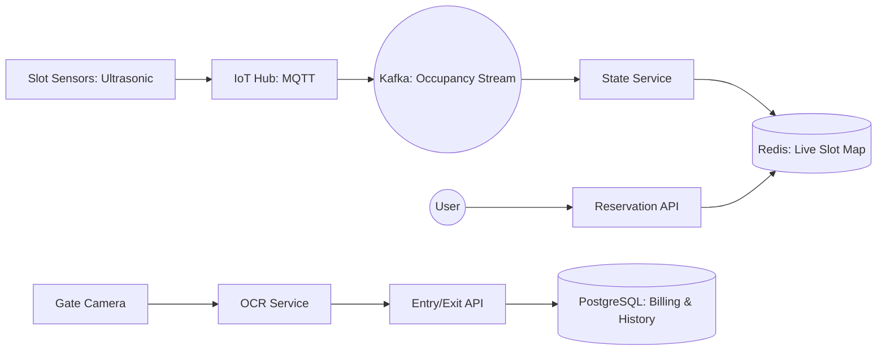

# System Design: Parking Lot Reservation (Real-time Backend)

## 🎯 Problem Statement

**Challenge**: Manage real-time occupancy and reservations for thousands of parking slots across multiple locations.
**Constraints**:
- **Live Status**: Occupancy must be updated in < 1 second on the user's app.
- **Race Conditions**: Two cars shouldn't be directed to the same "Free" slot.
- **Enforcement**: Validate entry/exit using ANPR (Automatic Number Plate Recognition).

---

## 🏗️ Architecture: Reactive IoT Backend



---

## 🛠️ Technical Implementation (Node.js/Redis)

### 1. Atomic Slot Reservation (Redis TTL)
Using Redis to "Hold" a slot while the user is driving toward it.

```javascript
// reservation_service.js
async function reserveSlot(userId, slotId) {
  // Set a'Hold' with 15-minute expiry. NX ensures we don't overwrite another hold.
  const isHeld = await redis.set(`hold:slot:${slotId}`, userId, 'EX', 900, 'NX');
  
  if (!isHeld) {
    throw new Error('Slot already taken or held');
  }
  
  return { status: 'HELD', expiresAt: Date.now() + 900000 };
}
```

### 2. Live Updates via WebSockets (Sub/Pub)
Whenever a sensor detects a car, we notify all connected drivers in that region.

```javascript
// state_service.js (Kafka Consumer)
async function onSensorUpdate(event) {
    const { slotId, status } = event; // status: 'OCCUPIED' | 'FREE'
    
    // 1. Update Global State
    await redis.hset('parking_map', slotId, status);
    
    // 2. Broadcast to specific floor's WebSocket channel
    const floorId = getFloorFromSlot(slotId);
    io.to(`floor:${floorId}`).emit('slot_change', { slotId, status });
}
```

---

## 🧠 Deep Dive: Advanced Backend Concepts

### 1. Demand-Based Pricing (Surge Logic)
- **Formula**: `BasePrice * (1 + (Occupancy% - 0.5) * SurgeMultiplier)`.
- **Implementation**: We use **Redis Aggregations**. Every sensor change updates an `occupancy_counter`. When the counter crosses a threshold (e.g., 80%), the pricing service pushes a "New Rate" event via WebSockets and updates the Redis `active_prices` hash.
- **Consistency**: The user is "Locked" into the price they saw when they clicked "Reserve" for 15 minutes.

### 2. ANPR (License Plate) Accuracy Management
- **The Challenge**: OCR is never 100% accurate (e.g., mistaking `O` for `0`).
- **The Solution**: **Fuzzy Matching & Probability**. Instead of `SQL = plate`, we search for `Levenshtein Distance <= 1`. 
- **Wait-Queue**: If a plate matches multiple reservations (e.g., `ABC12` vs `ABC1Z`), the system flags the gate-security to manual-verify while letting the car idle for < 5 seconds.

### 3. Sensor Management (De-bouncing)
- **Problem**: A car driving *over* a sensor to get to another slot can trigger a false "Occupied" event.
- **Solution**: **Temporal Debouncing**. The IoT Hub only registers an "Occupied" state if the ultrasonic sensor returns a consistent distance for > 5 seconds.

---

## 📊 Back-of-the-envelope Estimation
- **Inventory**: 100,000 Slots.
- **Traffic**: 1,600 updates/sec.
- **Search**: "Find Free Slot" is an $O(k)$ search in a Redis BitMap/Set.
- **Storage**:
    - Live Map (Redis): < 10MB.
    - Entry/Exit Logs: 100k events/day * 500 bytes ≈ **50 MB/day**.
    - ANPR Images (S3): 100k images/day * 200 KB ≈ **20 GB/day**.

---

## 🚀 Why This Works (Summary for Interview)
- **Real-time UX**: Using Redis + WebSockets ensures the user never drives into a "full" section they thought was empty.
- **Revenue Optimization**: Dynamic pricing maximizes ROI during peak events (e.g., concerts/festivals) without manual intervention.
- **Reliability**: The ANPR fuzzy-match logic prevents gate-bottlenecks, which is the #1 pain point for parking facility managers.

---

## 🔄 Alternative Solutions
- **Pure Camera-based Occupancy**: ✅ Cheaper per slot, but ❌ suffers from "Blind Spots" and lighting issues.
- **Manual Ticketing**: ❌ Slow, ❌ requires high labor cost, and ❌ impossible for pre-reservations.
- **Postgres-only (No Redis)**: ❌ Querying 100k rows for "nearest free slot" every second would overwhelm the DB CPU.
