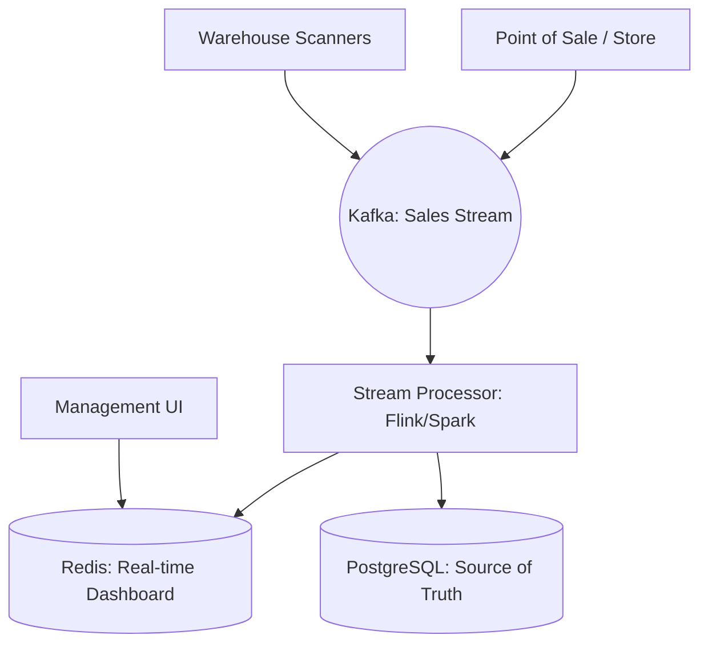

# System Design: Real-time Inventory Tracking (Global Scale)

## 🎯 Problem Statement

**Challenge**: Track billions of items across global warehouses and stores in real-time, handling massive spikes during sales without crashing.
**Constraints**:
- **Throughput**: 1 Million+ stock updates per second.
- **Accuracy**: Financial-grade accuracy (No stock "leakage").
- **Visibility**: Global inventory view for HQ, with regional views for local stores.

---

## 🏗️ Architecture: The Streaming Aggregator



---

## 🛠️ Technical Implementation (Node.js/Streaming)

### 1. High-Performance Delta Updates
We don't send `count=99`. We send `change=-1`. This prevents data loss if an event is processed twice (idempotency).

```javascript
// store_service.js
async function onSale(productId) {
  const event = {
    productId,
    delta: -1, 
    transactionId: uuid(), // For idempotency
    timestamp: Date.now()
  };
  
  await kafka.send('inventory-updates', event);
}
```

### 2. Stream Aggregation (Windowing)
Instead of updating the DB for every single sale, we aggregate in 5-second "Windows" using **Apache Flink** or a similar stream processor.

```javascript
// processor_logic.js (Flink-style pseudocode)
stream.partitionBy("productId")
      .timeWindow(seconds(5))
      .reduce((a, b) => {
          return { productId: a.productId, totalDelta: a.delta + b.delta };
      })
      .addSink(databaseUpdateSink);
```

---

## 🧠 Deep Dive: Advanced Backend Concepts

### 1. Event Sourcing for Auditing
- **The Concept**: Instead of just storing `Stock=10`, we store every event: `Recieved(+50)`, `Sold(-1)`, `Stolen(-1)`, `Returned(+1)`.
- **The Benefit**: You can "replay" the events to find exactly *when* an error occurred. This is standard for high-end retail (Walmart/Amazon) to prevent untraceable stock "leaks."
- **Storage**: Use **Apache Cassandra** or **AWS DynamoDB** for the event store due to high write-throughput.

### 2. The "Global vs Local" Consistency Challenge
- **Global View**: CEO wants to see "Total iPhones in India." (Eventual Consistency is fine, ~1 min delay).
- **Local View**: Store manager needs to know if the iPhone in the shelf is sold *now*. (Strong Consistency is required).
- **Architecture**: We use **CQRS (Command Query Responsibility Segregation)**.
    - **Command**: Updates the local SQL database immediately.
    - **Query**: Reads from a denormalized Kafka-fed "Global View" for big-picture stats.

### 3. Handling Massively Distributed Sales (The "Hot Item")
- **Problem**: 10,000 stores all selling "Coca-Cola" simultaneously. Kafka becomes a bottleneck for one topic.
- **Solution**: **Hierarchical Aggregation**. Instead of 10,000 stores hitting the cloud, they hit a **Regional Edge Collector**. The regional collector sums the sales every 60s and sends *one* update (`cola: +5000`) to the global Kafka cluster.

---

## 📊 Back-of-the-envelope Estimation
- **Scale**: 10,000 Stores, 100,000 SKUs per store.
- **Throughput**: 1 Million events/sec.
- **Ingress**: 100k stores * 10 events/sec * 200 bytes = **200 MB/sec Cloud Traffic**.
- **Cold Storage**: Event store (Cassandra) grows by ~15 TB per month (Compressed). Move events older than 1 month to **S3 Parquet** files.

---

## 🚀 Why This Works (Summary for Interview)
- **Accuracy**: Delta-based updates (`change=-1`) ensure that even if a message is retried, the count remains accurate using transaction IDs.
- **Visibility**: The combination of Hot Caches (Redis) and Stream Processing (Flink) allows HQ to react to sales trends in seconds.
- **Resilience**: Regional collectors ensure the system keeps working even if the primary cloud connection has a 10-minute outage.

---

## 🔄 Alternative Solutions
- **Centralized SQL**: ❌ Will melt under 1M writes/sec; locking contention on "Hot" items will kill the DB.
- **Batched Uploads (End of Day)**: ❌ Old-school; inventory is always wrong until midnight, making it impossible to run an online website on the same stock.
- **Redis-only Inventory**: ✅ Extremely fast but ❌ risky. If Redis crashes without a persistent backend backup, your entire company loses its stock count.
