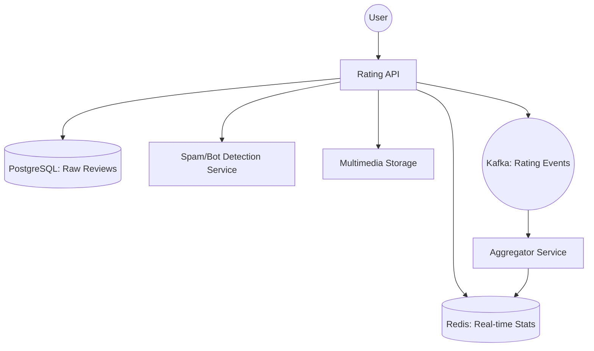

# System Design: E-commerce Rating & Review System

## 🎯 Problem Statement

**Challenge**: Build a high-scale rating system that provides accurate averages, prevents bot spam, and scales to millions of users.
**Constraints**:
- **Trust**: Only "Verified Buyers" should impact the core rating.
- **Performance**: Fetching a product page shouldn't require calculating `AVG()` over 100k reviews on-the-fly.
- **Multimedia**: Support photos and videos in reviews without slowing down the primary rating API.

---

## 🏗️ Architecture: Asynchronous Aggregation



---

## 🛠️ Technical Implementation (Node.js/SQL)

### 1. Avoiding `SELECT AVG(...)`
Instead of calculating the average on every request, we store the **Sum** and **Count** separately and update them atomically.

```javascript
// aggregator_service.js (Kafka Consumer)
async function updateProductRating(productId, newRating) {
  // We use Redis HINCRBY to update Sum and Count in one atomic step
  await redis.hincrby(`stats:prod:${productId}`, 'sum', newRating);
  await redis.hincrby(`stats:prod:${productId}`, 'count', 1);
  
  // The API will calculate: sum / count results in the Average
}
```

### 2. Weighted Average for Trust
New accounts or "Rating Bombs" are given less weight.

```javascript
// ranking_logic.js
function calculateWeightedRating(ratings) {
    // Formula: (R * v + C * m) / (v + C)
    // R = average for the movie
    // v = number of votes for the movie
    // m = minimum votes required to be listed
    // C = the mean vote across the whole report
    ...
}
```

---

## 🧠 Deep Dive: Advanced Backend Concepts

### 1. Sorting by Rating (The Wilson Score)
- **The Problem**: A product with one 5-star review (100% avg) shouldn't rank higher than a product with 1,000 reviews and a 4.8-star avg.
- **The Solution**: **Wilson Score Confidence Interval**. 
- **Concept**: The backend calculates the "Lower Bound" of the rating's confidence. For 1 review, the confidence is low, so the score is pulled down. For 1,000 reviews, the score stays high. 
- **Interview Tip**: Always mention Wilson Score when asked about "Top Rated" sorting.

### 2. Anti-Spam: Graph-Based Trust Analysis
- **The Logic**: Bots usually come in clusters. They all rate the same 10 products.
- **The Tech**: We build a **Bipartite Graph** (User -> Product). We use algorithms like **Connected Components** to find clusters of users that always rate the same products. If a cluster is detected, all their ratings are "Shadow-banned" (stored in DB but not added to the average).

### 3. The "Cold" Product Rating (Bayesian Average)
- **Problem**: New products have Zero ratings and look bad.
- **Solution**: **Bayesian Smoothing**. We give every product a "fake" starting set of ratings (e.g., five 3-star ratings). As real users rate it, the fake ratings' influence diminishes. This ensures new products don't sit at the bottom of the list forever.

---

## 📊 Back-of-the-envelope Estimation
- **Catalog**: 10 Million Items.
- **Throughput**: 100,000 Reads/sec (served from Redis).
- **Audit**: We store every review in **PostgreSQL** (JSONB for flexibility).
- **Latency**: Calculating the "Global Bayesian Score" is expensive, so we do it in an **Offline Spark Job** every 6 hours and push results to Redis.

---

## 🚀 Why This Works (Summary for Interview)
- **High Trust**: Verified buyer filters and graph-based bot detection ensure the platform remains credible.
- **Scalability**: Decoupling the "Review Submission" (Kafka) from the "Display Average" (Redis) ensures the site stays fast even if millions of people rate items after a massive sale.
- **Better UX**: The Wilson score ensures that "High Volume + High Quality" items are always at the top, increasing user conversion.

---

## 🔄 Alternative Solutions
- **Simple AVG() in SQL**: ❌ Slows down the DB; incorrect ranking for low-volume items.
- **Sentiment Analysis only**: ❌ Bots can use GPT to write "nice" comments. You need velocity and graph tracking too.
- **NoSQL for raw records**: ✅ Good (MongoDB/Couchbase), but ❌ PostgreSQL's JSONB is often better because you still need ACID for the relation between `User <-> Product <-> Review`.
