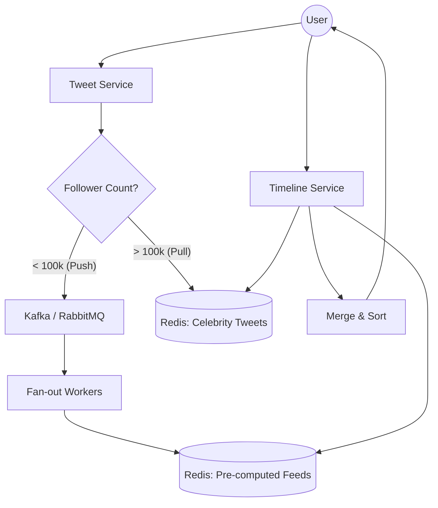

# System Design: Twitter Timeline (Backend Deep Dive)

## 🎯 Problem Statement

**Challenge**: Build a highly scalable news feed (Timeline) for millions of users.
**Core Conflict**: 
- **User A** follows **User B**.
- When User B tweets, it must appear in User A's feed instantly.
- **Celebrity Problem**: A user like Elon Musk has 150M+ followers. Pushing a tweet to 150M timelines simultaneously crashes databases and causes "Fan-out" bottlenecks.

---

## 🏗️ Architecture: Hybrid Fan-out (Push + Pull)



---

## 🛠️ Technical Implementation (Node.js/Redis)

### 1. The Fan-out Strategy
We categorize users into "Regular" and "Celebrities".

```javascript
// tweet_service.js
async function handleNewTweet(tweet) {
  const followerCount = await getFollowerCount(tweet.userId);
  
  if (followerCount > CELEBRITY_THRESHOLD) {
    // PULL MODEL: Just cache the tweet
    await redis.lpush(`celeb:tweets:${tweet.userId}`, JSON.stringify(tweet));
    await redis.ltrim(`celeb:tweets:${tweet.userId}`, 0, 1000); // Keep last 1000
  } else {
    // PUSH MODEL: Dispatch to workers for pre-computation
    await kafka.send('fanout-task', { tweetId: tweet.id, authorId: tweet.userId });
  }
}
```

### 2. Timeline Aggregation (The Hybrid Fetch)
When a user requests their feed, we merge pre-computed tweets with celebrity on-demand tweets.

```javascript
// timeline_service.js
async function getTimeline(userId) {
  // 1. Get pre-computed feed (Push data)
  const preComputedFeeds = await redis.zrevrange(`feed:${userId}`, 0, 100);
  
  // 2. Identify Celebrities followed
  const followedCelebs = await getFollowedCelebrities(userId);
  
  // 3. Pull from Celebrity caches (Pull data)
  const celebTweetsPromises = followedCelebs.map(celebId => 
    redis.lrange(`celeb:tweets:${celebId}`, 0, 50)
  );
  const celebTweets = (await Promise.all(celebTweetsPromises)).flat();

  // 4. Merge and Sort by Timestamp
  return [...preComputedFeeds, ...celebTweets]
    .sort((a, b) => b.timestamp - a.timestamp)
    .slice(0, 50);
}
```

---

## 🧠 Deep Dive: Advanced Backend Concepts

### 1. Fan-out Write (Push Model)
- **Pros**: Fast Reads. When a user opens the app, the feed is already built in Redis.
- **Cons**: Slow Writes. If a user has 50k followers, one tweet causes 50k writes to Redis.
- **Optimization**: Use **Background Workers** and **Batch Writes** to prevent API blocking.

### 2. Fan-out Read (Pull Model)
- **Pros**: Fast Writes. Celebrities just write once to their own list.
- **Cons**: Slow Reads. Every time a follower opens the app, the system must manually fetch and merge data.

### 3. Database Selection
- **Metadata (Tweets, Users)**: **PostgreSQL** or **MySQL** (Relational, ACID for data integrity).
- **Timeline Storage**: **Redis (Sorted Sets)**. Redis is in-memory and provides $O(log(N))$ complexity for inserts/lookups by timestamp.
- **Media**: **S3** with a **CDN (Cloudfront)**.

### 4. Feed Ranking Logic
Beyond chronological order, modern feeds use "Relevance".
- **Weightage**: Score = (Recency^a * Engagement^b) / Distance^c.
- **Process**: A separate **Ranking Service** periodically re-shuffles the Redis Sorted Set based on ML scores.

---

## 📊 Back-of-the-envelope Estimation
- **DAU**: 300 Million.
- **Write Path**: ~5,000 tweets per second (Avg), ~150,000 peak (Events like World Cup).
- **Read Path**: ~500,000 requests per second.
- **Storage**: (300M users * 100 tweets in cache * 200 bytes) ≈ **6 TB of Hot RAM (Redis)**.

---

## 🚀 Performance Metrics
- **Tweet Latency**: < 200ms for fan-out completion (Regular users).
- **Feed Load Time**: < 100ms (Redis lookup).
- **Celebrity Fan-out**: Instant (0 ms fan-out cost).
