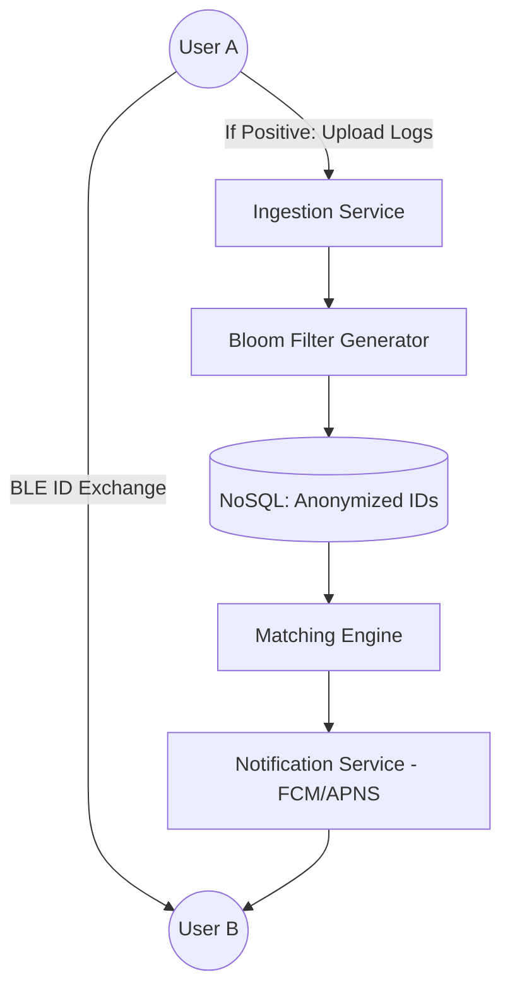

# System Design: Aarogya Setu (Distributed Proximity Tracing)

## 🎯 Problem Statement

**Challenge**: Track proximity between users to notify potential exposures to a pandemic while maintaining absolute user privacy.
**Constraints**:
- **Scaling**: 100M+ concurrent users.
- **Privacy**: No central server should know the user's location history unless they test positive.
- **Latency**: Critical alerts must be delivered within minutes of a positive test upload.

---

## 🏗️ Architecture: Decentralized Matching + Centralized Alerts



---

## 🛠️ Technical Implementation (Node.js/Redis)

### 1. Privacy-Preserving ID Generation
We avoid using sensitive IDs. Instead, we use rotating ephemeral IDs.

```javascript
// crypto_util.js
const crypto = require('crypto');

function generateRotatingDI(userId, secretKey) {
  // Rotate every 15 minutes to prevent tracking
  const timestamp = Math.floor(Date.now() / (15 * 60 * 1000)); 
  const hash = crypto.createHmac('sha256', secretKey)
                     .update(`${userId}:${timestamp}`)
                     .digest('hex');
  return hash.substring(0, 16); // Shortened for BLE efficiency
}
```

### 2. Bloom Filter for Privacy Optimization
Instead of sending 10 million positive IDs to every phone, we send a **Bloom Filter**.

```javascript
// bloom_service.js
const { BloomFilter } = require('bloom-filters');

async function createPositiveBloomFilter(positiveIds) {
  const filter = new BloomFilter(1000000, 10); // 1M bits, 10 hash functions
  positiveIds.forEach(id => filter.add(id));
  
  // Serialize for download
  return filter.saveAsJSON();
}

// Frontend (Phone) checks:
// if (bloomFilter.has(some_nearby_id)) { 
//    triggerPotentialRisk(); 
// }
```

---

## 🧠 Deep Dive: Advanced Backend Concepts

### 1. Data Sharding by Geometry (Geohashing)
- **Problem**: Storing every proximity log centrally is massive (Petabytes).
- **Solution**: Only store logs of "Infected" users. Use **Geohashing (S2 Geometry)** to partition data by city/district, allowing matching engines to run in parallel.

### 2. The False Positive Problem (RSSI Math)
- BLE signal strength (RSSI) is noisy. Backend must filter noise.
- **Formula**: `Distance ≈ 10 ^ ((Measured Power – RSSI) / (10 * n))`.
- **Logic**: The API accepts logs containing (ID, RSSI, Duration). Only entries where `Distance < 2m` for `Duration > 15 mins` are treated as "High Risk".

### 3. TTL (Time-To-Live) and Data Purging
- **Retention**: Pandemic data is valid only for 14-21 days (Incubation period).
- **Backend**: Use **Redis TTL** or **DynamoDB TTL** to automatically delete old proximity logs, ensuring compliance with "Right to be Forgotten" privacy laws.

---

## 📊 Back-of-the-envelope Estimation
- **Users**: 200 Million.
- **Daily Uplinks**: ~10,000 positive cases * 500 contacts each = **5 Million logs/day**.
- **Storage**: (5M logs * 100 bytes) = **500 MB/day** (Very low, because we only store "Risk" data).
- **Read Traffic**: 200M users polling for Bloom Filter updates every 6 hours.

---

## 🚀 Performance Metrics
- **Upload Latency**: < 500ms for positive log submission.
- **Alert Propagation**: < 10 seconds from "Positive Status Update" to "Contact Notification".
- **Bloom Filter Size**: ~2 MB for 100,000 IDs (Cost-effective for mobile data).
