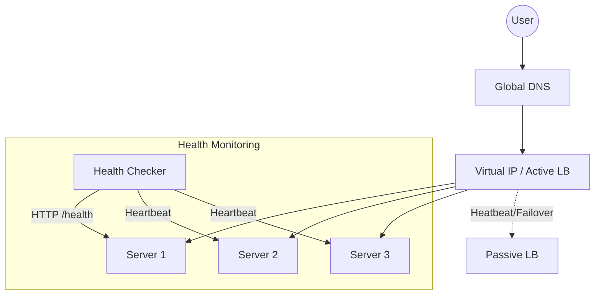

# System Design: Load Balancer (Distributed Traffic Control)

## 🎯 Problem Statement

**Challenge**: Distribute incoming traffic across multiple servers to ensure no single server becomes a bottleneck.
**Constraints**:
- **Availability**: The Load Balancer (LB) itself must not be a Single Point of Failure.
- **Accuracy**: Routing should be based on real-time server health.
- **Identity**: Sessions must be preserved (Sticky Sessions) if the application is stateful.

---

## 🏗️ Architecture: L4 (Network) vs L7 (Application)



---

## 🛠️ Technical Implementation (Node.js/JS)

### 1. Weighted Round Robin Algorithm
Simple Round Robin isn't enough if one server is beefier (CPU/RAM) than others.

```javascript
// lb_logic.js
class LoadBalancer {
  constructor(servers) {
    this.servers = servers; // [{ url, weight, currentWeight, healthy }]
  }

  getNextServer() {
    let bestServer = null;
    let totalWeight = 0;

    for (let s of this.servers) {
      if (!s.healthy) continue;

      s.currentWeight += s.weight;
      totalWeight += s.weight;

      if (!bestServer || s.currentWeight > bestServer.currentWeight) {
        bestServer = s;
      }
    }

    if (bestServer) {
        bestServer.currentWeight -= totalWeight;
    }
    return bestServer;
  }
}
```

### 2. Active Health Checks
A worker process that constantly tests the availability of the targets.

```javascript
// health_checker.js
const axios = require('axios');

async function checkHealth(servers) {
  for (let s of servers) {
    try {
      const res = await axios.get(`${s.url}/health`, { timeout: 1000 });
      s.healthy = (res.status === 200);
    } catch (err) {
      s.healthy = false;
      console.warn(`Server ${s.url} marked DOWN`);
    }
  }
}
```

---

## 🧠 Deep Dive: Advanced Backend Concepts

### 1. SSL Termination (SSL Offloading)
- **Concept**: The LB handles the heavy CPU task of decrypting HTTPS requests. 
- **Benefit**: The communication between the LB and the Backend servers happens over HTTP (within a private VPC), making the backend servers significantly faster and easier to manage.

### 2. IP Hashing (Sticky Sessions)
- **Concept**: Hash the Client's IP address: `ServerIndex = Hash(ClientIP) % TotalServers`.
- **Benefit**: Ensures the user always hits the same server. Critically important if the app uses local server-side sessions (non-stateless).

### 3. Layer 4 vs Layer 7
- **Layer 4 (Transport)**: Routes packets based on IP and Port. Extremely fast, but lacks "Intelligence" (can't see HTTP headers).
- **Layer 7 (Application)**: Can see cookies, URLs, and headers. Allows for **Smart Routing** (e.g., send `/images` to an image-optimizer server and `/api` to a Node.js server).

---

## 📊 Back-of-the-envelope Estimation
- **Traffic**: 1 Million RPS (Requests Per Second).
- **Concurrency**: 50,000 active TCP connections.
- **Compute**: A standard L7 Load Balancer requires ~1 CPU core per 5,000 - 10,000 requests/sec depending on the complexity of SSL/Headers.

---

## 🚀 Performance Metrics
- **Routing Latency**: < 1ms (L4), < 10ms (L7 with SSL).
- **Failover Time**: < 3 seconds (Active-Passive failover via Virtual IP).
- **Health Check Frequency**: Every 5 seconds with a "3-strike" policy before marking a server as DEAD.
