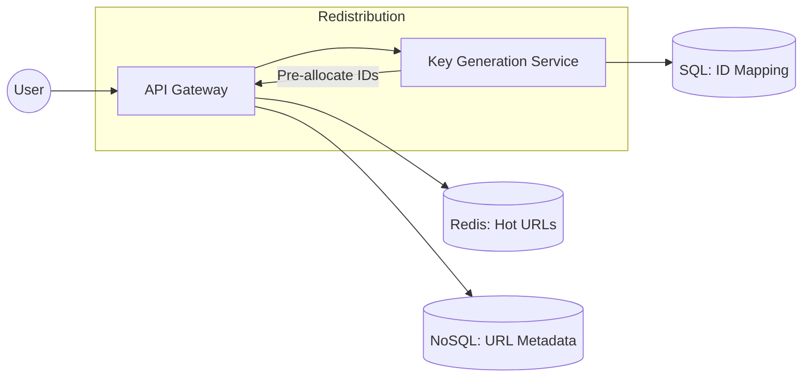

# System Design: URL Shortener (High Performance Redirector)

## 🎯 Problem Statement

**Challenge**: Create a system that converts long URLs into short, unique aliases (e.g., `bit.ly/abc123`).
**Constraints**:
- **Uniqueness**: No two long URLs should result in the same short alias at the same time.
- **Read-to-Write Ratio**: 100:1 (Extremely read-heavy).
- **Latency**: Redirection must happen in < 50ms.

---

## 🏗️ Architecture: The KGS (Key Generation Service)



---

## 🛠️ Technical Implementation (Node.js/Redis)

### 1. Base62 Encoding
We use 0-9, a-z, and A-Z (62 characters) to generate short strings from a numeric ID.

```javascript
// encoder.js
const CHARS = "0123456789abcdefghijklmnopqrstuvwxyzABCDEFGHIJKLMNOPQRSTUVWXYZ";

function encodeToBase62(num) {
  let res = "";
  while (num > 0) {
    res = CHARS[num % 62] + res;
    num = Math.floor(num / 62);
  }
  return res || "0";
}

// 7 characters in Base62 = 62^7 ≈ 3.5 Trillion unique IDs
```

### 2. The KGS Logic (Key Generation)
To avoid DB overhead during URL creation, we use a service that pre-allocates blocks of unique IDs.

```javascript
// kgs_service.js
let currentRange = { start: 1000, end: 2000 };
let currentPointer = currentRange.start;

async function getNextUniqueId() {
  if (currentPointer >= currentRange.end) {
    // Fetch next block from DB to avoid collision
    currentRange = await db.fetchNextRange(1000); 
    currentPointer = currentRange.start;
  }
  return currentPointer++;
}
```

---

## 🧠 Deep Dive: Advanced Backend Concepts

### 1. Redirection: 301 vs 302
- **301 (Permanent)**: Browser caches the redirect. Reduces server load but eliminates tracking and analytics.
- **302 (Temporary)**: Browser asks the server every time. **Better for business analytics** (clicks, location, device type) but higher server load.

### 2. Scaling the Read Path (Caching)
- Since the system is read-heavy, we store the `shortUrl -> longUrl` mapping in **Redis**.
- **Cache Eviction**: Use **LRU (Least Recently Used)** policy. Old URLs stay in the main database, but only "Hot" (trending) links stay in the fast cache.

### 3. Key Collisions and Distributed Systems
- In a distributed setup, two API servers could theoretically pick the same ID.
- **Solution**: The KGS uses **Zookeeper** or a centralized SQL table to assign "ID Ranges" to each API node (e.g., Node 1 gets 1-1000, Node 2 gets 1001-2000).

---

## 📊 Back-of-the-envelope Estimation
- **Writes**: 100 new URLs/sec.
- **Reads**: 10,000 redirects/sec (100x).
- **Storage (10 years)**: 
  - 100 URLs/s * 3600 * 24 * 365 * 10 ≈ **30 Billion links**.
  - 30B * 500 bytes/entry ≈ **15 TB Storage**.

---

## 🚀 Performance Metrics
- **Write Latency**: < 100ms (Using pre-allocated IDs).
- **Read Latency**: < 20ms (Redis Cache hit), < 100ms (DB lookup).
- **Availability**: 99.99% (Stateless API servers behind a Load Balancer).
