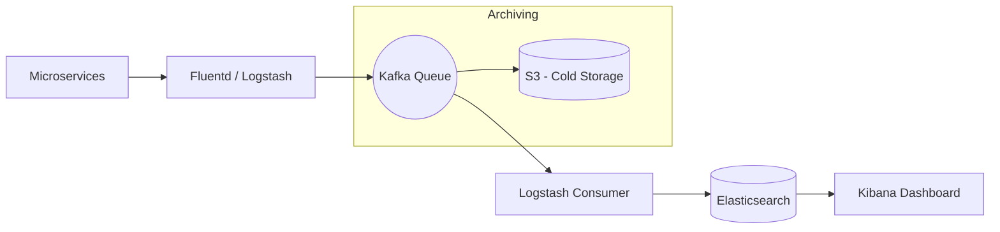

# System Design: Distributed Logging (ELK Stack Architecture)

## 🎯 Problem Statement

**Challenge**: Collect, store, and analyze logs from thousands of microservices in real-time.
**Constraints**:
- **Volume**: Terabytes of log data per day.
- **Searchability**: Developers must be able to search for specific errors (e.g., `404` or `Timeout`) across all services simultaneously.
- **Latency**: Logs should be available for search within seconds of being generated.

---

## 🏗️ Architecture: The Logging Pipeline



---

## 🛠️ Technical Implementation (Node.js/ELK)

### 1. Log Ingestion (The Producer)
Services shouldn't block their main thread for logging.

```javascript
// logger.js
const winston = require('winston');

const logger = winston.createLogger({
  level: 'info',
  format: winston.format.json(),
  defaultMeta: { service: 'payment-service', region: 'us-east-1' },
  transports: [
    new winston.transports.Http({
      host: 'log-collector.internal',
      path: '/v1/logs'
    })
  ]
});
```

### 2. Backpressure Management (Kafka)
If Elasticsearch is slow during a traffic spike, logs will be lost. We use Kafka as a buffer.

```javascript
// indexer_service.js (Consumer)
async function consumeAndIndex() {
  await consumer.run({
    eachBatch: async ({ batch }) => {
      const logs = batch.messages.map(m => m.value.toString());
      
      // Perform Bulk Indexing into ES for performance
      await esClient.bulk({
          body: logs.flatMap(log => [{ index: { _index: 'logs-daily' } }, log])
      });
    }
  });
}
```

---

## 🧠 Deep Dive: Advanced Backend Concepts

### 1. Structured Logging
- **Concept**: Don't log plain text like `"Error happened"`. Log JSON: `{"event": "db_error", "code": 500, "user_id": 123}`.
- **Benefit**: Elasticsearch can index specific fields, allowing you to run queries like: *"Show me all errors for User X in the last 10 minutes."*

### 2. Log Retention and Tiered Storage
- **Hot Storage (Elasticsearch)**: Keep logs for 7-14 days. Expensive but fast.
- **Cold Storage (S3/GCS)**: Move logs to S3 after 14 days and delete them from ES. Keep for 1 year for compliance/audit. 
- **Tooling**: Use **Index Lifecycle Management (ILM)** in Elasticsearch to automate this.

### 3. Correlation IDs (Tracing)
- **Problem**: A user request might traverse 10 services. How do you find all logs related to that *one* request?
- **Solution**: The API Gateway generates a `X-Correlation-ID` header. Every microservice must pass this ID to the next service and include it in its logs.

---

## 📊 Back-of-the-envelope Estimation
- **Events**: 1 Million log lines per second.
- **Average Size**: 500 bytes/log.
- **Traffic**: 500 MB/sec ≈ **43 TB/day**.
- **Elasticsearch Nodes**: Typically 1 node per 50-100GB of indexed data per day.

---

## 🚀 Performance Metrics
- **Ingestion Delay**: < 5 seconds from production to Kibana.
- **Search Latency**: < 500ms for standard text queries over billions of rows.
- **Reliability**: 99.9% log delivery (Lost logs are acceptable in extreme "Lossy" scenarios, but not for Audit logs).
