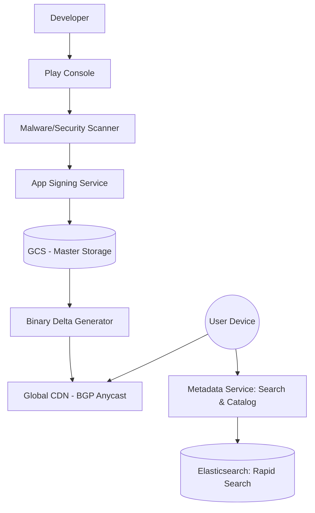

# System Design: Google Play Store (Asset Delivery & Distribution)

## 🎯 Problem Statement

**Challenge**: Deliver multi-gigabyte application files (APKs/AABs) to billions of devices globally.
**Constraints**:
- **Bandwidth Efficiency**: Minimize data usage for users (Updates should be small).
- **Security**: Prevent malware injection during the distribution process.
- **Concurrency**: Handle millions of simultaneous downloads during popular app releases (e.g., PUBG/Threads releases).

---

## 🏗️ Architecture: Global Asset Pipeline



---

## 🛠️ Technical Implementation (Node.js/Binary)

### 1. Generating Binary Delta Updates (The "Diff")
Instead of downloading a 100MB app again, we send a "patch" $(V_2 - V_1)$.

```javascript
// delta_service.js
const bsdiff = require('bsdiff-node'); // Standard binary diffing tool

async function generatePatch(oldApkPath, newApkPath, outputPath) {
  // Uses bsdiff algorithm to find bytes that changed
  await bsdiff.diff(oldApkPath, newApkPath, outputPath);
  console.log('Patch generated for bandwidth optimization');
}
```

### 2. Resumable Uploads/Downloads (Range Requests)
Large files must support pausing and resuming.

```javascript
// download_server.js
app.get('/download/:appId', (req, res) => {
  const range = req.headers.range; // e.g., "bytes=5000-"
  if (!range) return res.sendStatus(416);

  const start = parseInt(range.replace(/bytes=/, ""), 10);
  const fileStream = fs.createReadStream(filePath, { start });
  
  res.status(206); // Partial Content
  res.set({
    'Content-Range': `bytes ${start}-${totalSize - 1}/${totalSize}`,
    'Accept-Ranges': 'bytes',
  });
  fileStream.pipe(res);
});
```

---

## 🧠 Deep Dive: Advanced Backend Concepts

### 1. BGP Anycast and Global CDNs
- **Concept**: Multiple servers in different cities share the *same* IP address.
- **Benefit**: When a user pings `assets.playstore.com`, the internet routing (BGP) automatically sends the traffic to the **physically closest** data center. This minimizes latency and localizes traffic.

### 2. App Signing (Key Management)
- **Problem**: If an APK is tampered with, it can steal user data.
- **Solution**: The backend uses **Cloud KMS (Key Management Service)** to sign every APK with a private key. The Android OS on the user's phone verifies this signature using the public key before installation.

### 3. Progressive Rollouts (Canary Deployment)
- **Logic**: When an app update is uploaded, the Metadata Service only returns the New Version to 1% of users initially.
- **Feedback Loop**: If the "Crash Rate" from that 1% spike, the rollout is automatically halted. If stable, it goes to 10%, 50%, then 100%.

---

## 📊 Back-of-the-envelope Estimation
- **Catalog Size**: 3 Million+ Apps.
- **Total Storage**: 2-3 Petabytes (including historical versions).
- **Traffic**: 
  - Avg 10,000 downloads/sec.
  - Peak 1,000,000 downloads/sec.
- **Bandwidth**: 50 Gbps+ sustained egress.

---

## 🚀 Performance Metrics
- **Catalog Search Latency**: < 50ms (Elasticsearch + Redis).
- **Update Efficiency**: Delta updates are typically **70-90% smaller** than the full APK.
- **Download Reliability**: 99.9% success rate via automatic retry on the mobile client.
