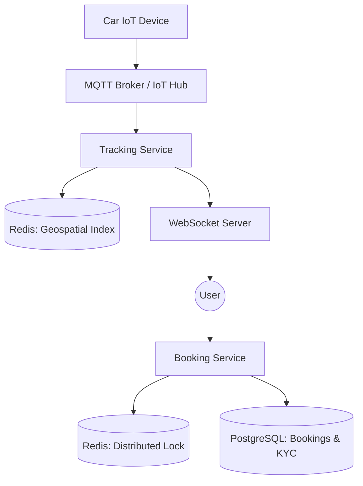

# System Design: ZoomCar (Distributed Car Rental System)

## 🎯 Problem Statement

**Challenge**: Manage car inventory across a city, preventing double bookings while handling real-time GPS tracking.
**Constraints**:
- **Concurrency**: High traffic during holidays/weekends. Two users must not be able to book the same car at the same time.
- **Geospatial**: Users must see the "Nearest Cars" instantly.
- **Hardware Integration**: The backend must communicate with the car's IoT device to unlock/lock doors remotedly.

---

## 🏗️ Architecture: Distributed Inventory & Real-time Tracking



---

## 🛠️ Technical Implementation (Node.js/Redis)

### 1. Preventing Double Bookings (Distributed Locking)
We use the **Redlock** algorithm to ensure that only one transaction can touch a specific `car_id` at a time.

```javascript
// booking_service.js
const Redlock = require('redlock');

async function bookCar(userId, carId) {
  const lock = await redlock.lock(`locks:car:${carId}`, 5000); // 5s lock
  try {
    const isAvailable = await checkAvailability(carId);
    if (isAvailable) {
      await db.query('INSERT INTO bookings ...');
      await updateInventory(carId, 'BOOKED');
    }
  } finally {
    await lock.unlock();
  }
}
```

### 2. Finding Nearby Cars (Geospatial Indexing)
Redis `GEOADD` and `GEORADIUS` are extremely efficient for this.

```javascript
// tracking_service.js
async function updateCarLocation(carId, lat, lng) {
  // Update real-time coordinates
  await redis.geoadd('active_cars', lng, lat, carId);
}

async function getNearbyCars(userLat, userLng, radiusKm) {
  // O(log(N)) complexity search
  return await redis.georadius('active_cars', userLng, userLat, radiusKm, 'km');
}
```

---

## 🧠 Deep Dive: Advanced Backend Concepts

### 1. Distributed Locking Trade-offs (Pessimistic vs Optimistic)
- **Pessimistic (Redis Lock)**: Safe, prevents any overlap. Best for high-value items like car rentals where a double-booking results in an angry customer.
- **Optimistic (DB Versioning)**: Better for "Medium" traffic. `UPDATE cars SET status='booked' WHERE id=1 AND version=5`. If 10 people click, only the first one succeeds.

### 2. IoT Lifecycle (Command & Control)
- **Problem**: Car is underground with no internet. How to unlock via app?
- **Solution**: Hybrid Bluetooth + Cellular. If cellular is down, the phone creates a Bluetooth handshake with the IoT device using a **Signed JWT** issued by the backend earlier.

### 3. Payment Escrow and Damage Penalties
- **Escrow**: When a booking starts, the system **authorizes** (locks) 1000 INR on the card.
- **Final Settlement**: Only after the car is returned and photos are uploaded, the actual amount is captured.

---

## 📊 Back-of-the-envelope Estimation
- **Inventory**: 100,000 Cars across 20 cities.
- **Tracking Updates**: Every car sends GPS every 10 seconds.
- **Ingestion**: 10,000 TPS (Transactions Per Second) for location data.
- **Storage**: Redis holds ~10MB for the entire geospatial index of 100k cars.

---

## 🚀 Performance Metrics
- **Discovery Time**: < 100ms for "Find nearest car" query.
- **Booking Latency**: < 1s (includes Lock acquisition + DB commit).
- **IoT Command Latency**: < 2s for "Unlock" command via MQTT.
- **Precision**: GPS tracking accurate within ~5 meters.
