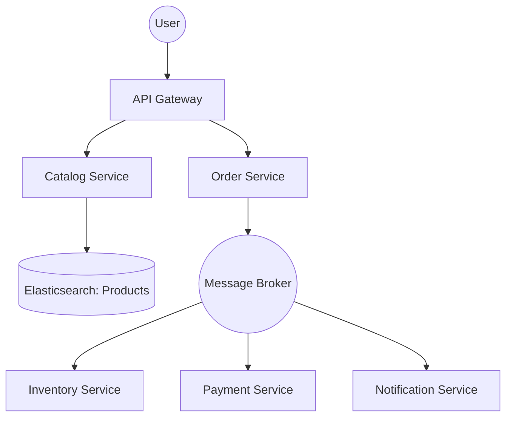

# System Design: E-commerce Platform (Architecture & Scalability)

## 🎯 Problem Statement

**Challenge**: Build a robust, scalable e-commerce platform capable of handling millions of concurrent users during a "Big Billion Day" sale.
**Constraints**:
- **Consistency**: High inventory accuracy (Never sell the same item twice).
- **Searchability**: Instant search and filtering across millions of products.
- **Availability**: High uptime; the checkout service must survive even if the recommendation service is down.

---

## 🏗️ Architecture: Microservices & Eventual Consistency



---

## 🛠️ Technical Implementation (Node.js/Microservices)

### 1. High Performance Product Search
Relational databases are too slow for complex filters (e.g., `Color=Red AND Brand=Nike AND Size=10`). 

```javascript
// search_service.js
const { Client } = require('@elastic/elasticsearch');
const esClient = new Client({ node: 'http://localhost:9200' });

async function searchProducts(query, filters) {
  const result = await esClient.search({
    index: 'products',
    body: {
      query: {
        bool: {
          must: [{ match: { name: query } }],
          filter: [
            { term: { color: filters.color } },
            ...otherFilters
          ]
        }
      },
      // Aggregations to show counts for sidebar filters
      aggs: { 
          brands: { terms: { field: "brand" } } 
      }
    }
  });
  return result.body.hits.hits;
}
```

### 2. Distributed Transactions (The Saga Pattern)
In microservices, we can't use `BEGIN TRANSACTION`. We use a sequence of events.

```javascript
// order_service.js
async function placeOrder(orderData) {
  // 1. Create order in PENDING status
  const order = await db.orders.create(orderData);
  
  // 2. Publish event to Kafka
  await kafka.publish('ORDER_CREATED', { orderId: order.id, items: order.items });
  
  // 3. Compensation logic: If Payment fails, Inventory service must RESTORE items
  // This is handled by a "Saga Orchestrator" or individual consumers.
}
```

---

## 🧠 Deep Dive: Advanced Backend Concepts

### 1. Database Per Service
- **Pattern**: Every microservice has its own DB (e.g., Catalog uses SQL, Order uses NoSQL, Analytics uses ClickHouse).
- **Benefit**: Decouples services. If the Catalog DB is slow, the Checkout service (using Order DB) is unaffected.

### 2. Handling "Hot" Inventory (Flash Sales)
- **Problem**: 1 million people trying to buy 10 iPhones.
- **Solution**: **Redis Lua Scripting**. By running the decrement logic inside a Lua script on Redis, the operation is **Atomic**.
- **Logic**: `IF redis.get(cart_item) > 0 THEN redis.decr(cart_item) ELSE RETURN EXPIRED`.

### 3. Read-through and Write-through Caching
- **Catalog**: Highly cacheable. Use Redis for `get_product(id)`.
- **Order Details**: Rarely changed. Cache after first read.
- **Dynamic Pricing**: Use the **Cache-Aside** pattern where the app decides when to refresh the price based on promo triggers.

---

## 📊 Back-of-the-envelope Estimation
- **Catalog**: 50 Million Products.
- **Traffic**: 100,000 requests per minute (Normal). 5,000,000 per minute (Sale).
- **Storage**: ~500 GB for product metadata, 20-30 TB for Order History (spread over years).

---

## 🚀 Performance Metrics
- **Search Latency**: < 100ms for complex queries.
- **Cart-to-Order Latency**: < 2s (End-to-end distributed workflow).
- **Checkout Success Rate**: 99.9% (using retry queues for payment gateway failures).
- **Cache Hit Rate**: > 90% for product pages.
