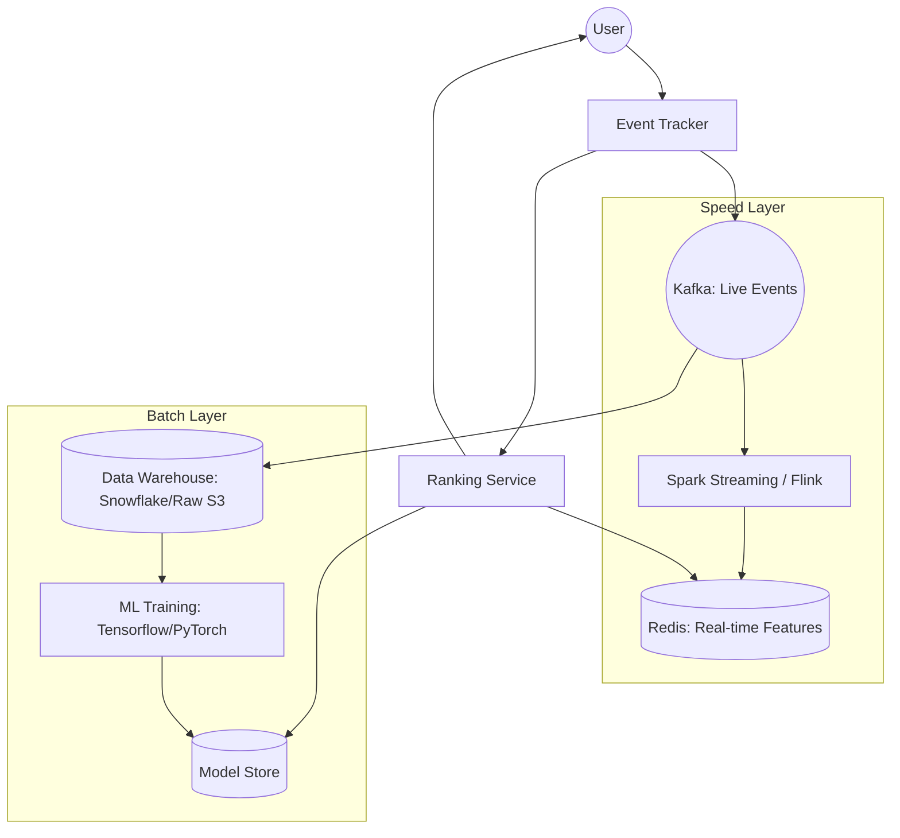

# System Design: Recommendation System (Personalization & ML Pipeline)

## 🎯 Problem Statement

**Challenge**: Deliver highly relevant content (Movies/YouTube/Netflix) to users based on their behavior, history, and preferences.
**Constraints**:
- **Latency**: Recommendations should appear on the homepage in < 200ms.
- **Data Volume**: Billions of user interactions (CLicks, Likes, Watch time) per day.
- **Freshness**: The system should react to a user's recent "like" within minutes (avoiding the "Stale Feed" problem).

---

## 🏗️ Architecture: Lambda Architecture (Real-time + Batch)



---

## 🛠️ Technical Implementation (Node.js/Python)

### 1. Collaborative Filtering (Matrix Factorization)
The "Heart" of basic recommendations: Users who like X also like Y.

```python
# recommendation_core.py (Conceptual Python ML implementation)
import pandas as pd
from sklearn.metrics.pairwise import cosine_similarity

def get_recommendations(user_id, interaction_matrix):
    # Find users with similar interaction history
    similarities = cosine_similarity(interaction_matrix[user_id], interaction_matrix)
    # Weighted average of their scores to predict what this user might like
    ...
    return recommended_item_ids
```

### 2. Event Ingestion (High Throughput)
Events are the fuel for recommendations.

```javascript
// tracker.js (Node.js API)
app.post('/track-event', async (req, res) => {
  const { userId, eventType, itemId, duration } = req.body;
  
  const event = {
    userId, eventType, itemId,
    timestamp: Date.now(),
    features: req.headers['user-agent'] // Capture device info for context
  };

  // Push to Kafka to avoid blocking the user
  await kafkaProducer.send({
    topic: 'user-interactions',
    messages: [{ value: JSON.stringify(event) }]
  });
  
  res.status(202).send(); // Accepted
});
```

---

## 🧠 Deep Dive: Advanced Backend Concepts

### 1. The Candidate Generation Problem
- **Problem**: In a catalog of 1 billion videos, you can't run a complex ML model on *all* of them for every user request.
- **Solution**: **Three-stage pipeline**:
  - **Recall**: Fetch 1,000 broad candidates (e.g., "Top 100 in category Comedy").
  - **Ranking**: Score those 1,000 using a heavy Neural Network.
  - **Re-ranking**: Filter already-seen videos or duplicates.

### 2. Feature Stores
- **Concept**: A centralized data store for ML features (e.g., `user_watch_time_avg`, `item_popularity`).
- **Benefit**: Ensures that the same data used during **Training** (Batch) is available during **Inference** (Real-time).

### 3. Dealing with Exploitation vs Exploration
- **Exploitation**: Show the user what they already like (Safe, but boring).
- **Exploration**: Show the user something new (Risky, but expands their horizons).
- **Backend**: Use **Multi-Armed Bandit** algorithms to decide the ratio of safe vs random content.

---

## 📊 Back-of-the-envelope Estimation
- **Users**: 500 Million daily active.
- **Events**: 50,000 events/second (Clicks, Scrolls, Views).
- **Storage**: ~10 TB of historical interactions for training (Compressed Parquet format).
- **Compute**: Heavy GPU/TPU usage for daily model re-training.

---

## 🚀 Performance Metrics
- **Serving Latency**: < 150ms (Pre-computed recall sets in Redis).
- **Model Update Cycle**: 1 hour (Real-time stream) to 24 hours (Deep batch).
- **Conversion/CTR**: Measured via A/B testing frameworks inside the Ranking Service.
