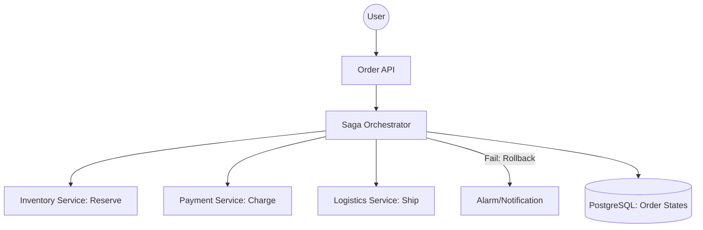

# System Design: Order Management System (OMS)

## 🎯 Problem Statement

**Challenge**: Design a system to handle the entire lifecycle of an order—from creation and payment to fulfillment and delivery—across a distributed environment.
**Constraints**:
- **Consistency**: Prevent "Ghost Orders" where payment is taken but no order is created.
- **Idempotency**: Retrying a request (due to network timeout) should NOT create a duplicate order.
- **Complexity**: Multiple third-party integrations (Stripe, FedEx, Inventory).

---

## 🏗️ Architecture: Orchestrated Saga Pattern



---

## 🛠️ Technical Implementation (Node.js/Idempotency)

### 1. The Idempotency Key
This prevents double-charging a user if they click "Pay" twice.

```javascript
// middleware/idempotency.js
async function checkIdempotency(req, res, next) {
  const key = req.headers['x-idempotency-key'];
  if (!key) return next();

  const cachedResponse = await redis.get(`idempotency:${key}`);
  if (cachedResponse) {
    return res.status(200).json(JSON.parse(cachedResponse));
  }
  
  // Tag current request for caching later
  req.idempotencyKey = key;
  next();
}
```

### 2. State Machine for Orders
An order should never jump from `CREATED` to `DELIVERED` without being `PICKED`.

```javascript
// order_model.js
const Transitions = {
  'CREATED': ['PAID', 'CANCELLED'],
  'PAID': ['SHIPPED', 'REFUNDED'],
  'SHIPPED': ['DELIVERED', 'RETURNED']
};

function transitionOrder(order, nextStatus) {
  if (!Transitions[order.status].includes(nextStatus)) {
    throw new Error('Invalid status transition');
  }
  order.status = nextStatus;
}
```

---

## 🧠 Deep Dive: Advanced Backend Concepts

### 1. Saga: Orchestration vs Choreography
- **Choreography**: Each service talks to the next via events. (Simple, but hard to debug "Who broke the chain?").
- **Orchestration**: A central **Saga Orchestrator** manages the workflow. (Easy to monitor, but the orchestrator itself is a central logic point).
- **Decision**: Use **Orchestration** for complex orders with 4+ steps.

### 2. Inventory Reservation (The "Soft Lock")
- **Problem**: Payment takes 10 seconds. In that time, someone else could buy the last item.
- **Solution**: **Reserve** the item first. Set stock to `status=reserved, expires_at=now+15m`. If payment fails or times out, the stock is automatically freed.

### 3. Outbox Pattern for Data Integrity
- **Concept**: Don't write to DB and send a Kafka message in two separate lines (one might fail).
- **Process**: Write both the Order and the Event into the *same* database transaction in an `outbox` table. A separate "Relay" service reads the outbox and pushes to Kafka. This guarantees **at-least-once delivery**.

---

## 📊 Back-of-the-envelope Estimation
- **Writes**: 500-1,000 orders per second.
- **Reads**: 10x (Track order status).
- **Database**: 1 Billion Orders per year ≈ **1-2 TB per year**.
- **Latency**: End-to-end "Place Order" API response in < 500ms (Async background processing).

---

## 🚀 Performance Metrics
- **Idempotency Check**: < 2ms (Redis lookup).
- **State Transition**: < 50ms.
- **Reliability**: 99.999% consistency via the Saga pattern.
- **Audit Logs**: 100% immutable history of every status change.
