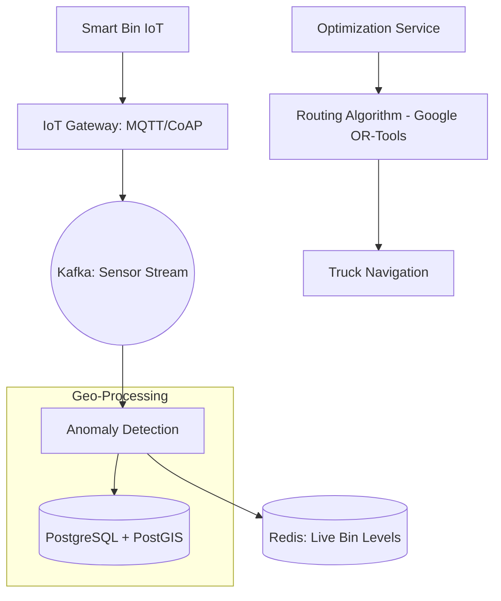

# System Design: Smart Waste Management (Logistics & IoT)

## 🎯 Problem Statement

**Challenge**: Efficiently manage city-wide waste collection by tracking "Fullness" levels of bins and optimizing truck routes.
**Constraints**:
- **IoT Density**: Millions of bins sending sensor data (Ultrasonic level).
- **Optimization**: The system must solve the "Traveling Salesman Problem" (TSP) for hundreds of trucks daily.
- **Offline Access**: Drivers must be able to work in areas with poor cellular coverage.

---

## 🏗️ Architecture: GIS & IoT Ingestion



---

## 🛠️ Technical Implementation (Node.js/GIS)

### 1. Handling High-Frequency IoT Data
Sensors shouldn't write to SQL directly. We use a stream processors to filter "Noise" (e.g., bin lid opened/closed vs actually full).

```javascript
// sensor_stream.js
async function processPacket(packet) {
  // 1. Validate Checksum
  // 2. Anomaly: If 'Full' jumps from 10% to 90% in 1 sec, it's likely noise/object blocking.
  if (isNoise(packet)) return;

  // 3. Store only significant changes in Redis
  await redis.set(`bin:level:${packet.id}`, packet.percentage, 'EX', 86400);
}
```

### 2. Solving Route Optimization (TSP)
We use a Graph-based algorithm to minimize fuel consumption.

```javascript
// routing_service.js (Pseudocode for solver)
const { solveTSP } = require('optimization-engine');

async function generateDailyRoute(truckId, sectorId) {
  const fullBins = await db.query('SELECT lat, lng FROM bins WHERE level > 80 AND sector=$1', [sectorId]);
  
  // Matrix of distances between all full bins
  const distanceMatrix = calculateMatrix(fullBins);
  
  // Return optimized order of coordinates
  return solveTSP(distanceMatrix);
}
```

---

## 🧠 Deep Dive: Advanced Backend Concepts

### 1. GIS: PostGIS for Spatial Queries
- **Why?**: Standard SQL is bad at "Find bins within 500m of this Truck".
- **Concept**: PostGIS uses **R-Tree indices**.
- **Query**: `SELECT id FROM bins WHERE ST_DWithin(geom, truck_geom, 500);`

### 2. Connectivity Modes (MQTT vs HTTP)
- **MQTT**: Lightweight, binary protocol. Ideal for battery-powered sensors (Smart Bins) because it keeps the TCP connection alive with minimal overhead.
- **CoAP**: Even lighter (uses UDP). Good for extremely low-power nodes.

### 3. Geofencing for Compliance
- **Requirement**: Verify that the truck actually stopped at the designated bin.
- **Implementation**: The backend triggers a "Verification Successful" event only if the Truck's GPS (from Driver app) and the Bin's location overlap for `> 2 minutes` in the **PostGIS** database.

---

## 📊 Back-of-the-envelope Estimation
- **Bins**: 1 Million.
- **Updates**: Every 15 minutes.
- **Ingestion**: ~1,100 PPS (Packets Per Second).
- **Route Computation**: Daily for 1,000 trucks. (CPU intensive, run in parallel background jobs).

---

## 🚀 Performance Metrics
- **Routing Computation**: < 2 minutes for a route of 100 stops.
- **Sensor Latency**: < 5 seconds from Bin-Full to Dashboard-Alert.
- **Fuel Savings**: Goal is > 20% compared to static/traditional routes.
- **Uptime**: 99.9% (Critical city infrastructure).
