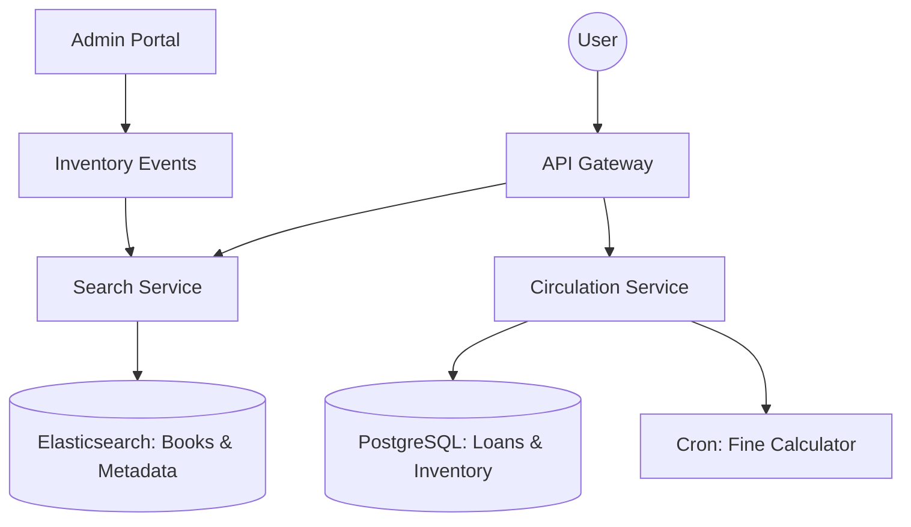

# System Design: Library Management (Distributed Catalog & Inventory)

## 🎯 Problem Statement

**Challenge**: Manage millions of books across multiple branches, handling reservations, checkouts, and late returns concurrently.
**Constraints**:
- **Concurrency**: Multiple users trying to reserve the *last* available copy of a popular book.
- **Search**: Fast lookup by Title, Author, ISBN, or Genre across a massive catalog.
- **Rules**: Automatic fine calculation based on dynamic logic (Holidays, Membership Tier).

---

## 🏗️ Architecture: Search Optimized Catalog



---

## 🛠️ Technical Implementation (Node.js/SQL)

### 1. Handling Race Conditions (Optimistic Locking)
To prevent two people from checking out the same copy of a physical book simultaneously.

```sql
-- Circulation DB Schema
-- TABLE books: { id, title, total_copies, available_copies, version }

-- ATOMIC UPDATE with versioning
UPDATE books 
SET available_copies = available_copies - 1, 
    version = version + 1
WHERE id = ? AND available_copies > 0 AND version = current_version_from_read;
```

### 2. Full-Text Search Indexing
Relational `LIKE %query%` is too slow for millions of books. We sync data to Elasticsearch.

```javascript
// search_service.js
const result = await es.search({
  index: 'library_catalog',
  body: {
    query: {
      multi_match: {
        query: 'Harry Potter',
        fields: ['title^3', 'author^2', 'description'], // Title has 3x weight
        fuzziness: 'AUTO' // Handles typos
      }
    }
  }
});
```

---

## 🧠 Deep Dive: Advanced Backend Concepts

### 1. Fine Calculation Pipeline (Batch vs Event)
- **Problem**: Millions of borrowed books. Calculating fines in a single loop every midnight is too heavy.
- **Solution**: **Sharded Batch Processing**. Split users by ID (e.g., Worker 1 handles IDs 1-1M, Worker 2 handles 1.1M-2M) and use a distributed task scheduler (like **BullMQ** or **Celery**).

### 2. Distributed Resource Locking (Reservations)
- **Logic**: When a user clicks "Hold", the book is locked for 24 hours.
- **Implementation**: **Redis Keys with Expiry**. 
- `SET book:hold:123 user:456 EX 86400 NX`.
- `NX` ensures the key is only set if it doesn't exist (Atomic Hold).

### 3. ISBN Data Normalization
- **Problem**: Books are donated with inconsistent metadata.
- **Solution**: **Deduplication Engine**. When a book is added, the system normalization service queries the **Open Library API** or **Google Books API** to fetch standard metadata and merges it before indexing.

---

## 📊 Back-of-the-envelope Estimation
- **Catalog**: 10 Million Books.
- **Users**: 5 Million Members.
- **Daily Checkouts**: 50,000.
- **Storage**: ~50 GB for metadata, but Index size (Elasticsearch) can be 2-3x for rapid lookups.

---

## 🚀 Performance Metrics
- **Catalog Search**: < 100ms for fuzzy search across 10M rows.
- **Checkout Transaction**: < 200ms (P99).
- **Fine Accuracy**: 100% (Calculated based on ISO timestamps at the moment of return).
- **Concurrency**: Supports 1,000+ simultaneous holds on the same popular title without data corruption.
