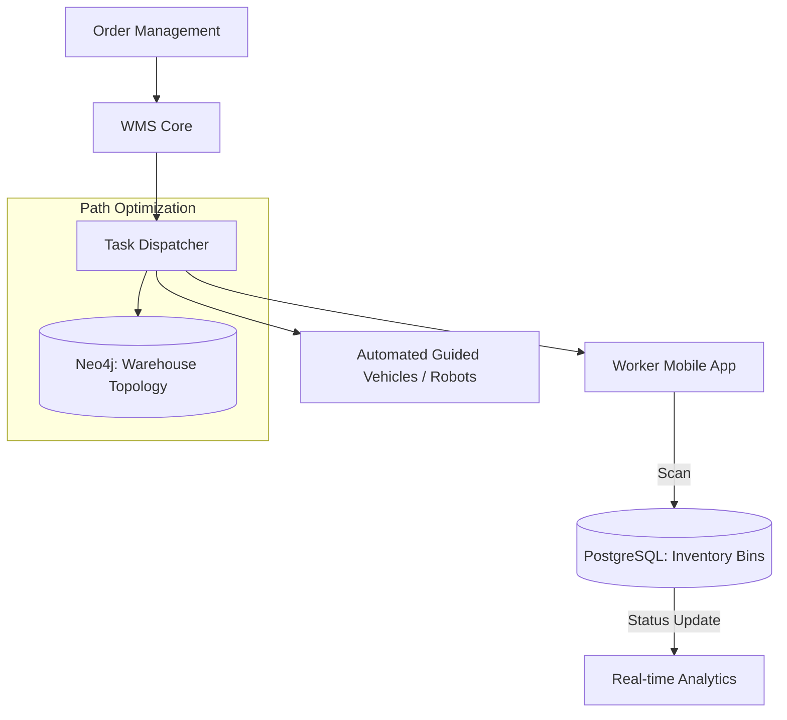

# System Design: Warehouse Management System (WMS)

## 🎯 Problem Statement

**Challenge**: Orchestrate thousands of workers and robots to pick, pack, and ship orders with near-zero latency and 100% accuracy.
**Constraints**:
- **Concurrency**: Multiple pickers working in the same bin simultaneously.
- **Latency**: Scanners must get instant "Success/Fail" feedback to keep the flow moving.
- **Efficiency**: Minimize "Total Worker Travel Distance" using optimized picking paths.

---

## 🏗️ Architecture: Event-Driven Warehouse Flow



---

## 🛠️ Technical Implementation (Node.js/SQL)

### 1. High-Precision Inventory Control (Pessimistic Locking)
In a warehouse, if two people pick the last item from the same physical bin, one will be empty-handed. We use `SELECT ... FOR UPDATE`.

```sql
-- picking_service.js
-- We lock the specific BIN row until the transaction completes
BEGIN;
SELECT count FROM inventory_bins 
WHERE bin_id = 'A-102' AND sku_id = 'SHOE-99' 
FOR UPDATE;

-- If count > 0, we proceed
UPDATE inventory_bins SET count = count - 1 WHERE bin_id = 'A-102';
INSERT INTO picker_manifest (picker_id, sku_id) VALUES (45, 'SHOE-99');
COMMIT;
```

### 2. Wave Picking Algorithm
Grouping orders to minimize travel time.

```javascript
// wave_service.js
async function createWave() {
  // 1. Fetch all pending orders for the next hour
  const orders = await getPendingOrders(60);
  
  // 2. Group items by Zone (e.g., A, B, C)
  const zoneBuckets = groupByZone(orders);
  
  // 3. Assign 1 worker to collect ALL items from Zone A for 10 different orders
  // This is much faster than 10 workers going to Zone A separately.
}
```

---

## 🧠 Deep Dive: Advanced Backend Concepts

### 1. Graph Databases (Neo4j) for Pathfinding
- **Concept**: A warehouse is a graph of aisles and shelves. 
- **Benefit**: Finding the "Shortest path to pick 5 disparate items" is a complex problem. Graph databases allow for instant `Shortest Path` calculations that standard SQL can't handle efficiently at scale.

### 2. Deadlock Prevention in Robot Fleets
- **Problem**: Two robots (AGVs) meet in a narrow aisle and block each other.
- **Solution**: **Centralized Traffic Controller**. The backend maintains a "Reservation" for aisle segments. A robot must ask: `Reserve Segment(Aisle-3-Bay-5)` before moving.

### 3. Cycle Counting (Continuous Auditing)
- **Concept**: Instead of stopping the warehouse for a yearly count, the system creates tiny "Audit Tasks" daily.
- **Trigger**: When a bin's stock reaches 0, the backend immediately asks the picker to verify: "Is the bin actually empty?". This uses the worker's presence to audit the DB for free.

---

## 📊 Back-of-the-envelope Estimation
- **SKUs**: 500,000 unique items.
- **Daily Picks**: 1 Million items.
- **Workers**: 2,000 per shift.
- **Storage**: ~200 GB for inventory snapshots (Daily backups for audit).
- **Network**: Highly optimized MQTT for scanners to ensure < 50ms round-trip latency.

---

## 🚀 Performance Metrics
- **Picking Efficiency**: > 100 items per hour per worker.
- **Data Consistency**: 100% (Strict ACID compliance for inventory).
- **Scanner Feedback**: < 100ms (Crucial for worker UX).
- **Accuracy**: 99.99% via double-scanning (Bin Scan + Item Scan).
