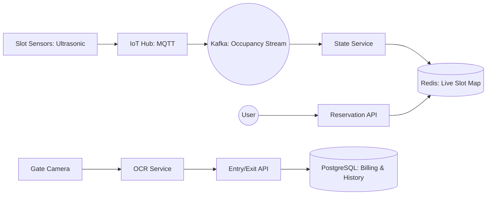

# System Design: Parking Lot Reservation (Real-time Backend)

## 🎯 Problem Statement

**Challenge**: Manage real-time occupancy and reservations for thousands of parking slots across multiple locations.
**Constraints**:
- **Live Status**: Occupancy must be updated in < 1 second on the user's app.
- **Race Conditions**: Two cars shouldn't be directed to the same "Free" slot.
- **Enforcement**: Validate entry/exit using ANPR (Automatic Number Plate Recognition).

---

## 🏗️ Architecture: Reactive IoT Backend



---

## 🛠️ Technical Implementation (Node.js/Redis)

### 1. Atomic Slot Reservation (Redis TTL)
Using Redis to "Hold" a slot while the user is driving toward it.

```javascript
// reservation_service.js
async function reserveSlot(userId, slotId) {
  // Set a'Hold' with 15-minute expiry. NX ensures we don't overwrite another hold.
  const isHeld = await redis.set(`hold:slot:${slotId}`, userId, 'EX', 900, 'NX');
  
  if (!isHeld) {
    throw new Error('Slot already taken or held');
  }
  
  return { status: 'HELD', expiresAt: Date.now() + 900000 };
}
```

### 2. Live Updates via WebSockets (Sub/Pub)
Whenever a sensor detects a car, we notify all connected drivers in that region.

```javascript
// state_service.js (Kafka Consumer)
async function onSensorUpdate(event) {
    const { slotId, status } = event; // status: 'OCCUPIED' | 'FREE'
    
    // 1. Update Global State
    await redis.hset('parking_map', slotId, status);
    
    // 2. Broadcast to specific floor's WebSocket channel
    const floorId = getFloorFromSlot(slotId);
    io.to(`floor:${floorId}`).emit('slot_change', { slotId, status });
}
```

---

## 🧠 Deep Dive: Advanced Backend Concepts

### 1. Dynamic Pricing Engine (Demand-based)
- **Logic**: If occupancy > 90%, double the hourly rate.
- **Implementation**: A **Rule Engine** or Cron job that periodically reads Redis counts and updates the `pricing_table` in SQL. The API fetches the current price from a cache to avoid slow joins.

### 2. High Availability At The Gate (Offline Mode)
- **Problem**: Internet goes down, but cars are stuck at the gate.
- **Solution**: **Local Cache (Edge)**. The gate controller (Raspberry Pi/Industrial PC) maintains a local SQLite database of "Active Reservations" synced every minute. It can open the gate even if the cloud is unreachable.

### 3. ANPR Integration Pipeline (Async OCR)
- **Flow**: Camera triggers -> Image uploaded to S3 -> SQS message sent -> OCR Worker process -> Result compared with Reservation ID.
- **Optimization**: Use **OpenCV** or pre-trained **ML models (Tesseract/Amazon Rekognition)** for high-speed plate extraction.

---

## 📊 Back-of-the-envelope Estimation
- **Lots**: 500 Parking Lots.
- **Total Slots**: 100,000.
- **Sensor Data**: 1 update per slot every 1 minute.
- **Traffic**: ~1,600 events per second.
- **Storage**: ~500 MB for live Redis state; several TB for historical billing data in SQL.

---

## 🚀 Performance Metrics
- **Booking Latency**: < 200ms.
- **Live Update Propogation**: < 500ms (Sensor -> Gateway -> Kafka -> Redis -> WebSocket).
- **ANPR Match Time**: < 1.5 seconds from car stopping to gate opening.
- **Consistency**: 100% via Redis atomic locks.
