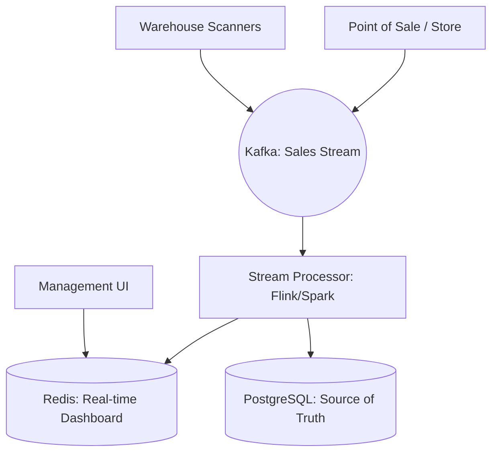

# System Design: Real-time Inventory Tracking (Global Scale)

## 🎯 Problem Statement

**Challenge**: Track billions of items across global warehouses and stores in real-time, handling massive spikes during sales without crashing.
**Constraints**:
- **Throughput**: 1 Million+ stock updates per second.
- **Accuracy**: Financial-grade accuracy (No stock "leakage").
- **Visibility**: Global inventory view for HQ, with regional views for local stores.

---

## 🏗️ Architecture: The Streaming Aggregator



---

## 🛠️ Technical Implementation (Node.js/Streaming)

### 1. High-Performance Delta Updates
We don't send `count=99`. We send `change=-1`. This prevents data loss if an event is processed twice (idempotency).

```javascript
// store_service.js
async function onSale(productId) {
  const event = {
    productId,
    delta: -1, 
    transactionId: uuid(), // For idempotency
    timestamp: Date.now()
  };
  
  await kafka.send('inventory-updates', event);
}
```

### 2. Stream Aggregation (Windowing)
Instead of updating the DB for every single sale, we aggregate in 5-second "Windows" using **Apache Flink** or a similar stream processor.

```javascript
// processor_logic.js (Flink-style pseudocode)
stream.partitionBy("productId")
      .timeWindow(seconds(5))
      .reduce((a, b) => {
          return { productId: a.productId, totalDelta: a.delta + b.delta };
      })
      .addSink(databaseUpdateSink);
```

---

## 🧠 Deep Dive: Advanced Backend Concepts

### 1. Consistent Hashing for Database Sharding
- **Problem**: 10 million products can't fit in one SQL database.
- **Solution**: Split products across nodes using `ShardID = Hash(ProductID) % TotalNodes`.
- **Advanced**: Use **Consistent Hashing** so that adding a new database node doesn't require re-shuffling the entire dataset.

### 2. "At-Least-Once" vs "Exactly-Once" Processing
- **Problem**: If a server crashes while updating stock, the count becomes wrong.
- **Backend**: We use **Exactly-Once Semantics (EOS)** in Kafka. This involves a **Two-Phase Commit** between the Kafka offset and the Database transaction.

### 3. Inventory Reconciliation (The "Nightly Sync")
- **Reality**: Physical items break, get stolen, or are misplaced. The digital count will eventually drift.
- **Solution**: A separate **Reconciliation Service** runs every night, comparing physical scan logs (from WMS) with the digital SQL count and creating "Adjustment Vouchers" for discrepancies.

---

## 📊 Back-of-the-envelope Estimation
- **Events**: 1 Million events/sec during peak sales.
- **Data Size**: Each event is ~200 bytes.
- **Network Ingress**: 200 MB/sec.
- **Database**: 100 Million SKUs * 10 historical records each = **1 Billion rows**. Needs heavy partitioning (Sharding).

---

## 🚀 Performance Metrics
- **End-to-end Latency**: < 2 seconds (Sale at Store -> Reflected on Global Dashboard).
- **Ingestion Scalability**: Horizontal scaling of Kafka brokers and Consumers.
- **Accuracy**: 100% digital accuracy (Digital count matches sum of sale deltas).
- **Data Retention**: 30 days in "Hot" DB, 5 years in "Archive" (S3/BigQuery).
