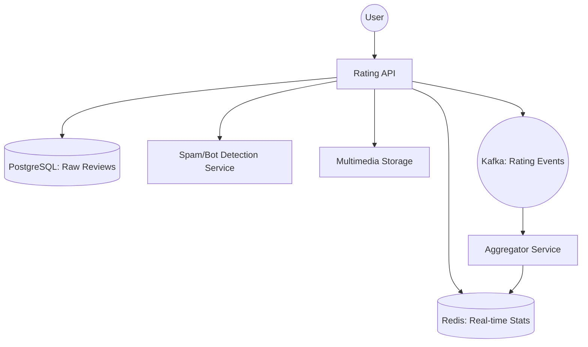

# System Design: E-commerce Rating & Review System

## 🎯 Problem Statement

**Challenge**: Build a high-scale rating system that provides accurate averages, prevents bot spam, and scales to millions of users.
**Constraints**:
- **Trust**: Only "Verified Buyers" should impact the core rating.
- **Performance**: Fetching a product page shouldn't require calculating `AVG()` over 100k reviews on-the-fly.
- **Multimedia**: Support photos and videos in reviews without slowing down the primary rating API.

---

## 🏗️ Architecture: Asynchronous Aggregation



---

## 🛠️ Technical Implementation (Node.js/SQL)

### 1. Avoiding `SELECT AVG(...)`
Instead of calculating the average on every request, we store the **Sum** and **Count** separately and update them atomically.

```javascript
// aggregator_service.js (Kafka Consumer)
async function updateProductRating(productId, newRating) {
  // We use Redis HINCRBY to update Sum and Count in one atomic step
  await redis.hincrby(`stats:prod:${productId}`, 'sum', newRating);
  await redis.hincrby(`stats:prod:${productId}`, 'count', 1);
  
  // The API will calculate: sum / count results in the Average
}
```

### 2. Weighted Average for Trust
New accounts or "Rating Bombs" are given less weight.

```javascript
// ranking_logic.js
function calculateWeightedRating(ratings) {
    // Formula: (R * v + C * m) / (v + C)
    // R = average for the movie
    // v = number of votes for the movie
    // m = minimum votes required to be listed
    // C = the mean vote across the whole report
    ...
}
```

---

## 🧠 Deep Dive: Advanced Backend Concepts

### 1. Anti-Spam & Bot Prevention
- **Velocity Tracking**: If a product receives 1,000 ratings in 1 minute, trigger a "Manual Review" flag and stop updating the public average temporarily.
- **Sentiment Mismatch**: If the user gives 1 star but the comment says "I love it, amazing!", the backend flags this as a potential bot or user error using **NLP (Natural Language Processing)**.

### 2. Handling Multimedia (S3 Pre-signed URLs)
- **Problem**: Uploading a 50MB review video through your Node.js server will block your CPU/RAM.
- **Solution**: **Direct-to-S3 Upload**.
  - 1. User asks API: "I want to upload a photo."
  - 2. API returns a **Pre-signed URL**.
  - 3. User uploads directly to S3.
  - 4. S3 triggers a **Lambda** function to update the Review DB entry with the image URL.

### 3. Distribution Analytics (Histogram)
- **Requirement**: Show the bar graph (e.g., 80% 5-stars, 5% 4-stars...).
- **Implementation**: Instead of one "Sum" field, we keep 5 separate counters in Redis: `stars:1`, `stars:2`, etc.

---

## 📊 Back-of-the-envelope Estimation
- **Catalog**: 10 Million Products.
- **Total Reviews**: 500 Million.
- **Reads**: 100,000 RPS (Requesting a product page).
- **Writes**: 100 RPS (Writing a review - much rarer).
- **Storage**: ~250 GB for review text, Petabytes for Multimedia (S3).

---

## 🚀 Performance Metrics
- **Average Rating Fetch**: < 2ms (Redis Hash lookup).
- **Review Submission**: < 500ms (Post to SQL + Push to Kafka).
- **Bot Detection Latency**: ~200ms (Async processing).
- **Multimedia Processing**: < 30 seconds for video transcoding/thumbnailing.
