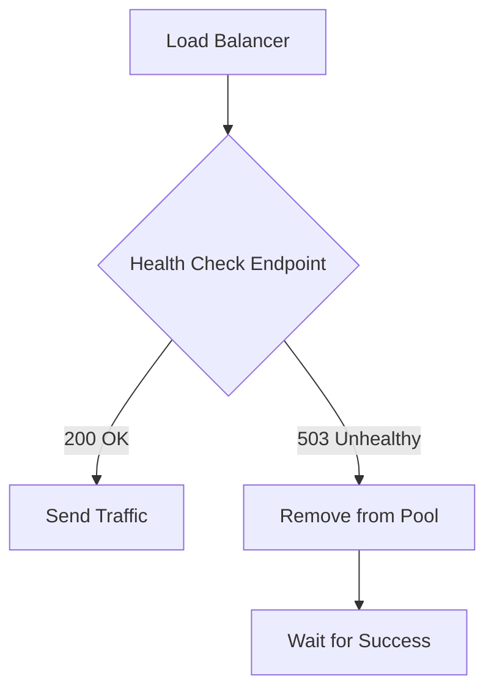

# Health Checks: Minimal Guide

## Core Purpose
*   **Definition:** Monitoring endpoint for system health (DB, Cache, APIs).
*   **Liveness Probe:** "Is the app running?" (e.g., `/health/liveness`).
*   **Readiness Probe:** "Is the app ready to handle traffic?" (e.g., `/health/readiness`).

### Health Check Flow Configuration


## Implementation Pattern
```python
@app.get("/health")
async def health_check(db = Depends(get_db), redis = Depends(get_redis)):
    # Simple check for database
    try:
        await db.execute(text("SELECT 1"))
        db_status = "healthy"
    except Exception:
        db_status = "unhealthy"

    # Simple check for redis
    try:
        await redis.ping()
        redis_status = "healthy"
    except Exception:
        redis_status = "unhealthy"

    return {"status": "ok", "db": db_status, "redis": redis_status}
```

## Failures & Status Codes
- ✅ **Healthy:** (Status 200 OK) → Keep in Load Balancer.
- ❌ **Unhealthy:** (Status 503 Service Unavailable) → Remove from Load Balancer.

## Best Practices
- ✅ Don't perform **Heavy queries** in health checks.
- ✅ Use **Timeout** (e.g., 2s) to prevent blocking the check.
- ✅ Check all **Critical dependencies** (DB, Redis, Third-party APIs).
- ✅ Integrate with **Kubernetes** or **Cloud Load Balancers**.

## Summary Checklist
- ✅ Liveness/Readiness probes (Health endpoints)
- ✅ Database health check (Ping)
- ✅ Redis health check (Ping)
- ✅ Use 200 for OK, 503 for FAIL
- ✅ Timeouts configured
