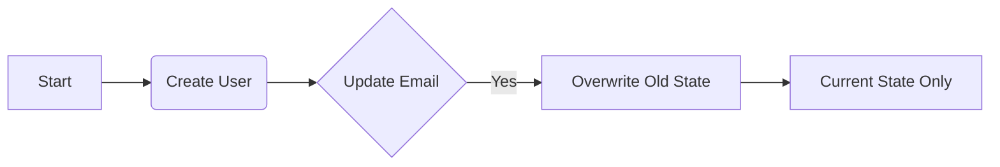
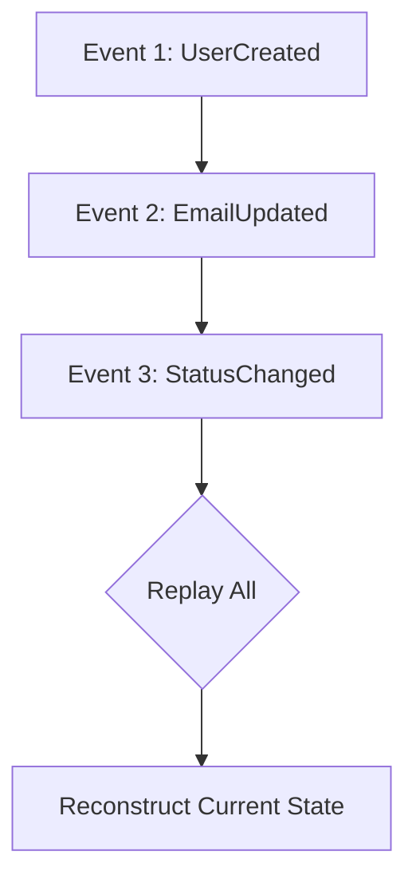

# Event Sourcing vs CRUD: Simplified Theory & Practice

## 1. What is CRUD? (The Traditional Way)
CRUD stands for **Create, Read, Update, Delete**. It's the most common way to manage data.
*   **The Concept:** You store the **Current State** of an object. When a user updates their email, the database overwrites the old email with the new one.

### CRUD Overview Diagram


*   **Pros:** Very simple to build, fast performance for simple reads, and developer-friendly.
*   **Cons:** No history. You don't know *what* the email was 5 minutes ago or *why* it was changed.

## 2. What is Event Sourcing? (The Log-based Way)
Instead of storing the current state, you store **every change** that ever happened as an "Event".
*   **The Concept:** The database is an **Append-Only** log of events.
*   **State Reconstruction:** To find the current state, you "replay" all events from the beginning of time.

### Event Sourcing Overview Diagram


*   **Pros:** Perfect audit trail, you can "time-travel" to any point in history, and you can't accidentally lose data.
*   **Cons:** High complexity, slower reads (needs replaying), and data migration is harder.

## 3. When to Choose?
| Feature | Choose CRUD If... | Choose Event Sourcing If... |
|---------|-------------------|-----------------------------|
| **History** | You only need the latest info. | History is a business requirement. |
| **Audit** | Audit is not critical. | Every change must be tracked/audited. |
| **Complexity**| You want to build fast (MVP). | You have complex business workflows. |
| **Performance**| High-speed reads are primary. | Write speed is primary (Append-only). |

## 4. The Snapshot Strategy (Performance Theory)
*   **The Problem:** Replaying 10k events is slow.
*   **The Solution:** Periodically (e.g., every 100 events) save the current state as a **"Snapshot"**.
*   **Efficiency:** Rebuild speed = Snapshot + New Events only.

## 5. Summary Implementation (Minimalist)
```python
# CRUD: Overwrites
async def update_email_crud(user_id, email):
    user = await db.get(user_id)
    user.email = email  # ⚠️ Old email is GONE
    await db.commit()

# Event Sourcing: Appends
async def update_email_es(user_id, email):
    event = EmailUpdated(user_id=user_id, new_email=email)
    await event_store.save(event) # ✅ History is PRESERVED
```

## Summary Checklist
- ✅ CRUD = Whiteboard (Overwrite)
- ✅ ES = Ledger (Append-only)
- ✅ Snapshot = Performance optimization
- ✅ Financial systems = Event Sourcing
- ✅ Common apps = CRUD
