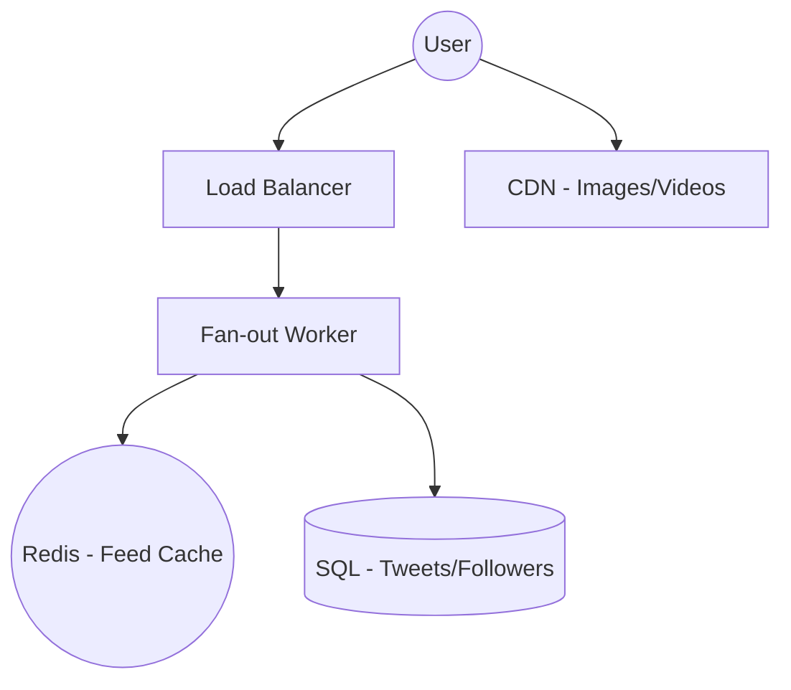
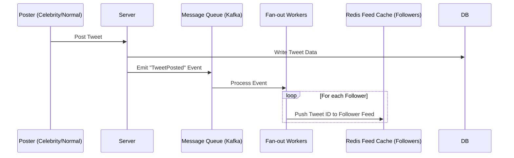

# System Design: Twitter (News Feed & Scale)

## 🏗️ Architecture



### �️ Simple UI Layout (Mental Model)


### �🔄 Data Flow: Feed Update (Fan-out)


## 🛠️ Technical Breakdown

### 1. Feed Generation (Push vs. Pull)
- **Push Model (Small Users)**: When a regular user tweets, we push the tweet into the 'Redis Feed' of all their followers. This ensures extremely fast read performance.
- **Pull Model (Celebs)**: For users with massive followings (e.g., 100M+ followers), a push model would overwhelm the system. Instead, their followers' feeds fetch the tweets 'on-the-fly' only when those followers open the app.

### 2. Frontend Optimizations
- **Windowing/Virtualization**: To handle 100k+ tweets effectively, we only render the elements currently visible on the screen.
- **Optimistic UI**: When a user 'Likes' a tweet, we immediately update the heart icon to red without waiting for the API response. If the API fails, we roll back the state gracefully.
- **Media Optimization**: Use a CDN with a 'Blur-up' technique to load progressive images, ensuring a smooth and perceived fast user experience.

---

### Oral Explanation (Interview Ready)

> "The core challenge in Twitter's design is **Fan-out**. We solve this using a hybrid approach: a **Push model** for regular users (caching feeds in Redis) and a **Pull model** for celebrities to prevent system bottlenecks."

1.  **Rendering**: On the frontend, we implement **Virtualization** to maintain a smooth scrolling experience even with thousands of items.
2.  **Latency**: We utilize **WebSockets** or **Server-Sent Events** to deliver real-time notifications and feed updates.
3.  **Consistency**: This is an 'Eventually Consistent' system—a slight delay in tweet visibility is acceptable in exchange for high availability and speed.

---

## 💻 Machine Coding Solution: Infinite Scroll Hook

In a Twitter-like feed, performance is key. We use an Intersection Observer to load more data as the user scrolls.

```javascript
import { useState, useEffect, useRef, useCallback } from 'react';

// Custom Hook for Infinite Scrolling
export const useInfiniteScroll = (callback) => {
  const observer = useRef();

  const lastElementRef = useCallback(node => {
    if (observer.current) observer.current.disconnect();

    observer.current = new IntersectionObserver(entries => {
      if (entries[0].isIntersecting) {
        callback(); // Fetch next page
      }
    });

    if (node) observer.current.observe(node);
  }, [callback]);

  return lastElementRef;
};

> [!NOTE]
> ### 💡 Technical Note: IntersectionObserver API
> In the code above, `observer.current` holds an instance of the `IntersectionObserver`. Here is what you need to know for interviews:
>
> #### 1. What is `disconnect()`?
> It stops the observer from watching **all** elements. We call it before creating a new observer or when the element changes to prevent memory leaks and ensure we aren't observing stale DOM nodes.
>
> #### 2. What's inside `observer.current`?
> **Properties:**
> - `.root`: The element used as the viewport (default is `null`, meaning the browser viewport).
> - `.rootMargin`: Margin around the root (e.g., `"10px 20px 30px 40px"`), similar to CSS margin.
> - `.thresholds`: An array of values (0.0 to 1.0) indicating at what percentage of visibility the callback should run.
>
> **Methods:**
> - `.observe(target)`: Starts watching a specific DOM element.
> - `.unobserve(target)`: Stops watching one specific element.
> - `.disconnect()`: Stops watching everything (Complete cleanup).
> - `.takeRecords()`: Returns an array of all observed targets' current states.

// Component Usage
function TweetFeed() {
  const [tweets, setTweets] = useState([]);
  const [page, setPage] = useState(1);

  const loadMore = () => setPage(prev => prev + 1);
  const lastTweetRef = useInfiniteScroll(loadMore);

  return (
    <div className="feed">
      {tweets.map((tweet, index) => (
        <div 
          key={tweet.id} 
          ref={index === tweets.length - 1 ? lastTweetRef : null}
          className="tweet-card"
        >
          {tweet.content}
        </div>
      ))}
    </div>
  );
}
```

---

## 🧠 Deep Dive: Infinite Scroll Performance & Logic

### 1. Intersection Observer vs. Scroll Events
- **Efficiency**: Unlike the legacy `scroll` event listener which fires dozens of times per second (causing main-thread congestion), the **Intersection Observer API** is asynchronous and only triggers when the 'Last Element' actually enters the viewport.
- **Layout Thrashing**: By using this API, we avoid constant calls to `getBoundingClientRect()`, which can force unnecessary layout recalculations and cause "Jank" in the UI.

### 2. Virtualization (Windowing)
- **Problem**: Rendering 5,000 tweets in the DOM will crash the mobile browser's memory.
- **Solution**: We use **Virtualization** (via libraries like `react-window`). We only keep ~20 tweets in the actual DOM—those currently visible and a small "buffer" above and below.
- **Recycling**: As the user scrolls, the item containers are reused, and only the data inside them changes, keeping the memory footprint constant regardless of list length.

### 3. Scroll Restoration & Persistence
- When a user navigates away from the feed and returns, they expect to be at the exact same spot.
- **Implementation**: We store the current scroll position and the `tweets` array in a persistent store (Redux or `sessionStorage`). Upon remounting, we reconstruct the list and use `window.scrollTo()` to move the user back to their previous coordinates.

### 4. Batched Fetching & Throttle
- We never fetch one tweet at a time. We fetch in **Pages** (e.g., 20 tweets).
- **Loading State**: We always maintain a `isLoading` local state to prevent "Double Fetching"—if a user triggers the observer while a request is still in progress, we ignore the subsequent triggers until the first one completes.

---
