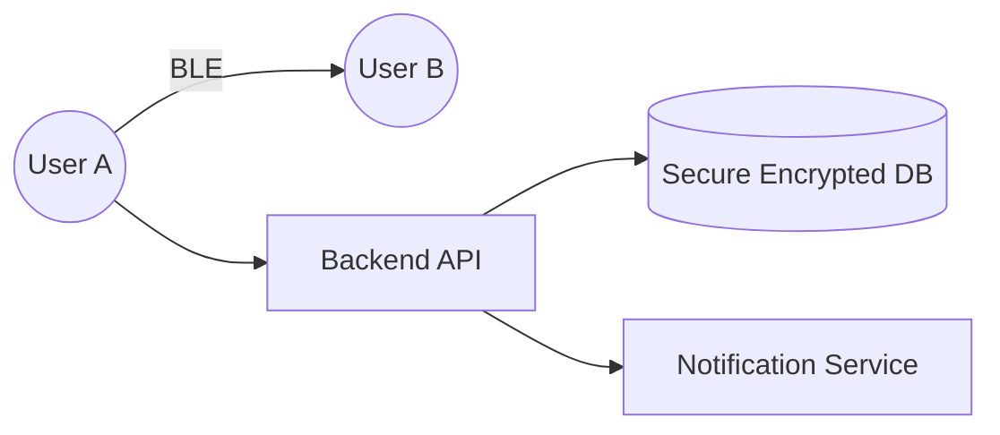

# System Design: Aarogya Setu (Contact Tracing)

## 🏗️ Architecture



### 🖼️ Simple UI Layout (Mental Model)


## 🛠️ Technical Breakdown

### 1. Proximity Detection (BLE)
- **Bluetooth Low Energy (BLE)**: When two devices are in close proximity, they exchange encrypted 'IDs'.
- **Packet Batching**: To conserve battery life, this data is not sent immediately to the server. It is batched locally on the device and synced periodically.

### 2. Privacy & Data
- **ID Rotation**: To protect user privacy, identifiers are never static. The system uses generates tokens (DIDs) that rotate every 15-30 minutes.
- **Local Storage**: Encrypted logs are stored locally using IndexedDB for enhanced security and offline support.

### 3. Frontend Focus
- **Service Workers**: Enables background BLE scanning even when the application is not actively in the foreground.
- **Heatmaps**: Utilizing high-performance Map components (like Mapbox) to visualize location-based risk factors and hotspots.

---

### Oral Explanation (Interview Ready)

> "The core foundation of Aarogya Setu is **BLE (Bluetooth Low Energy)** for contact tracing. Privacy is the highest priority, so instead of sharing actual user data, devices exchange **Rotating Tokens**."

1.  **Background Sync**: Scans run continuously even when the app is closed, powered by **Service Workers**.
2.  **Data Ingestion**: Since the system must handle millions of concurrent users, the backend utilizes queue systems like **Kafka** to manage massive traffic spikes.
3.  **UI Performance**: When rendering maps, we use **Marker Clustering** to ensure the interface remains responsive even with thousands of data points.

---

## 💻 Machine Coding Solution: BLE Proximity Simulation Hook

Since actual Bluetooth APIs are complex, interviewers often ask for a simulation of scanning and batching.

```javascript
import { useState, useEffect } from 'react';

// Simulated Hook to scan nearby devices
export const useBLEProximityList = () => {
  const [nearbyDevices, setNearbyDevices] = useState([]);

  useEffect(() => {
    // 1. In real app, we use navigator.bluetooth (Web Bluetooth API)
    // 2. Mocking proximity discovery every 5 seconds
    const interval = setInterval(() => {
      const mockDevice = {
        id: `device_${Math.random().toString(36).substr(2, 9)}`,
        rssi: Math.floor(Math.random() * -100), // Signal strength
        timestamp: new Date().toLocaleTimeString()
      };
      
      setNearbyDevices(prev => [...prev.slice(-10), mockDevice]); 
      
      // Batching Logic: If length > 10, sync with server
      if (nearbyDevices.length >= 10) {
        syncLogsWithServer(nearbyDevices);
      }
    }, 5000);

    return () => clearInterval(interval);
  }, [nearbyDevices]);

  const syncLogsWithServer = async (logs) => {
    console.log("Syncing Encrypted Logs to Server...", logs);
    // await fetch('/api/sync', { method: 'POST', body: JSON.stringify({ logs }) });
  };

  return nearbyDevices;
};
```

---

## 🧠 Deep Dive: Advanced Processes

### 1. The Proximity Math (RSSI to Meters)
BLE doesn't give you distance in meters; it gives you **RSSI** (Received Signal Strength Indicator).
- **The Challenge**: RSSI is affected by walls, phone cases, and pocket placement.
- **The Solution**: The app collects multiple data points over 5-10 minutes. If the average RSSI stays above a threshold (e.g., -70dBm), it qualifies as a "Close Contact." Signal attenuation models are used to filter out "false positives" like being separated by a wall.

### 2. Privacy Preservation (Bloom Filters)
To check if you've been near an infected person without sending your entire proximity log to the server:
- **Approach**: The server publishes a compressed list of "Infected IDs" daily.
- **Optimization**: We use **Bloom Filters** (a probabilistic data structure). The phone checks its local logs against this small filter. If there's a "hit," only then does it verify specifically with the server. This ensures that the majority of logs never leave your device.

### 3. Background Scanning Constraints
- **iOS/Android Restraints**: OS-level restrictions often kill background apps to save battery. Aarogya Setu uses specific manufacturer-approved background scanning flags to keep the BLE active.
- **Battery Optimization**: The app enters a "Sleep" cycle when no movement is detected (using accelerometer data) to further conserve power.

### 4. Data Purging (TTL)
Data is only useful for the virus incubation period (usually 14-28 days).
- **Local Purge**: The app automatically deletes logs older than 30 days from IndexedDB.
- **Server Purge**: Identifiers on the server are purged once the risk period is over, ensuring no long-term tracking of individuals.
