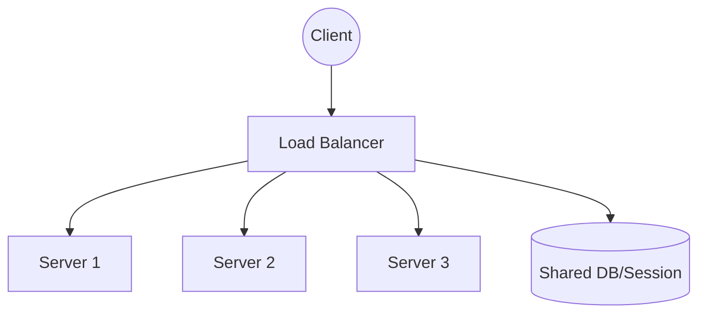
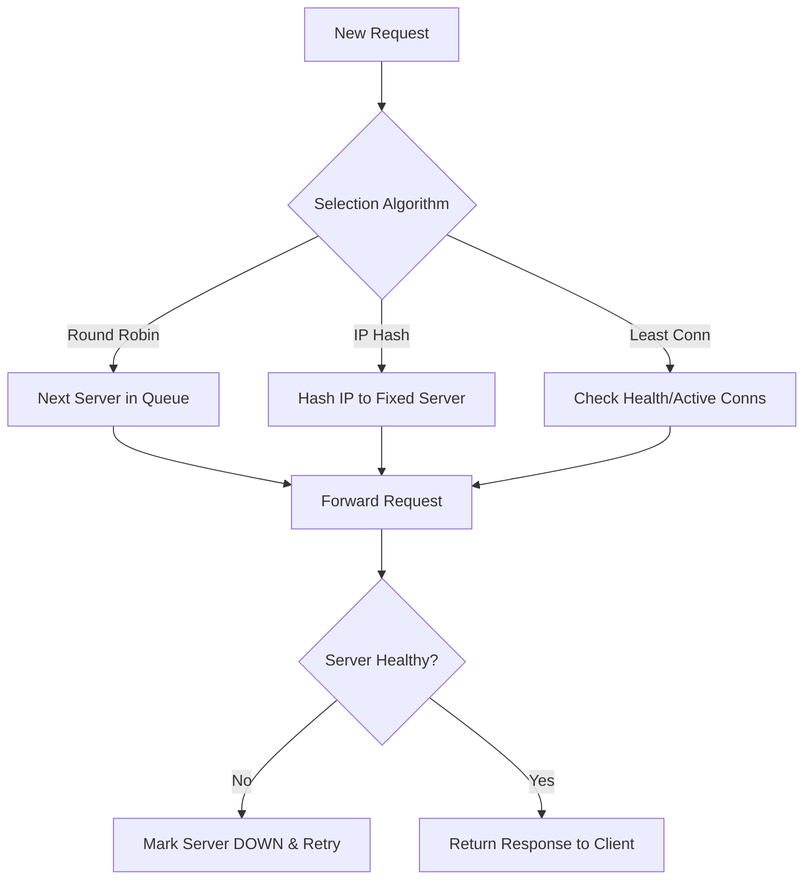

# System Design: Load Balancer (Frontend Perspective)

## 🏗️ Architecture



### 🖼️ Simple UI Layout (Mental Model)


### 🔄 Logic Flow: Request Routing


## 🛠️ Technical Breakdown

### 1. Algorithms
- **Round Robin**: Requests are distributed sequentially across the server pool.
- **Least Connections**: Directs traffic to the server with the fewest active connections.
- **IP Hash**: Ensures a specific user or IP is consistently directed to the same server (Sticky Sessions).

### 2. SSL Termination
- The SSL certificate is managed at the LB level. The LB decrypts 'HTTPS' requests and forwards 'HTTP' to the backend, significantly reducing the CPU overhead on individual application servers.

### 3. Frontend Impact
- **Sticky Sessions**: Essential if the application relies on local server-side session storage (though stateless is preferred).
- **Health Checks**: The LB constantly monitors server availability. If a server fails, the LB immediately halts traffic to it and redirects users to a healthy instance.

---

### Oral Explanation (Interview Ready)

> "The primary role of a **Load Balancer** is efficient traffic distribution. It ensures that no single server is overwhelmed, guaranteeing high availability and a consistent response for the user."

1.  **Algorithms**: While **Round Robin** is the simplest, advanced systems often use **Least Connections** for better load distribution.
2.  **Performance Optimization**: By implementing **SSL Termination**, the heavy lifting of decryption is done at the LB, leaving the backend servers dedicated to business logic.
3.  **Caching**: Many modern LBs also act as edge caches for static content, further reducing latency.

---

## 💻 Machine Coding Solution: Round Robin Load Balancer

Interviewers often ask to implement a simple Load Distribution algorithm in JavaScript.

```javascript
class LoadBalancer {
  constructor(servers) {
    this.servers = servers; // Array of server URLs
    this.currentIndex = 0;
  }

  // Round Robin Implementation
  getNextServer() {
    if (this.servers.length === 0) return null;

    const server = this.servers[this.currentIndex];
    this.currentIndex = (this.currentIndex + 1) % this.servers.length;
    return server;
  }

  // Weighted Round Robin (Basic)
  getWeightedServer() {
    // Simplified: Servers could be objects like { url: '...', weight: 2 }
    // Higher weight servers appear more times in a list
    const pool = this.servers.flatMap(s => Array(s.weight || 1).fill(s.url));
    const server = pool[this.currentIndex % pool.length];
    this.currentIndex++;
    return server;
  }

  addServer(url) {
    this.servers.push(url);
  }

  removeServer(url) {
    this.servers = this.servers.filter(s => s !== url);
  }
}

// Usage
```javascript
console.log(lb.getNextServer()); // server-1.com
console.log(lb.getNextServer()); // server-2.com
```

---

## 🧠 Deep Dive: Advanced Processes

### 1. Health Check Mechanisms
A Load Balancer is useless if it sends traffic to a dead server.
- **Passive Health Checks**: Monitoring real-time traffic. If a server returns a 5xx error, the LB temporarily reduces its weight.
- **Active Health Checks**: The LB sends a heartbeat request (e.g., `GET /health`) every 5-10 seconds. If the server fails 3 consecutive checks, it is removed from the rotation.

### 2. Session Persistence (Sticky Sessions)
While modern apps aim for **Statelessness**, some legacy or stateful apps need a user to hit the same server every time.
- **Implementation**: The LB inserts a "Persistence Cookie" into the first response. The browser sends this cookie back on every request, and the LB uses it to route the user to the specific server.
- **Downside**: This can lead to uneven load distribution if one server gets stuck with "heavy" users.

### 3. Layer 4 vs. Layer 7 Balancing
- **L4 (Transport Layer)**: Faster, looks only at IP and Port. cannot see "inside" the request.
- **L7 (Application Layer)**: Can see HTTP headers, cookies, and URLs. This allows for "Smart Routing" (e.g., sending `/api` requests to the API server and `/images` to the static server).

### 4. High Availability (The LB for the LB)
What if the Load Balancer itself fails?
- **Solution**: We use a **Floating IP** and two Load Balancers in an **Active-Passive** configuration. If the primary LB goes down, the secondary LB takes over the Floating IP instantly using a protocol called Keepalived or VRRP.
