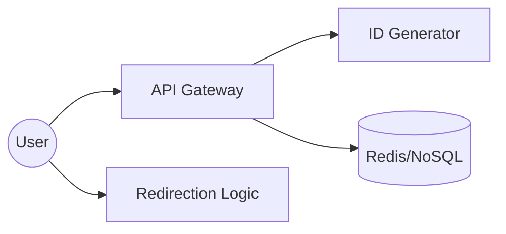
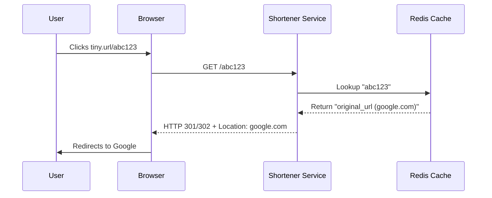

# System Design: URL Shortener (TinyURL)

## 🏗️ Architecture



### 🖼️ Simple UI Layout (Mental Model)


### 🔄 Data Flow: Short Link Redirection


## 🛠️ Technical Breakdown

### 1. Unique ID Generation
- **Base62 Encoding**: We use a mix of digits (0-9) and alphabets (a-z, A-Z) to generate IDs.
- **Pre-generation Service**: A dedicated service (Key Generation Service - KGS) pre-calculates and stores unique IDs in the database, avoiding high-latency runtime calculations.

### 2. High Performance (Read Heavy)
- URL shorteners are naturally read-heavy systems.
- **Redis Caching**: By storing popular short URLs in Redis, we can serve most requests without even querying the primary database.

### 3. Redirection Codes
- **301 (Permanent Redirect)**: Instructs the browser to cache the result indefinitely (SEO friendly).
- **302 (Temporary Redirect)**: Preferred for detailed analytics, as it forces every request to hit the server.

---

### Oral Explanation (Interview Ready)

> "The core of a TinyURL design is the **ID Generation** strategy. We use **Base62 encoding** to ensure that with just 6 characters, we can generate trillions of unique, shortened links."

1.  **Performance Strategy**: Since the system is **Read-heavy**, we cache nearly 90% of active traffic in **Redis**.
2.  **KGS Implementation**: We decouple ID generation into a separate service to ensure no two concurrent requests ever receive the same ID.
3.  **Analytics & UX**: On the frontend, we provide dashboards for click tracking, though the actual metrics are captured asynchronously via our redirection logic.

---

## 💻 Machine Coding Solution: Base62 Encoder Utility

The heart of a URL shortener is converting a unique database ID (number) into a short string.

```javascript
const CHARACTERS = "0123456789abcdefghijklmnopqrstuvwxyzABCDEFGHIJKLMNOPQRSTUVWXYZ";
const BASE = CHARACTERS.length; // 62

/**
 * Encodes a numeric ID to a Base62 string.
 */
export const encodeBase62 = (id) => {
  let shortUrl = "";
  while (id > 0) {
    shortUrl = CHARACTERS[id % BASE] + shortUrl;
    id = Math.floor(id / BASE);
  }
  return shortUrl || "0";
};

/**
 * Decodes a Base62 string back to a numeric ID.
 */
export const decodeBase62 = (str) => {
  let id = 0;
  for (let i = 0; i < str.length; i++) {
    id = id * BASE + CHARACTERS.indexOf(str[i]);
  }
  return id;
};

// Example Usage
const dbId = 123456789;
```javascript
console.log(`Original ID: ${dbId} -> Short String: ${tinyId}`);
console.log(`Decoded ID: ${decodeBase62(tinyId)}`);
```

---

## 🧠 Deep Dive: Advanced Processes

### 1. Key Generation Service (KGS)
To avoid ID collisions in a distributed system, we use a separate service to "pre-allocate" IDs.
- **Efficiency**: Instead of querying the database for every new link, the KGS keeps a range of IDs in memory (e.g., IDs 1,000,000 to 1,010,000).
- **Concurrency**: Multiple instances of the URL Shortener app can request different "ranges" from the KGS, ensuring they never generate the same short link.

### 2. URL Expiration & Cleanup
URLs shouldn't live forever.
- **TTL (Time To Live)**: We add an `expires_at` column in the database.
- **Cleanup Worker**: A background job runs periodically to delete expired links, freeing up space in the database and the Redis cache.

### 3. Preventing Link Scraping
Base62 IDs are sequential (abc1, abc2, etc.), making it easy for bots to guess links.
- **Solution**: We can add a "Salt" to the ID or use a random bit-shuffling algorithm before encoding it to Base62. This creates non-obvious, non-sequential short URLs.

### 4. Custom Aliases
Users often want `tiny.url/my-portfolio` instead of `tiny.url/df4G2`.
- **Implementation**: We check the database first to see if the custom alias is already taken. If not, we map the custom string to the original URL.
- **Edge Case**: If the user tries to use an alias that matches a generated Base62 ID, we must handle the conflict during the lookup logic.
