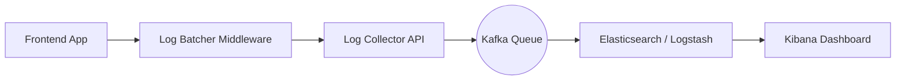
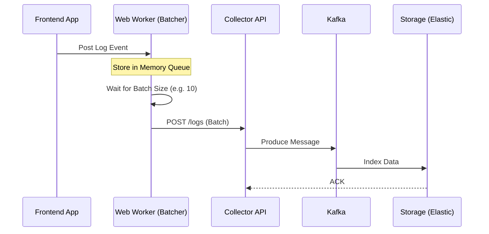

# System Design: Logging System (Frontend & Distributed)

## 🏗️ Architecture



### 🖼️ Simple UI Layout (Mental Model)


### 🔄 Data Flow: Log Ingestion Sequence


## 🛠️ Technical Breakdown

### 1. Log Ingestion (Non-blocking)
- **Batching**: Sending every log individually can exhaust the browser's network resources. We collect logs in memory and send them in bursts (e.g., every 10-20 logs or every 5 seconds).
- **`navigator.sendBeacon()`**: A critical optimization for reliable logging. When a user closes a tab or window, standard XHR or Fetch requests might be canceled. `sendBeacon` ensures logs reach the server without blocking the main thread or causing UI lag.

### 2. Levels & Filtering
- **Log Levels**: Standard levels include Debug, Info, Warn, Error, and Fatal. In production, we typically capture 'Warn' level and above to reduce unnecessary noise and storage costs.
- **Privacy Enforcement**: It is mandatory to use regex-based masking on the frontend to protect sensitive data (like credit card numbers or passwords) before transmission.

### 3. Storage (ELK Stack)
- **Elasticsearch**: Used for indexing logs to make them highly searchable and filterable.
- **TTL (Time to Live)**: We implement retention policies where old logs (e.g., 30+ days) are automatically deleted or moved to cold storage to optimize operational costs.

---

### Oral Explanation (Interview Ready)

> "The core tradeoff in designing a logging system is **'Reliability vs. Performance'**. We want to avoid overwhelming the backend while ensuring that no critical diagnostic data is lost."

3.  **UI Performance**: To keep the main thread smooth, we can offload the log processing and batching logic to a **Web Worker**.

---

## 💻 Machine Coding Solution: Log Batcher Middleware

A core requirement is to prevent overwhelming the network. This JS class manages in-memory batching.

```javascript
class LogBatcher {
  constructor(endpoint, maxBatchSize = 10, interval = 5000) {
    this.endpoint = endpoint;
    this.maxBatchSize = maxBatchSize;
    this.queue = [];
    this.timer = null;

    // Start periodic flush
    this.startTimer(interval);
  }

  log(data) {
    const logEntry = {
      ...data,
      timestamp: new Date().toISOString(),
      level: data.level || 'info'
    };

    this.queue.push(logEntry);

    if (this.queue.length >= this.maxBatchSize) {
      this.flush();
    }
  }

  async flush() {
    if (this.queue.length === 0) return;

    const logsToSend = [...this.queue];
    this.queue = []; // Clear queue immediately

    try {
      // Use navigator.sendBeacon if available for better durability
      if (navigator.sendBeacon) {
        navigator.sendBeacon(this.endpoint, JSON.stringify(logsToSend));
      } else {
        await fetch(this.endpoint, {
          method: 'POST',
          body: JSON.stringify(logsToSend),
          headers: { 'Content-Type': 'application/json' }
        });
      }
    } catch (err) {
      console.error("Log flush failed", err);
      // Optional: Add logs back to queue or store in LocalStorage
    }
  }

  startTimer(interval) {
    this.timer = setInterval(() => this.flush(), interval);
  }
}

// Usage
const logger = new LogBatcher('https://api.logs.com/batch');
logger.log({ message: 'User clicked login', level: 'info' });
```

---

## 🧠 Deep Dive: Advanced Processes

### 1. Handling "Lossy" vs. "Lossless" Logs
Not all logs are equal.
- **Analytics/Clickstream**: Often "Lossy". If a few logs are lost during a crash, it's acceptable for the benefit of lower system overhead.
- **Audit/Security Logs**: Must be "Lossless". These require immediate `ACK` from the server and potentially local storage persistence if the network is down.

### 2. Backpressure Management
If the central logging server is slow, the collector API can start getting backed up.
- **Kafka's Role**: Kafka acts as a massive buffer. Even if the Elasticsearch indexing is slow, Kafka can hold hours of logs until the consumer catches up.

### 3. Sampling for High Traffic
At Google or Netflix scale, logging every single request is too expensive.
- **Dynamic Sampling**: We might log 100% of 'Error' logs but only 1% of 'Info' logs. This can be configured remotely without redeploying the frontend.

### 4. Correlation IDs
To debug a request that spans 10 different microservices, we use a **Correlation ID**.
- **Process**: The frontend generates a UUID and sends it in the `X-Correlation-ID` header. Every backend service passes this ID to the next one, allowing developers to see the "full path" of a single user action in Kibana.
