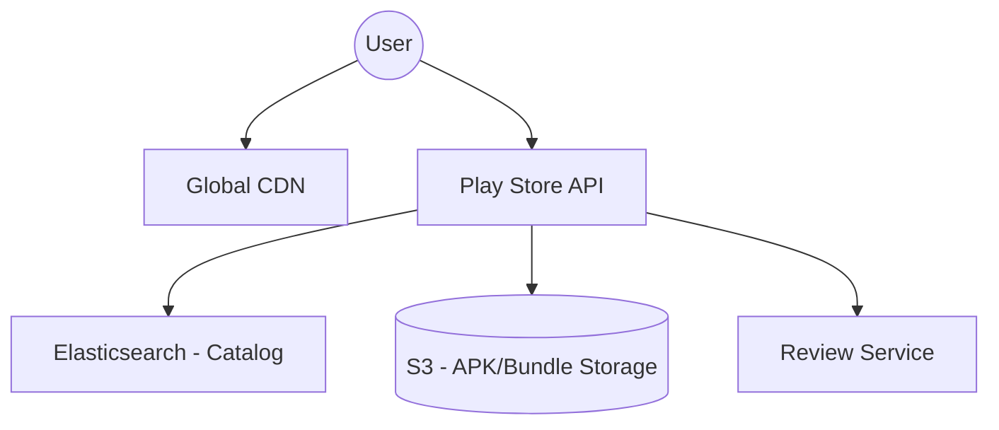
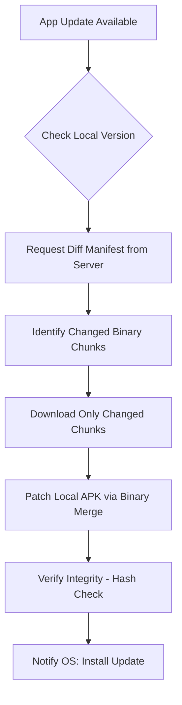

# System Design: Google Play Store (Asset Delivery)

## 🏗️ Architecture



### 🖼️ Simple UI Layout (Mental Model)


### 🔄 Logic Flow: Delta Update Process


## 🛠️ Technical Breakdown

### 1. Large Asset Delivery (Binary)
- **Global CDN**: Application packages (APKs/Bundles) can be massive (1GB+). These are served through global CDNs (like CloudFront or Akami) to ensure low-latency delivery from edge locations nearest to the user.
- **Delta Updates**: Instead of downloading a full 100MB application for a minor fix, the system uses byte-diffing to download only the changed 2MB increment. This significantly reduces data consumption and update time.

### 2. Catalog & Search
- To provide sub-second search results across millions of apps, we utilize indexing engines like **Elasticsearch**.
- **Caching Strategy**: Result sets for trending apps and top charts are cached in **Redis** for instantaneous retrieval.

### 3. Frontend/PWA Focus
- **Progressive Web App (PWA)**: We optimize for PWA features to ensure the web experience feels native and installable.
- **Lazy Loading**: Non-critical sections like "User Reviews" and "Similar Apps" are lazy-loaded to prioritize the primary app details and install button.

---

### Oral Explanation (Interview Ready)

3.  **Resilience**: We support resumeable downloads using standard HTTP Range Request headers, ensuring success even in unstable network conditions.

---

## 💻 Machine Coding Solution: Resumeable Download Concept

A core frontend challenge is resuming a large download if the internet cuts out. This uses the `Range` header.

```javascript
async function downloadAsset(url, startByte = 0) {
  try {
    const response = await fetch(url, {
      headers: {
        'Range': `bytes=${startByte}-` // Request from X byte to end
      }
    });

    if (response.status === 206) { // Partial Content
      const reader = response.body.getReader();
      let receivedBytes = startByte;

      while (true) {
        const { done, value } = await reader.read();
        if (done) break;
        
        receivedBytes += value.length;
        console.log(`Progress: ${receivedBytes} bytes received`);
        
        // Save 'value' (Uint8Array) to local cache (FileSystem API / IndexedDB)
      }
    }
  } catch (error) {
    console.log("Download paused. Saving last byte:", receivedBytes);
    // On retry, call downloadAsset(url, receivedBytes)
  }
}
```

---

## 🧠 Deep Dive: Advanced Processes

### 1. Bsdiff / Courgette (Binary Differing)
How are "Delta Updates" created? 
- Google uses algorithms like **Bsdiff** or **Courgette**. 
- Courgette works by de-assembling the machine code of the APK, finding the changes in the logic (rather than just the raw bytes), and creating a very small patch. This is why a 100MB app can often update with just a 2MB download.

### 2. Signing & Integrity (The "Man-in-the-Middle" protection)
Since APKs are downloaded from CDNs (public servers), security is paramount.
- **Process**: Every APK is digitally signed by the developer. The Play Store client verifies this signature and a **SHA-256 Hash** before allowing the Android OS to install it. If even 1 bit is changed by a hacker on the CDN, the hash check fails.

### 3. Progressive Rollouts
We never release an update to 100% of users at once.
- **Canary Release**: 1% users -> 5% -> 20% -> 100%. 
- **Monitoring**: If the "Crash Rate" for the 1% group spikes, the system automatically halts the rollout.

### 4. Dynamic Features (Play Feature Delivery)
Modern Android apps aren't just one big file.
- **On-demand Modules**: A game might only download the "Tutorial" levels initially. When the user reaches "Level 10", the app fetches that specific binary module on-the-fly. This keeps the initial download size small.
