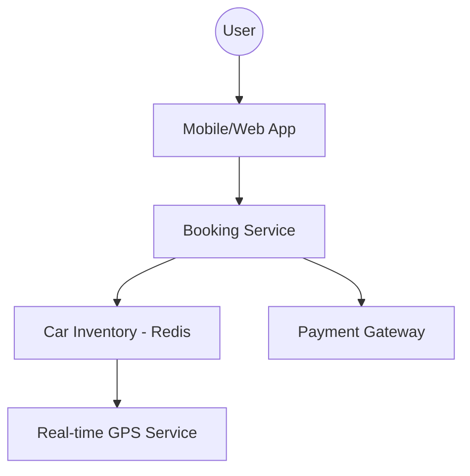

# System Design: ZoomCar (Rental Management LLD)

## 🏗️ Architecture



### 🖼️ Simple UI Layout (Mental Model)


### 🔄 Logic Flow: Distributed Locking for Inventory
```mermaid
flowchart TD
    A[User Clicks "Book Now"] --> B{Try Acquire Redis Lock}
    B -- Unavailable --> C[Show "Car just booked by another user"]
    B -- Available --> D[Set Lock with 10m TTL]
    D --> E[Redirect to Payment Page]
    E --> F{Payment Successful?}
    F -- Yes --> G[Confirm Booking & Release Lock]
    F -- No/Timeout --> H[Auto-release Lock after TTL expires]
    H --> I[Car back in available pool]
```

## 🛠️ Technical Breakdown

### 1. Inventory Management (Concurrency)
- **Locking Mechanism**: To prevent "Double Booking" where two users book the same car simultaneously, we implement **Redis Distributed Locks**.
- **Booking Time-to-Live (TTL)**: When a car is selected, it enters a 'Hold' state for 5-10 minutes. If the payment is not completed within this window, the car is released back into the available pool.

### 2. High-Performance Maps
- **Socket Synchronization**: We use WebSockets to deliver real-time GPS coordinates to the frontend, ensuring smooth car position updates on the map.
- **Geofencing**: Automated boundaries are checked to ensure the car stays within authorized territories.

### 3. State Management (XState)
- The booking lifecycle is complex (Discovery -> Verification -> Payment -> Unlock). On the frontend, we use **State Machines** (like XState) to prevent 'Illegal State Transitions', such as allowing a car to be unlocked without a verified payment.

---

### Oral Explanation (Interview Ready)

3.  **Error Orchestration**: Managing edge cases like KYC failures or payment timeouts requires tight coordination between frontend state and backend transactional logic.

---

## 💻 Machine Coding Solution: Booking State Machine

Using a state machine prevents logic bugs like "Unlocking a car before payment".

```javascript
const BookingStates = {
  SEARCHING: 'SEARCHING',
  VERIFYING: 'VERIFYING',
  PAYING: 'PAYING',
  BOOKED: 'BOOKED',
  FAILED: 'FAILED'
};

class BookingFlow {
  constructor() {
    this.status = BookingStates.SEARCHING;
  }

  // Transitions
  requestBooking() {
    if (this.status === BookingStates.SEARCHING) {
      this.status = BookingStates.VERIFYING;
      console.log("Status: KYC Verification In Progress...");
    }
  }

  paymentStarted() {
    if (this.status === BookingStates.VERIFYING) {
      this.status = BookingStates.PAYING;
      console.log("Status: Redirecting to Gateway...");
    }
  }

  confirm() {
    if (this.status === BookingStates.PAYING) {
      this.status = BookingStates.BOOKED;
      console.log("Status: Car UNLOCKED! Enjoy your ride.");
    }
  }

  cancel(reason) {
    this.status = BookingStates.FAILED;
    console.log(`Booking Failed: ${reason}`);
  }
}

const myTrip = new BookingFlow();
myTrip.requestBooking();
myTrip.paymentStarted();
myTrip.confirm();
```

---

## 🧠 Deep Dive: Advanced Processes

### 1. Handling the "Thundering Herd" (Flash Inventory)
When a high-demand car (e.g., a luxury SUV at a discount) becomes available, thousands might click "Book" at the exact same millisecond.
- **Race Condition**: A standard `SELECT -> UPDATE` database query will fail because two users might see `is_available = true` before the first one updates it. 
- **The Fix**: We use `redis.setnx` (Set if Not Exists) which is atomic. Only one user can "own" the key for that car ID.

### 2. GPS Precision & Map Jitter
Satellite GPS signals often "jitter" by 5-10 meters. 
- **Smoothening**: The frontend doesn't just teleport the car icon to every new coordinate. We use **Linear Interpolation (Lerp)** or **Kalman Filters** to animate the car moving smoothly along the road.

### 3. Remote Engine Immobilization
In case of theft or non-payment:
- **Process**: The car has an Onboard Diagnostics (OBD) device with a 4G sim. The backend sends an encrypted command. The device interacts with the car's **CAN bus** (Controller Area Network) to safely disable the starter motor (it won't stop the car while driving for safety reasons, but it won't restart after being turned off).

### 4. Image-based Damage Assessment (KYC)
Before a trip starts, the user must upload photos of the car.
- **Implementation**: We use **Computer Vision (ML)** models (usually running on the backend) to detect existing scratches or dents. This protects both the user from being wrongly charged and the company from fraud.
