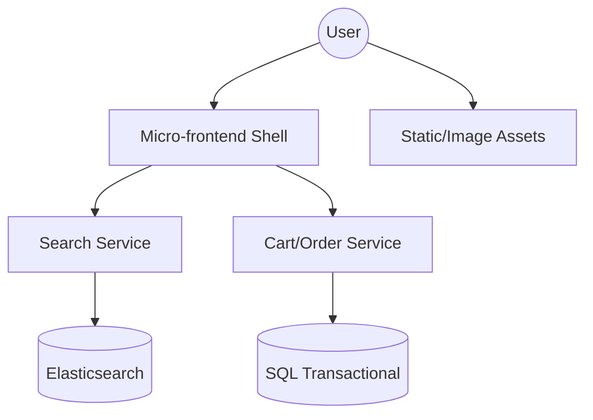
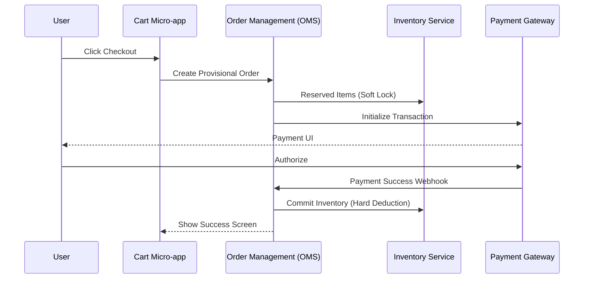

# System Design: E-commerce Platform (Scale & Performance)

## 🏗️ Architecture



### 🖼️ Simple UI Layout (Mental Model)


### 🔄 Data Flow: Reliable Checkout Process


## 🛠️ Technical Breakdown

### 1. Rendering Strategy (SSR vs. ISR)
- **Static Pages**: Policies and contact pages are pre-processed as static assets.
- **Product Listing (PLP)**: **Incremental Static Regeneration (ISR)** is ideal here, allowing for high performance with periodic updates (e.g., every 10 minutes).
- **Product Description (PDP)**: For real-time updates on price and stock, we use SSR (Server-Side Rendering) or client-side fetching with tools like React Query/SWR.

### 2. Micro-Frontends (MFE)
- In large organizations, features like Search, Cart, and Checkout are managed by independent teams. We use **Module Federation** to enable standalone deployments without requiring a full site rebuild.

### 3. Search & SEO Strategy
- **Elasticsearch**: Powering complex filtering (Color, Size, Price Range) across millions of SKUs.
- **Dynamic SEO**: For Product pages, we ensure that relevant meta tags, social preview images, and titles are correctly injected during the server-side render.

---

### Oral Explanation (Interview Ready)

3.  **Concurrency Management**: During high-traffic events like flash sales, we use **Atomic Database Updates** to prevent inventory overselling and maintain data integrity.

---

## 💻 Machine Coding Solution: High-Performance Cart Hook

A cart needs to stay in sync across tabs and survive page refreshes.

```javascript
import { useState, useEffect } from 'react';

export const useCart = () => {
  const [cart, setCart] = useState(() => {
    const saved = localStorage.getItem('cart');
    return saved ? JSON.parse(saved) : [];
  });

  // Sync to localStorage
  useEffect(() => {
    localStorage.setItem('cart', JSON.stringify(cart));
  }, [cart]);

  const addItem = (product) => {
    setCart(prev => {
      const exists = prev.find(item => item.id === product.id);
      if (exists) {
        return prev.map(item => 
          item.id === product.id ? { ...item, qty: item.qty + 1 } : item
        );
      }
      return [...prev, { ...product, qty: 1 }];
    });
  };

  const removeItem = (id) => {
    setCart(prev => prev.filter(item => item.id !== id));
  };

  const total = cart.reduce((acc, item) => acc + item.price * item.qty, 0);

  return { cart, addItem, removeItem, total };
};
```

---

## 🧠 Deep Dive: Advanced Processes

### 1. Inventory Integrity (Dirty Reads)
In a big sale, `Stock = Stock - 1` can fail if two requests happen at the same time.
- **The Fix**: We use database-level constraints: `UPDATE products SET stock = stock - 1 WHERE id = 123 AND stock > 0`. This ensures we never sell more than we have, even without complex locks.

### 2. Universal Search (Elasticsearch)
Standard SQL `LIKE %iphone%` is too slow.
- **Process**: We index product data into Elasticsearch. 
- **Fuzzy Search**: "Iphon" will still find "iPhone" because of **Levenshtein Distance** algorithms.
- **Ranking**: Products with higher ratings or higher profit margins are boosted in results using "Custom Scoring" functions.

### 3. Personalization Engine
How does it know what you like?
- **Behavioral Tracking**: Every product click is sent to a "Stream Processor" (like Apache Flink).
- **Collaborative Filtering**: "Users who bought X also bought Y." The system finds users with similar purchase histories to recommend products you haven't seen yet.

### 4. Micro-Frontend Communication
If the "Cart" is one app and the "Product Detail" is another, how do they talk?
- **Custom Events**: The Shell app provides a global event bus. `window.dispatchEvent(new CustomEvent('ADD_TO_CART', { detail: product }))`.
- **Shared State**: Using a shared Redux store or a lightweight observable (like RxJS) that both micro-apps can subscribe to.
