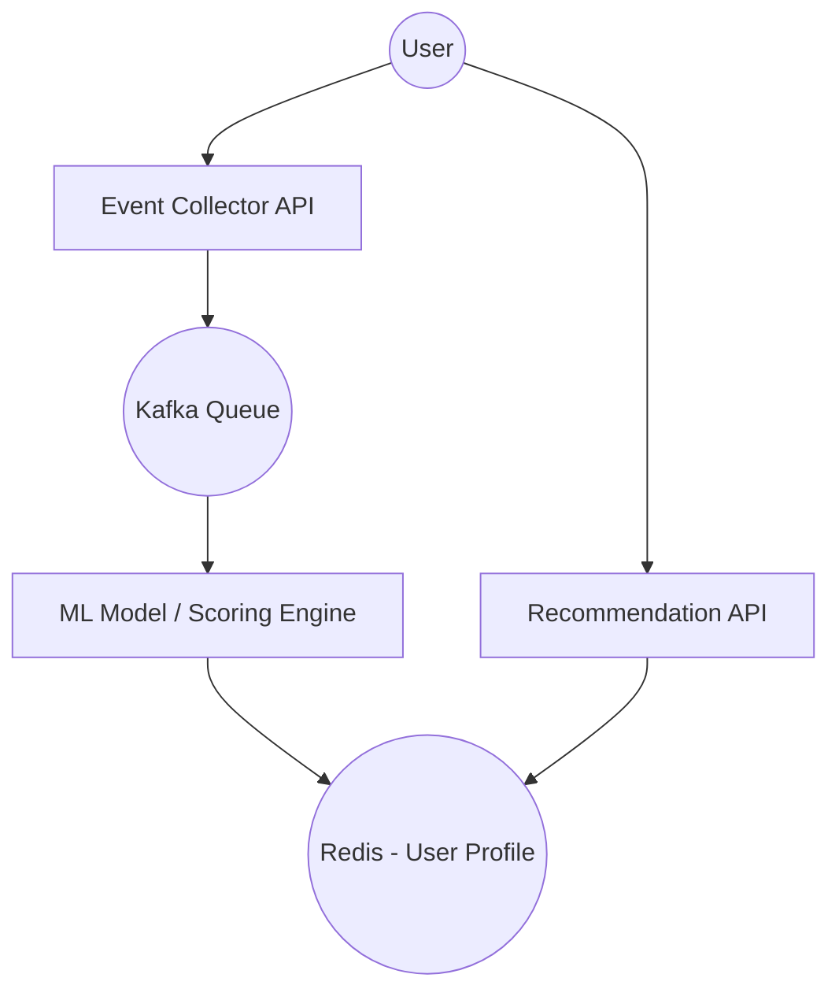
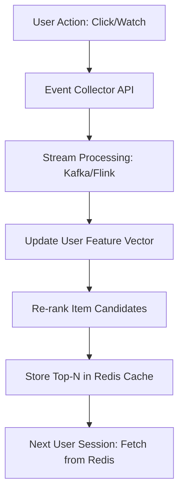

# System Design: Recommendation System (Personalization)

## 🏗️ Architecture



### 🖼️ Simple UI Layout (Mental Model)


### 🔄 Logic Flow: Feedback Loop


## 🛠️ Technical Breakdown

### 1. Data Ingestion (Behavior Tracking)
- **Event Trackers**: We track granular user actions such as clicks, scroll depth, and video watch time, which are then transmitted to the backend for real-time processing.
- **Throttling**: Due to the high volume of events, we implement batching and throttling on the frontend to optimize network usage before sending data to the server.

### 2. Rendering (Skeleton Screens)
- Recommendation APIs can be computationally expensive and may introduce latency. We utilize **Skeleton Screens** (Shimmer effects) to maintain a responsive feel while the data is being processed.
- **Lazy Loading**: We prioritize the main content and fade in personalized sections only after the recommendation payload is ready.

### 3. ML Models (Cold Start Problem)
- **New Users (Cold Start)**: Since we lack historical data for new users, we initially serve **Trending** content or use **Signup preferences** to populate their recommendations.

---

### Oral Explanation (Interview Ready)

> "The core of a Recommendation System lies in its **'Event Collection'** and **'Scoring Engine'**. We continuously track user actions to update their preference profiles in real-time."

1.  **Latency**: Since prediction models are resource-heavy, we pre-cache results in **Redis** for instant, low-latency delivery.
2.  **UI/UX**: To handle processing delays, we use **Skeleton Loaders** to provide perceived performance.
3.  **Real-time vs Batch**: While some profile updates happen in daily batches, 'Next Video' suggestions are updated within seconds using stream processing or webhooks.

---

## 💻 Machine Coding Solution: Shimmer Loading Skeleton

When recommendations are being fetched, we avoid showing an empty screen.

```javascript
import React from 'react';

const RecommendationSkeleton = () => (
  <div className="skeleton-container">
    {[1, 2, 3, 4].map(i => (
      <div key={i} className="skeleton-card">
        <div className="skeleton-image shimmer" />
        <div className="skeleton-text shimmer" />
        <div className="skeleton-text-short shimmer" />
      </div>
    ))}
    <style>{`
      .skeleton-card { width: 200px; margin-bottom: 20px; }
      .skeleton-image { height: 120px; background: #eee; border-radius: 8px; }
      .skeleton-text { height: 15px; background: #eee; margin: 10px 0; width: 80%; }
      .shimmer {
        background: linear-gradient(90deg, #f0f0f0 25%, #e0e0e0 50%, #f0f0f0 75%);
        background-size: 200% 100%;
        animation: loading 1.5s infinite;
      }
      @keyframes loading {
        0% { background-position: 200% 0; }
        100% { background-position: -200% 0; }
      }
    `}</style>
  </div>
);
```

---

## 🧠 Deep Dive: Advanced Processes

### 1. Collaborative Filtering vs. Content-Based
- **Collaborative Filtering**: "Users like you also liked this." It finds patterns between users. 
- **Content-Based**: "Since you liked Interstellar, you'll like Inception." It focuses on item properties (genre, director).
- **Hybrid**: Most systems (like Netflix) use a mix of both.

### 2. Candidate Generation & Ranking
- **Selection**: From 1 million items, we first pick 1,000 potential candidates using simple heuristics (Candidate Generation).
- **Scoring**: A complex Neural Network then scores these 1,000 items (Ranking).
- **Re-ranking**: We apply filters like "Don't show what the user already watched" or "Boost new releases."

### 3. Feature Store
Data scientists need access to live features (User age, last 5 items clicked).
- **Implementation**: We use a **Feature Store** (like Feast) that provides a consistent set of data to both the training pipeline and the live inference API.

### 4. Handling "Popularity Bias"
The system tends to recommend what is popular, which makes new or niche items fail.
- **Exploration vs. Exploitation**: Sometimes we purposefully show the user a random item they might like (Exploration) to learn more about their tastes, rather than just showing what we know they like (Exploitation).
